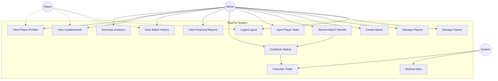

# Use Case Diagrams
## PlayPot - Volleyball Stake & Stats Management System

**Document Version:** 1.0  
**Date:** January 2025  
**Created by:** Development Team

---

## 1. Overview

This document presents the use case diagrams for PlayPot, illustrating the interactions between different actors and the system. The diagrams help visualize the functional requirements and user interactions with the application.

---

## 2. System Actors

### 2.1 Primary Actors
- **Admin/Match Organizer:** System administrator with full access rights
- **Player:** Individual volleyball player (future enhancement)

### 2.2 Secondary Actors
- **System Timer:** Automated system processes
- **Firebase Services:** External authentication and database services

---

## 3. Main Use Case Diagram

Below is the comprehensive use case diagram showing all system interactions:

---

## 4. Detailed Use Case Descriptions

### 4.1 Authentication Use Cases

#### UC1: Login/Logout
- **Actor:** Admin, Player (future)
- **Description:** User authenticates to access system features
- **Preconditions:** User has valid credentials
- **Main Flow:**
  1. User enters email and password
  2. System validates credentials with Firebase Auth
  3. System grants access based on user role
  4. User can logout to end session
- **Alternative Flows:** 
  - Invalid credentials: Show error message
  - Forgotten password: Send reset email

### 4.2 Team Management Use Cases

#### UC2: Manage Teams
- **Actor:** Admin
- **Description:** Create, edit, and delete volleyball teams
- **Preconditions:** Admin is authenticated
- **Main Flow:**
  1. Admin navigates to team management
  2. Admin can create new team with name and optional logo
  3. Admin can edit existing team information
  4. Admin can delete teams (with confirmation)
- **Alternative Flows:**
  - Team has existing players: Warn before deletion
  - Duplicate team name: Show validation error

### 4.3 Player Management Use Cases

#### UC3: Manage Players
- **Actor:** Admin
- **Description:** Add, edit, and remove players from teams
- **Preconditions:** Admin is authenticated, teams exist
- **Main Flow:**
  1. Admin selects team for player management
  2. Admin can add new player with name and contact info
  3. Admin can edit player information
  4. Admin can transfer player to different team
  5. Admin can remove player from team
- **Alternative Flows:**
  - Player has match history: Confirm before removal
  - Transfer to non-existent team: Show error

### 4.4 Match Management Use Cases

#### UC4: Create Match
- **Actor:** Admin
- **Description:** Set up new volleyball match with participating teams
- **Preconditions:** Admin is authenticated, minimum 2 teams exist
- **Main Flow:**
  1. Admin creates new match entry
  2. Admin selects participating teams (2-3 teams)
  3. Admin sets stake amount per team
  4. Admin sets match date and time
  5. System calculates total prize pool
- **Alternative Flows:**
  - Invalid stake amount: Show validation error
  - Past date selected: Warn admin

#### UC5: Record Match Results
- **Actor:** Admin
- **Description:** Enter match results and declare winning team
- **Preconditions:** Match exists, Admin is authenticated
- **Main Flow:**
  1. Admin selects completed match
  2. Admin declares winning team
  3. System triggers stake distribution process
  4. Match status updated to completed
- **Alternative Flows:**
  - Match already completed: Show warning
  - No winner selected: Require selection

#### UC6: Input Player Stats
- **Actor:** Admin
- **Description:** Record individual player performance statistics
- **Preconditions:** Match exists, players assigned to teams
- **Main Flow:**
  1. Admin selects match for stat entry
  2. Admin enters stats for each player (smashes, spikes, assists)
  3. Admin designates MVP if applicable
  4. System updates player aggregate statistics
- **Alternative Flows:**
  - Invalid stat values: Show validation errors
  - Multiple MVPs: Allow only one per match

### 4.5 Financial Management Use Cases

#### UC7: Distribute Stakes
- **Actor:** System (triggered by Admin)
- **Description:** Automatically distribute winnings to winning team members
- **Preconditions:** Match result recorded, winning team declared
- **Main Flow:**
  1. System calculates total prize pool
  2. System identifies winning team members
  3. System divides winnings equally among team members
  4. System updates each player's total earnings
  5. System logs transaction for audit trail
- **Alternative Flows:**
  - Empty team: Show error, require manual distribution
  - Calculation error: Log error and notify admin

#### UC8: View Financial Reports
- **Actor:** Admin
- **Description:** Access financial summaries and transaction history
- **Preconditions:** Admin is authenticated, financial data exists
- **Main Flow:**
  1. Admin navigates to financial reports
  2. Admin can view total stakes collected
  3. Admin can view total winnings distributed
  4. Admin can view individual player earnings
  5. Admin can export financial data
- **Alternative Flows:**
  - No data available: Show appropriate message
  - Export failure: Show error and retry option

### 4.6 Reporting and Analytics Use Cases

#### UC9: View Match History
- **Actor:** Admin, Player (future)
- **Description:** Browse historical match data and results
- **Preconditions:** User is authenticated, matches exist
- **Main Flow:**
  1. User navigates to match history
  2. User can filter matches by date, team, or status
  3. User can view match details including results and stats
  4. User can search for specific matches
- **Alternative Flows:**
  - No matches found: Show empty state message
  - Filter returns no results: Clear filter option

#### UC10: View Leaderboards
- **Actor:** Admin, Player (future)
- **Description:** View rankings based on various performance metrics
- **Preconditions:** User is authenticated, player stats exist
- **Main Flow:**
  1. User navigates to leaderboards
  2. User can select ranking criteria (earnings, smashes, MVPs, etc.)
  3. System displays ranked list of players
  4. User can view detailed stats for each player
- **Alternative Flows:**
  - No stats available: Show empty leaderboard
  - Tie in rankings: Use secondary criteria

#### UC11: View Player Profiles
- **Actor:** Admin, Player (future)
- **Description:** View detailed player statistics and performance history
- **Preconditions:** User is authenticated, player data exists
- **Main Flow:**
  1. User selects player from list or search
  2. System displays player profile with statistics
  3. User can view match-by-match performance
  4. User can view earnings history
- **Alternative Flows:**
  - Player not found: Show error message
  - No match history: Show appropriate message

#### UC12: Generate Analytics
- **Actor:** Admin
- **Description:** Create charts and insights from system data
- **Preconditions:** Admin is authenticated, sufficient data exists
- **Main Flow:**
  1. Admin navigates to analytics dashboard
  2. Admin selects analysis type (trends, comparisons, etc.)
  3. System generates charts and visualizations
  4. Admin can export or share analytics
- **Alternative Flows:**
  - Insufficient data: Show minimum data requirement
  - Chart generation fails: Show error and retry

### 4.7 System Use Cases

#### UC13: Backup Data
- **Actor:** System (automated)
- **Description:** Automatically backup system data to prevent loss
- **Preconditions:** System is operational
- **Main Flow:**
  1. System initiates backup process daily
  2. System creates snapshot of all data
  3. System stores backup to secure location
  4. System logs backup completion
- **Alternative Flows:**
  - Backup failure: Alert admin and retry
  - Storage full: Alert admin and cleanup old backups

#### UC14: Calculate Totals
- **Actor:** System (triggered by data changes)
- **Description:** Automatically update calculated fields and aggregates
- **Preconditions:** Data modification occurs
- **Main Flow:**
  1. System detects data change (new match, stats entry)
  2. System recalculates affected totals
  3. System updates player aggregates
  4. System updates team statistics
- **Alternative Flows:**
  - Calculation error: Log error and alert admin
  - Data inconsistency: Trigger data validation

---

## 5. Use Case Relationships

### 5.1 Include Relationships
- **UC5 (Record Results)** includes **UC7 (Distribute Stakes)**
- **UC6 (Input Stats)** includes **UC14 (Calculate Totals)**
- **UC7 (Distribute Stakes)** includes **UC14 (Calculate Totals)**

### 5.2 Extend Relationships
- **UC1 (Login)** extends to role-based access control
- **UC8 (Financial Reports)** extends **UC7 (Distribute Stakes)** for audit trail
- **UC12 (Analytics)** extends multiple use cases for data visualization

### 5.3 Generalization Relationships
- **View Data** (generalization of UC9, UC10, UC11)
- **Manage Entities** (generalization of UC2, UC3)

---

## 6. Business Rules

1. **BR-001:** Only one admin can modify data at a time per entity
2. **BR-002:** Stakes must be distributed equally among winning team members
3. **BR-003:** Player statistics cannot be negative values
4. **BR-004:** Each match can have only one MVP
5. **BR-005:** Teams must have at least 3 players to participate in matches
6. **BR-006:** Stake amounts must be divisible by team member count

---

**Document Status:** Complete  
**Next Review:** Phase 2 Design Review  
**Approved by:** [To be signed] 