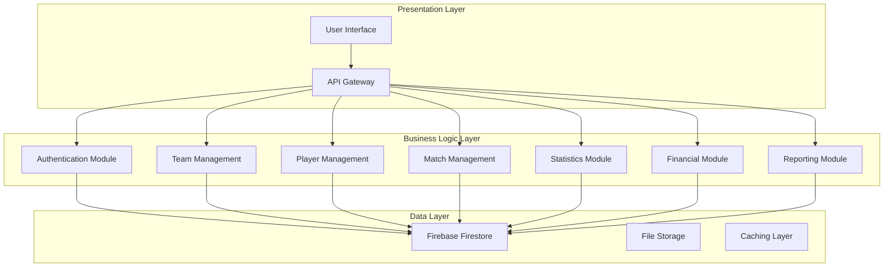
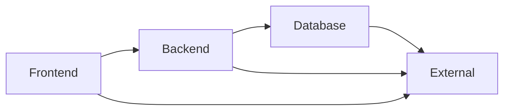

# Functional Decomposition
## PlayPot - Volleyball Stake & Stats Management System

**Document Version:** 1.0  
**Date:** January 2025  
**Created by:** Development Team

---

## 1. Overview

This document provides a hierarchical breakdown of the PlayPot system into its functional components. It identifies the major modules, sub-modules, and individual functions required to implement the complete system.

---

## 2. System Architecture Overview

PlayPot follows a three-tier architecture pattern:



---

## 3. Major Module Breakdown

### 3.1 Level 0: PlayPot System

```
PlayPot System
├── Frontend Module
├── Backend Module
├── Database Module
└── External Services Module
```

### 3.2 Level 1: Primary Modules

```
PlayPot System
├── 1.0 Frontend Module
│   ├── 1.1 User Interface Components
│   ├── 1.2 State Management
│   ├── 1.3 Routing & Navigation
│   └── 1.4 API Integration
│
├── 2.0 Backend Module
│   ├── 2.1 Authentication & Authorization
│   ├── 2.2 Business Logic Services
│   ├── 2.3 Data Access Layer
│   └── 2.4 API Endpoints
│
├── 3.0 Database Module
│   ├── 3.1 Data Models
│   ├── 3.2 Query Operations
│   ├── 3.3 Data Validation
│   └── 3.4 Backup & Recovery
│
└── 4.0 External Services Module
    ├── 4.1 Firebase Authentication
    ├── 4.2 Firebase Firestore
    ├── 4.3 Firebase Hosting
    └── 4.4 Analytics Services
```

---

## 4. Detailed Functional Decomposition

### 4.1 Frontend Module (1.0)

#### 4.1.1 User Interface Components (1.1)
```
1.1 User Interface Components
├── 1.1.1 Layout Components
│   ├── 1.1.1.1 Header Component
│   ├── 1.1.1.2 Navigation Menu
│   ├── 1.1.1.3 Footer Component
│   └── 1.1.1.4 Sidebar Component
│
├── 1.1.2 Page Components
│   ├── 1.1.2.1 Dashboard Page
│   ├── 1.1.2.2 Teams Page
│   ├── 1.1.2.3 Players Page
│   ├── 1.1.2.4 Matches Page
│   ├── 1.1.2.5 Statistics Page
│   └── 1.1.2.6 Reports Page
│
├── 1.1.3 Form Components
│   ├── 1.1.3.1 Login Form
│   ├── 1.1.3.2 Team Creation Form
│   ├── 1.1.3.3 Player Addition Form
│   ├── 1.1.3.4 Match Creation Form
│   └── 1.1.3.5 Stats Entry Form
│
├── 1.1.4 Display Components
│   ├── 1.1.4.1 Team Card Component
│   ├── 1.1.4.2 Player Card Component
│   ├── 1.1.4.3 Match Summary Component
│   ├── 1.1.4.4 Statistics Chart Component
│   └── 1.1.4.5 Leaderboard Component
│
└── 1.1.5 Utility Components
    ├── 1.1.5.1 Loading Spinner
    ├── 1.1.5.2 Error Message Display
    ├── 1.1.5.3 Success Notification
    ├── 1.1.5.4 Confirmation Dialog
    └── 1.1.5.5 Date Picker Component
```

#### 4.1.2 State Management (1.2)
```
1.2 State Management
├── 1.2.1 Global State
│   ├── 1.2.1.1 Authentication State
│   ├── 1.2.1.2 User Profile State
│   ├── 1.2.1.3 Teams State
│   ├── 1.2.1.4 Players State
│   └── 1.2.1.5 Matches State
│
├── 1.2.2 Local State
│   ├── 1.2.2.1 Form State Management
│   ├── 1.2.2.2 UI State (modals, dropdowns)
│   └── 1.2.2.3 Temporary Data Cache
│
└── 1.2.3 State Actions
    ├── 1.2.3.1 CRUD Operations
    ├── 1.2.3.2 Authentication Actions
    └── 1.2.3.3 Data Synchronization
```

#### 4.1.3 Routing & Navigation (1.3)
```
1.3 Routing & Navigation
├── 1.3.1 Route Definitions
├── 1.3.2 Protected Routes
├── 1.3.3 Navigation Guards
└── 1.3.4 Breadcrumb Management
```

#### 4.1.4 API Integration (1.4)
```
1.4 API Integration
├── 1.4.1 HTTP Client Configuration
├── 1.4.2 API Service Functions
├── 1.4.3 Error Handling
└── 1.4.4 Request/Response Interceptors
```

### 4.2 Backend Module (2.0)

#### 4.2.1 Authentication & Authorization (2.1)
```
2.1 Authentication & Authorization
├── 2.1.1 User Authentication
│   ├── 2.1.1.1 Login Validation
│   ├── 2.1.1.2 Session Management
│   ├── 2.1.1.3 Password Reset
│   └── 2.1.1.4 Logout Handling
│
├── 2.1.2 Authorization Control
│   ├── 2.1.2.1 Role-Based Access Control
│   ├── 2.1.2.2 Permission Validation
│   └── 2.1.2.3 Route Protection
│
└── 2.1.3 Security Functions
    ├── 2.1.3.1 Token Validation
    ├── 2.1.3.2 CSRF Protection
    └── 2.1.3.3 Input Sanitization
```

#### 4.2.2 Business Logic Services (2.2)
```
2.2 Business Logic Services
├── 2.2.1 Team Management Service
│   ├── 2.2.1.1 Create Team
│   ├── 2.2.1.2 Update Team
│   ├── 2.2.1.3 Delete Team
│   ├── 2.2.1.4 Get Team Details
│   └── 2.2.1.5 List All Teams
│
├── 2.2.2 Player Management Service
│   ├── 2.2.2.1 Add Player
│   ├── 2.2.2.2 Update Player
│   ├── 2.2.2.3 Remove Player
│   ├── 2.2.2.4 Transfer Player
│   └── 2.2.2.5 Get Player Statistics
│
├── 2.2.3 Match Management Service
│   ├── 2.2.3.1 Create Match
│   ├── 2.2.3.2 Update Match Results
│   ├── 2.2.3.3 Record Player Stats
│   ├── 2.2.3.4 Calculate Match Totals
│   └── 2.2.3.5 Get Match History
│
├── 2.2.4 Financial Service
│   ├── 2.2.4.1 Calculate Stake Distribution
│   ├── 2.2.4.2 Update Player Earnings
│   ├── 2.2.4.3 Generate Financial Reports
│   ├── 2.2.4.4 Audit Trail Management
│   └── 2.2.4.5 Transaction Logging
│
└── 2.2.5 Statistics Service
    ├── 2.2.5.1 Calculate Player Aggregates
    ├── 2.2.5.2 Generate Leaderboards
    ├── 2.2.5.3 Performance Analytics
    ├── 2.2.5.4 Trend Analysis
    └── 2.2.5.5 Export Statistics
```

#### 4.2.3 Data Access Layer (2.3)
```
2.3 Data Access Layer
├── 2.3.1 Repository Pattern
│   ├── 2.3.1.1 Team Repository
│   ├── 2.3.1.2 Player Repository
│   ├── 2.3.1.3 Match Repository
│   └── 2.3.1.4 Statistics Repository
│
├── 2.3.2 Query Builders
│   ├── 2.3.2.1 Complex Query Builder
│   ├── 2.3.2.2 Filter Query Builder
│   └── 2.3.2.3 Aggregate Query Builder
│
└── 2.3.3 Database Operations
    ├── 2.3.3.1 CRUD Operations
    ├── 2.3.3.2 Batch Operations
    ├── 2.3.3.3 Transaction Management
    └── 2.3.3.4 Connection Pooling
```

#### 4.2.4 API Endpoints (2.4)
```
2.4 API Endpoints
├── 2.4.1 Authentication Endpoints
│   ├── 2.4.1.1 POST /api/auth/login
│   ├── 2.4.1.2 POST /api/auth/logout
│   ├── 2.4.1.3 POST /api/auth/refresh
│   └── 2.4.1.4 POST /api/auth/reset-password
│
├── 2.4.2 Team Endpoints
│   ├── 2.4.2.1 GET /api/teams
│   ├── 2.4.2.2 POST /api/teams
│   ├── 2.4.2.3 PUT /api/teams/:id
│   ├── 2.4.2.4 DELETE /api/teams/:id
│   └── 2.4.2.5 GET /api/teams/:id/players
│
├── 2.4.3 Player Endpoints
│   ├── 2.4.3.1 GET /api/players
│   ├── 2.4.3.2 POST /api/players
│   ├── 2.4.3.3 PUT /api/players/:id
│   ├── 2.4.3.4 DELETE /api/players/:id
│   └── 2.4.3.5 GET /api/players/:id/stats
│
├── 2.4.4 Match Endpoints
│   ├── 2.4.4.1 GET /api/matches
│   ├── 2.4.4.2 POST /api/matches
│   ├── 2.4.4.3 PUT /api/matches/:id
│   ├── 2.4.4.4 POST /api/matches/:id/results
│   └── 2.4.4.5 POST /api/matches/:id/stats
│
└── 2.4.5 Analytics Endpoints
    ├── 2.4.5.1 GET /api/analytics/leaderboard
    ├── 2.4.5.2 GET /api/analytics/financial-report
    ├── 2.4.5.3 GET /api/analytics/player-performance
    └── 2.4.5.4 GET /api/analytics/team-comparison
```

### 4.3 Database Module (3.0)

#### 4.3.1 Data Models (3.1)
```
3.1 Data Models
├── 3.1.1 User Model
├── 3.1.2 Team Model
├── 3.1.3 Player Model
├── 3.1.4 Match Model
├── 3.1.5 Statistics Model
└── 3.1.6 Transaction Model
```

#### 4.3.2 Query Operations (3.2)
```
3.2 Query Operations
├── 3.2.1 Basic CRUD Operations
├── 3.2.2 Complex Queries
├── 3.2.3 Aggregation Queries
└── 3.2.4 Search Operations
```

#### 4.3.3 Data Validation (3.3)
```
3.3 Data Validation
├── 3.3.1 Schema Validation
├── 3.3.2 Business Rule Validation
├── 3.3.3 Data Integrity Checks
└── 3.3.4 Constraint Validation
```

#### 4.3.4 Backup & Recovery (3.4)
```
3.4 Backup & Recovery
├── 3.4.1 Automated Backup
├── 3.4.2 Data Export
├── 3.4.3 Recovery Procedures
└── 3.4.4 Data Migration
```

### 4.4 External Services Module (4.0)

#### 4.4.1 Firebase Authentication (4.1)
```
4.1 Firebase Authentication
├── 4.1.1 User Registration
├── 4.1.2 Email/Password Authentication
├── 4.1.3 Session Management
└── 4.1.4 Password Reset
```

#### 4.4.2 Firebase Firestore (4.2)
```
4.2 Firebase Firestore
├── 4.2.1 Document Operations
├── 4.2.2 Collection Queries
├── 4.2.3 Real-time Listeners
└── 4.2.4 Security Rules
```

#### 4.4.3 Firebase Hosting (4.3)
```
4.3 Firebase Hosting
├── 4.3.1 Static File Hosting
├── 4.3.2 SSL Certificate Management
├── 4.3.3 CDN Distribution
└── 4.3.4 Custom Domain Configuration
```

#### 4.4.4 Analytics Services (4.4)
```
4.4 Analytics Services
├── 4.4.1 User Analytics
├── 4.4.2 Performance Monitoring
├── 4.4.3 Error Tracking
└── 4.4.4 Usage Statistics
```

---

## 5. Cross-Cutting Concerns

### 5.1 Security Functions
- Input validation and sanitization
- Authentication and authorization
- Data encryption
- Audit logging
- CSRF and XSS protection

### 5.2 Error Handling
- Global error handling
- User-friendly error messages
- Error logging and monitoring
- Graceful degradation

### 5.3 Performance Optimization
- Caching strategies
- Lazy loading
- Code splitting
- Image optimization
- Database query optimization

### 5.4 Monitoring & Logging
- Application performance monitoring
- Error tracking
- User activity logging
- System health monitoring

---

## 6. Module Dependencies

### 6.1 High-Level Dependencies


### 6.2 Internal Module Dependencies
- Authentication module required by all other modules
- Team management required by player management
- Player management required by match management
- Match management required by statistics and financial modules
- All modules depend on database and error handling

---

## 7. Implementation Priority

### 7.1 Phase 1 (Core MVP)
1. Authentication & Authorization (2.1)
2. Basic UI Components (1.1.1, 1.1.2)
3. Team Management Service (2.2.1)
4. Player Management Service (2.2.2)
5. Database Models (3.1)

### 7.2 Phase 2 (Match Management)
1. Match Management Service (2.2.3)
2. Financial Service (2.2.4)
3. Form Components (1.1.3)
4. API Endpoints (2.4.2, 2.4.3, 2.4.4)

### 7.3 Phase 3 (Analytics & Reporting)
1. Statistics Service (2.2.5)
2. Display Components (1.1.4)
3. Analytics Endpoints (2.4.5)
4. Chart Components (1.1.4.4)

---

**Document Status:** Complete  
**Next Review:** Phase 2 Design Review  
**Dependencies:** Use Case Diagrams, SRS Document 