# User Stories and User Flows
## PlayPot - Volleyball Stake & Stats Management System

**Document Version:** 1.0  
**Date:** January 2025  
**Created by:** Development Team

---

## 1. Overview

This document defines the user stories and user flows for PlayPot. User stories capture the requirements from the user's perspective, while user flows illustrate the step-by-step process users follow to complete tasks within the system.

---

## 2. User Personas

### 2.1 Primary Persona: Admin/Match Organizer
- **Name:** Alex (Match Organizer)
- **Age:** 28-35
- **Tech Savviness:** Moderate
- **Goals:** 
  - Efficiently manage volleyball matches
  - Ensure fair money distribution
  - Track team and player performance
  - Reduce administrative overhead
- **Pain Points:**
  - Manual money calculations prone to errors
  - Paper-based record keeping
  - Time-consuming match organization

### 2.2 Secondary Persona: Player
- **Name:** Sam (Volleyball Player)
- **Age:** 22-40
- **Tech Savviness:** Basic to Moderate
- **Goals:**
  - View personal performance statistics
  - Track earnings from matches
  - See team performance comparisons
- **Pain Points:**
  - Unclear about personal performance metrics
  - Uncertainty about money distribution
  - Limited visibility into match history

---

## 3. Epic Breakdown

### Epic 1: Authentication & User Management
### Epic 2: Team & Player Management
### Epic 3: Match Creation & Management
### Epic 4: Financial Management & Distribution
### Epic 5: Statistics & Analytics
### Epic 6: Reporting & Insights

---

## 4. User Stories by Epic

### 4.1 Epic 1: Authentication & User Management

#### Story 1.1: Admin Login
**As an** admin  
**I want to** securely log into the system  
**So that** I can access match management features  

**Acceptance Criteria:**
- [ ] Admin can enter email and password
- [ ] System validates credentials with Supabase Auth
- [ ] Successful login redirects to dashboard
- [ ] Failed login shows appropriate error message
- [ ] Password reset option available

**Story Points:** 3  
**Priority:** High

#### Story 1.2: Session Management
**As an** admin  
**I want to** maintain my login session securely  
**So that** I don't have to re-authenticate frequently  

**Acceptance Criteria:**
- [ ] Session persists for reasonable duration
- [ ] Session expires after inactivity
- [ ] User can manually logout
- [ ] Session state is secure

**Story Points:** 2  
**Priority:** Medium

### 4.2 Epic 2: Team & Player Management

#### Story 2.1: Create Team
**As an** admin  
**I want to** create new volleyball teams  
**So that** I can organize players into competing groups  

**Acceptance Criteria:**
- [ ] Admin can enter team name
- [ ] Admin can optionally upload team logo
- [ ] Team names must be unique
- [ ] System saves team to database
- [ ] Success confirmation displayed

**Story Points:** 3  
**Priority:** High

#### Story 2.2: Add Players to Team
**As an** admin  
**I want to** add players to teams  
**So that** I can track individual performance and earnings  

**Acceptance Criteria:**
- [ ] Admin can select existing team
- [ ] Admin can enter player name and contact info
- [ ] Player names must be unique within team
- [ ] System assigns player to selected team
- [ ] Player appears in team roster

**Story Points:** 3  
**Priority:** High

#### Story 2.3: Edit Team Information
**As an** admin  
**I want to** edit team details  
**So that** I can keep team information current  

**Acceptance Criteria:**
- [ ] Admin can modify team name
- [ ] Admin can update team logo
- [ ] Changes are validated and saved
- [ ] Update confirmation displayed

**Story Points:** 2  
**Priority:** Medium

#### Story 2.4: Transfer Player Between Teams
**As an** admin  
**I want to** move players between teams  
**So that** I can adjust team compositions as needed  

**Acceptance Criteria:**
- [ ] Admin can select player and destination team
- [ ] Player's match history is preserved
- [ ] Player's earnings are maintained
- [ ] Transfer is logged for audit trail

**Story Points:** 5  
**Priority:** Medium

### 4.3 Epic 3: Match Creation & Management

#### Story 3.1: Create New Match
**As an** admin  
**I want to** create a new match  
**So that** I can set up the competition and stake amounts  

**Acceptance Criteria:**
- [ ] Admin can select 2-3 participating teams
- [ ] Admin can set stake amount per team
- [ ] Admin can set match date and time
- [ ] System calculates total prize pool
- [ ] Match is saved with "Pending" status

**Story Points:** 5  
**Priority:** High

#### Story 3.2: Record Match Results
**As an** admin  
**I want to** record the winning team  
**So that** the system can distribute stakes appropriately  

**Acceptance Criteria:**
- [ ] Admin can select the winning team
- [ ] System validates that match exists and is pending
- [ ] Winning team is recorded
- [ ] Match status changes to "Completed"
- [ ] Stake distribution is triggered automatically

**Story Points:** 3  
**Priority:** High

#### Story 3.3: Input Player Statistics
**As an** admin  
**I want to** record individual player performance  
**So that** I can track detailed game statistics  

**Acceptance Criteria:**
- [ ] Admin can select completed match
- [ ] Admin can enter stats for each participating player
- [ ] Stats include: smashes, spikes, assists, MVP status
- [ ] Only one player can be designated MVP per match
- [ ] Player aggregate statistics are updated automatically

**Story Points:** 5  
**Priority:** Medium

### 4.4 Epic 4: Financial Management & Distribution

#### Story 4.1: Automatic Stake Distribution
**As a** system  
**I want to** automatically distribute winnings  
**So that** money is fairly allocated to winning team members  

**Acceptance Criteria:**
- [ ] System calculates total prize pool (stake × teams)
- [ ] System identifies active players on winning team
- [ ] Winnings are divided equally among team members
- [ ] Each player's total earnings are updated
- [ ] Transaction is logged for audit trail

**Story Points:** 8  
**Priority:** High

#### Story 4.2: View Financial Reports
**As an** admin  
**I want to** view financial summaries  
**So that** I can track money flow and player earnings  

**Acceptance Criteria:**
- [ ] Admin can view total stakes collected
- [ ] Admin can view total winnings distributed
- [ ] Admin can see individual player earnings
- [ ] Reports can be filtered by date range
- [ ] Financial data can be exported

**Story Points:** 5  
**Priority:** Medium

### 4.5 Epic 5: Statistics & Analytics

#### Story 5.1: Player Performance Dashboard
**As an** admin or player  
**I want to** view detailed player statistics  
**So that** I can analyze performance trends  

**Acceptance Criteria:**
- [ ] User can view player profile with all statistics
- [ ] Stats include: total smashes, spikes, assists, MVP count
- [ ] Performance is shown per match and in aggregate
- [ ] Charts visualize performance trends
- [ ] Earnings history is displayed

**Story Points:** 8  
**Priority:** Medium

#### Story 5.2: Leaderboard Views
**As an** admin or player  
**I want to** see player rankings  
**So that** I can compare performance across players  

**Acceptance Criteria:**
- [ ] Leaderboard can be sorted by different metrics
- [ ] Metrics include: earnings, smashes, spikes, MVP count
- [ ] Rankings update automatically after matches
- [ ] Ties in rankings are handled consistently
- [ ] Leaderboard is mobile-responsive

**Story Points:** 5  
**Priority:** Medium

### 4.6 Epic 6: Reporting & Insights

#### Story 6.1: Match History View
**As an** admin or player  
**I want to** browse historical match data  
**So that** I can review past games and results  

**Acceptance Criteria:**
- [ ] User can view list of all completed matches
- [ ] Matches can be filtered by date, team, or status
- [ ] Match details include teams, results, and stats
- [ ] Search functionality for specific matches
- [ ] Pagination for large match lists

**Story Points:** 5  
**Priority:** Low

#### Story 6.2: Team Performance Analytics
**As an** admin  
**I want to** analyze team performance  
**So that** I can identify strengths and areas for improvement  

**Acceptance Criteria:**
- [ ] Team win/loss ratios are calculated
- [ ] Team performance trends over time
- [ ] Comparison between teams
- [ ] Average player performance per team
- [ ] Export capabilities for analysis

**Story Points:** 8  
**Priority:** Low

---

## 5. User Flow Diagrams

### 5.1 Admin Login Flow

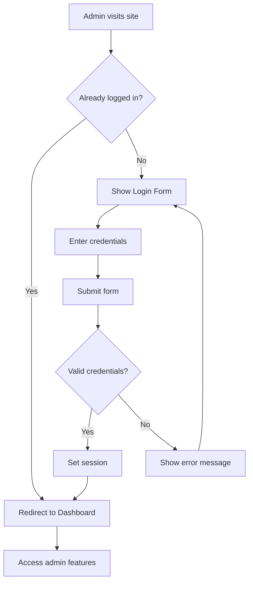

### 5.2 Team Creation Flow

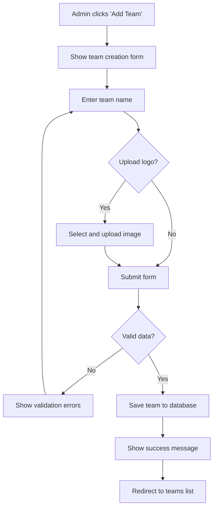

### 5.3 Match Creation Flow

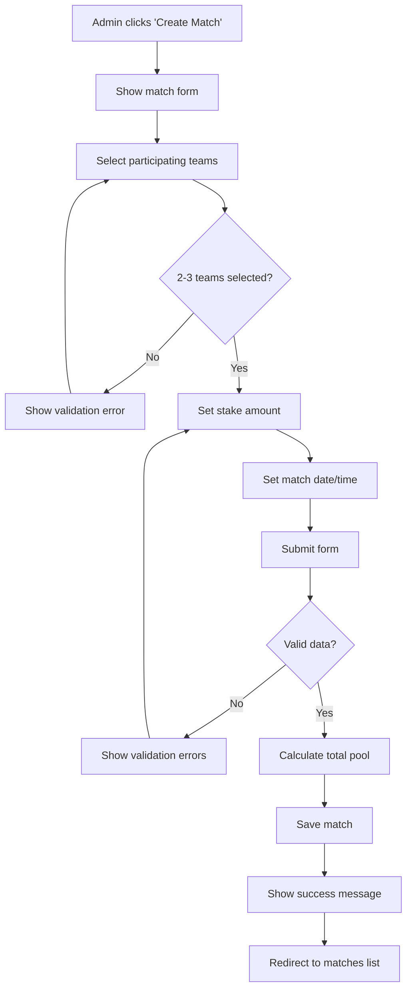

### 5.4 Match Result Recording Flow

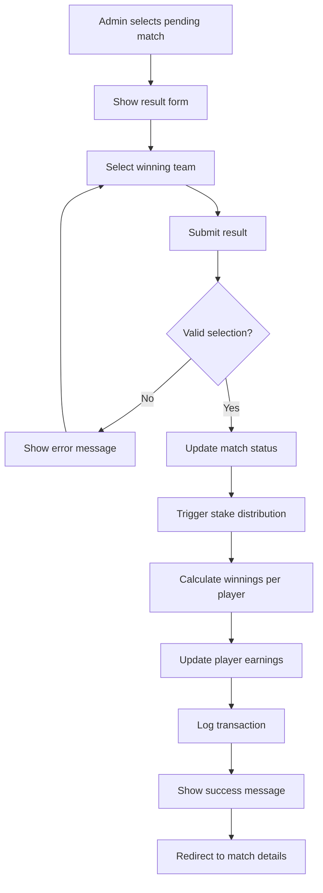

### 5.5 Player Statistics Entry Flow

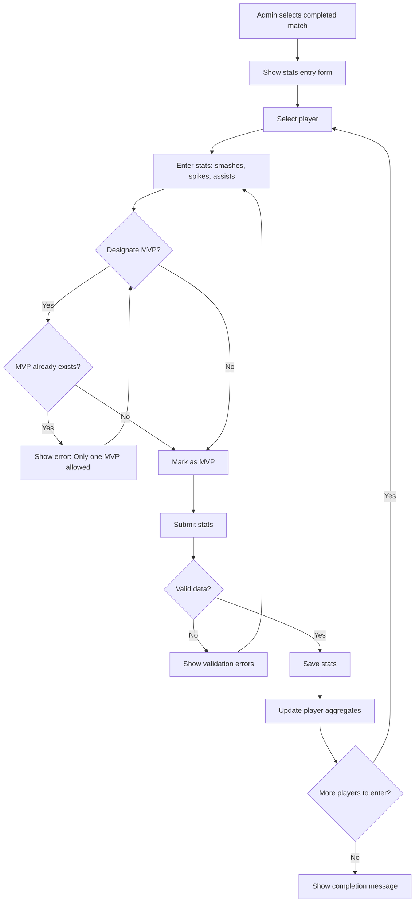

### 5.6 Financial Report Viewing Flow

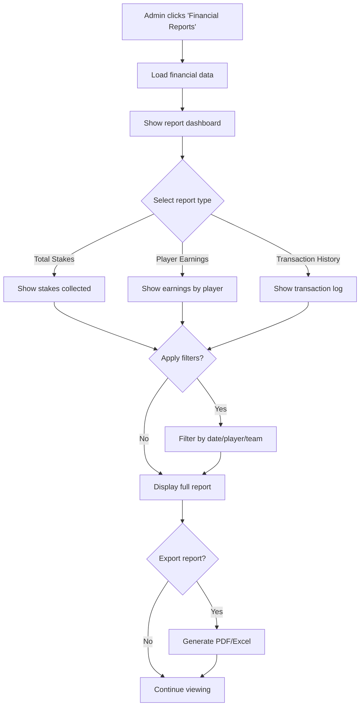

---

## 6. Mobile User Flows

### 6.1 Mobile Dashboard Access
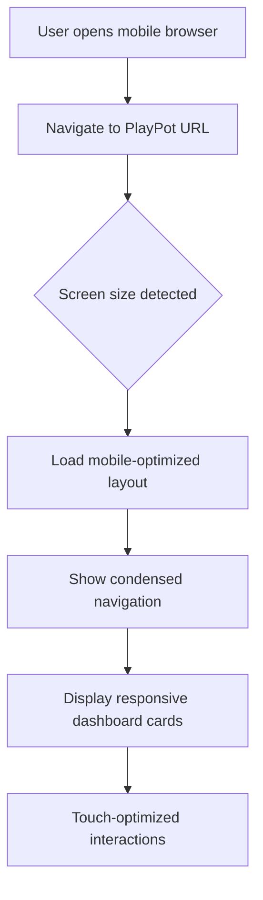

### 6.2 Mobile Match Creation
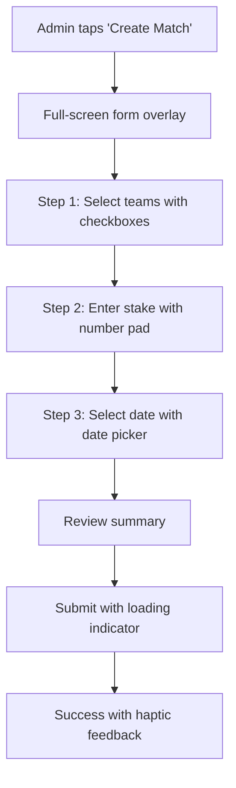

---

## 7. Error Handling Flows

### 7.1 Network Connection Error
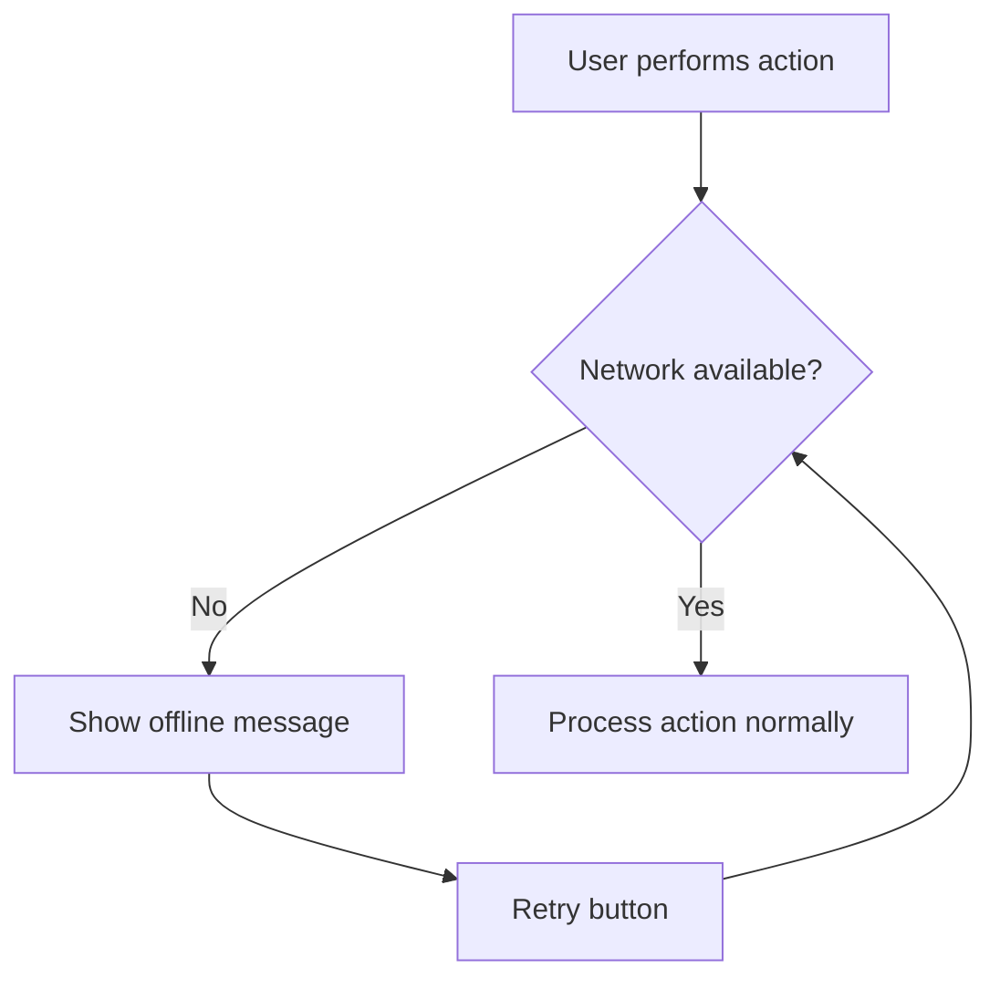

### 7.2 Validation Error Flow
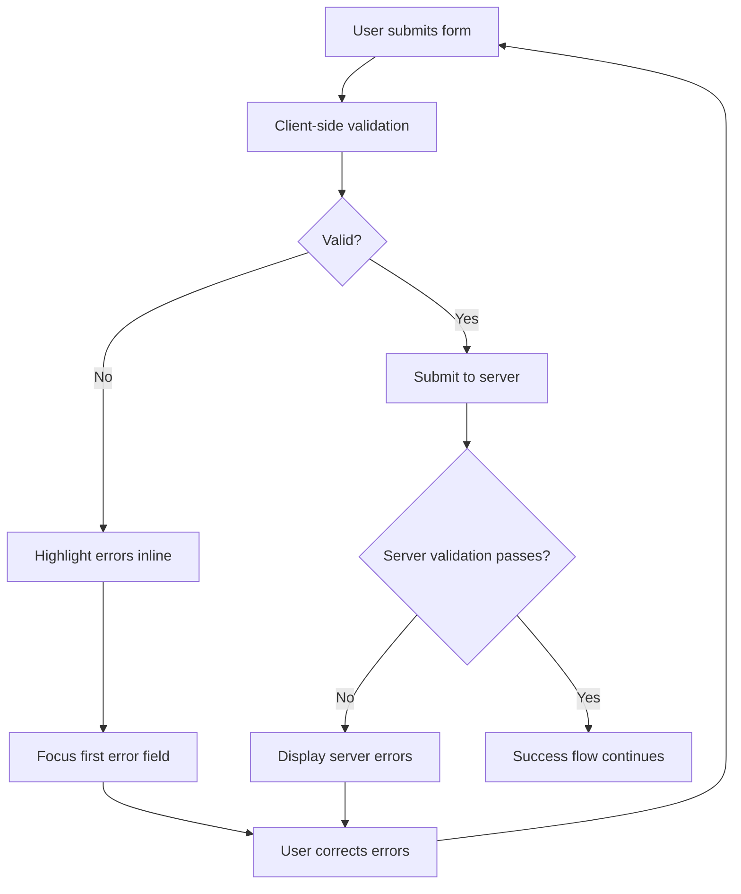

---

## 8. Story Mapping & Prioritization

### 8.1 MVP (Minimum Viable Product) Stories
**Must Have (High Priority):**
- Admin Login (1.1)
- Create Team (2.1)
- Add Players to Team (2.2)
- Create New Match (3.1)
- Record Match Results (3.2)
- Automatic Stake Distribution (4.1)

**Should Have (Medium Priority):**
- Session Management (1.2)
- Edit Team Information (2.3)
- Input Player Statistics (3.3)
- View Financial Reports (4.2)
- Player Performance Dashboard (5.1)
- Leaderboard Views (5.2)

**Could Have (Low Priority):**
- Transfer Player Between Teams (2.4)
- Match History View (6.1)
- Team Performance Analytics (6.2)

### 8.2 Story Dependencies
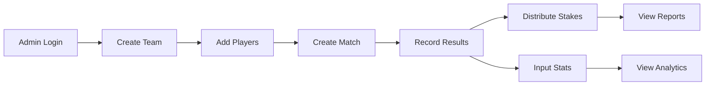

---

## 9. Definition of Done

For each user story to be considered complete:

### 9.1 Functional Requirements
- [ ] All acceptance criteria met
- [ ] Feature works on desktop and mobile
- [ ] Error handling implemented
- [ ] Input validation in place
- [ ] Success/error messages shown

### 9.2 Technical Requirements
- [ ] Code follows style guidelines
- [ ] Unit tests written and passing
- [ ] Integration tests passing
- [ ] No console errors
- [ ] Performance acceptable (<3s load time)

### 9.3 Quality Requirements
- [ ] UI matches design specifications
- [ ] Accessibility standards met
- [ ] Cross-browser compatibility verified
- [ ] Security considerations addressed
- [ ] Documentation updated

---

**Document Status:** Complete  
**Next Review:** Before Phase 3 Implementation  
**Dependencies:** Use Case Diagrams, Functional Decomposition 