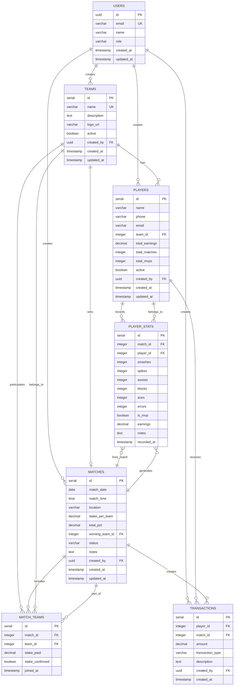

# Entity Relationship Diagram (ER Diagram)
## PlayPot - PostgreSQL Database Schema Design

**Document Version:** 1.0  
**Date:** January 2025  
**Created by:** Development Team

---

## 1. Overview

This document presents the Entity Relationship Diagram for PlayPot's PostgreSQL database. The design focuses on financial data integrity, efficient volleyball statistics tracking, and scalable team management.

---

## 2. ER Diagram



---

## 3. Entity Descriptions

### 3.1 USERS Table
**Purpose:** Authentication and user management  
**Supabase Integration:** Links with Supabase Auth

| Column | Data Type | Constraints | Description |
|--------|-----------|-------------|-------------|
| `id` | UUID | PRIMARY KEY | Supabase Auth user ID |
| `email` | VARCHAR(255) | UNIQUE, NOT NULL | User email address |
| `name` | VARCHAR(100) | NOT NULL | User display name |
| `role` | VARCHAR(20) | DEFAULT 'admin' | User role (admin, player) |
| `created_at` | TIMESTAMP | DEFAULT NOW() | Account creation time |
| `updated_at` | TIMESTAMP | DEFAULT NOW() | Last profile update |

**Indexes:**
- `idx_users_email` on `email`
- `idx_users_role` on `role`

### 3.2 TEAMS Table
**Purpose:** Volleyball team management

| Column | Data Type | Constraints | Description |
|--------|-----------|-------------|-------------|
| `id` | SERIAL | PRIMARY KEY | Unique team identifier |
| `name` | VARCHAR(50) | UNIQUE, NOT NULL | Team name |
| `description` | TEXT | | Team description/motto |
| `logo_url` | VARCHAR(255) | | Team logo image URL |
| `active` | BOOLEAN | DEFAULT TRUE | Team active status |
| `created_by` | UUID | FOREIGN KEY USERS(id) | Creator user ID |
| `created_at` | TIMESTAMP | DEFAULT NOW() | Team creation time |
| `updated_at` | TIMESTAMP | DEFAULT NOW() | Last team update |

**Indexes:**
- `idx_teams_name` on `name`
- `idx_teams_active` on `active`
- `idx_teams_created_by` on `created_by`

**Business Rules:**
- Team names must be unique across the system
- Teams can be marked inactive but not deleted (preserve history)
- Only active teams can participate in new matches

### 3.3 PLAYERS Table
**Purpose:** Player information and performance tracking

| Column | Data Type | Constraints | Description |
|--------|-----------|-------------|-------------|
| `id` | SERIAL | PRIMARY KEY | Unique player identifier |
| `name` | VARCHAR(100) | NOT NULL | Player full name |
| `phone` | VARCHAR(15) | | Player contact number |
| `email` | VARCHAR(255) | | Player email address |
| `team_id` | INTEGER | FOREIGN KEY TEAMS(id) | Current team assignment |
| `total_earnings` | DECIMAL(10,2) | DEFAULT 0 | Lifetime earnings |
| `total_matches` | INTEGER | DEFAULT 0 | Total matches played |
| `total_mvps` | INTEGER | DEFAULT 0 | Total MVP awards |
| `active` | BOOLEAN | DEFAULT TRUE | Player active status |
| `created_by` | UUID | FOREIGN KEY USERS(id) | Creator user ID |
| `created_at` | TIMESTAMP | DEFAULT NOW() | Player registration time |
| `updated_at` | TIMESTAMP | DEFAULT NOW() | Last player update |

**Indexes:**
- `idx_players_name` on `name`
- `idx_players_team_id` on `team_id`
- `idx_players_active` on `active`
- `idx_players_total_earnings` on `total_earnings DESC`

**Business Rules:**
- Players can only belong to one team at a time
- Player transfers maintain historical statistics
- Earnings are automatically calculated from match winnings

### 3.4 MATCHES Table
**Purpose:** Match information and results

| Column | Data Type | Constraints | Description |
|--------|-----------|-------------|-------------|
| `id` | SERIAL | PRIMARY KEY | Unique match identifier |
| `match_date` | DATE | NOT NULL | Match date |
| `match_time` | TIME | | Match start time |
| `location` | VARCHAR(100) | | Match venue |
| `stake_per_team` | DECIMAL(8,2) | NOT NULL, CHECK > 0 | Entry fee per team |
| `total_pot` | DECIMAL(10,2) | NOT NULL | Total prize pool |
| `winning_team_id` | INTEGER | FOREIGN KEY TEAMS(id) | Winner team ID |
| `status` | VARCHAR(20) | DEFAULT 'pending' | Match status |
| `notes` | TEXT | | Additional match notes |
| `created_by` | UUID | FOREIGN KEY USERS(id) | Creator user ID |
| `created_at` | TIMESTAMP | DEFAULT NOW() | Match creation time |
| `updated_at` | TIMESTAMP | DEFAULT NOW() | Last match update |

**Status Values:** `pending`, `in_progress`, `completed`, `cancelled`

**Indexes:**
- `idx_matches_date` on `match_date DESC`
- `idx_matches_status` on `status`
- `idx_matches_winning_team` on `winning_team_id`

**Business Rules:**
- Total pot = stake_per_team × number of participating teams
- Only completed matches have winning_team_id
- Match results cannot be changed once financial distribution occurs

### 3.5 MATCH_TEAMS Table
**Purpose:** Many-to-many relationship between matches and teams

| Column | Data Type | Constraints | Description |
|--------|-----------|-------------|-------------|
| `id` | SERIAL | PRIMARY KEY | Unique record identifier |
| `match_id` | INTEGER | FOREIGN KEY MATCHES(id) | Match reference |
| `team_id` | INTEGER | FOREIGN KEY TEAMS(id) | Team reference |
| `stake_paid` | DECIMAL(8,2) | NOT NULL | Amount paid by team |
| `stake_confirmed` | BOOLEAN | DEFAULT FALSE | Payment confirmation |
| `joined_at` | TIMESTAMP | DEFAULT NOW() | Team join time |

**Indexes:**
- `idx_match_teams_match_id` on `match_id`
- `idx_match_teams_team_id` on `team_id`
- `unique_match_team` UNIQUE on `(match_id, team_id)`

**Business Rules:**
- Each team can only participate once per match
- Stake payment must be confirmed before match starts
- Minimum 2 teams, maximum 6 teams per match

### 3.6 PLAYER_STATS Table
**Purpose:** Individual player performance per match

| Column | Data Type | Constraints | Description |
|--------|-----------|-------------|-------------|
| `id` | SERIAL | PRIMARY KEY | Unique stats record |
| `match_id` | INTEGER | FOREIGN KEY MATCHES(id) | Match reference |
| `player_id` | INTEGER | FOREIGN KEY PLAYERS(id) | Player reference |
| `smashes` | INTEGER | DEFAULT 0, CHECK >= 0 | Successful smashes |
| `spikes` | INTEGER | DEFAULT 0, CHECK >= 0 | Successful spikes |
| `assists` | INTEGER | DEFAULT 0, CHECK >= 0 | Assists made |
| `blocks` | INTEGER | DEFAULT 0, CHECK >= 0 | Successful blocks |
| `aces` | INTEGER | DEFAULT 0, CHECK >= 0 | Service aces |
| `errors` | INTEGER | DEFAULT 0, CHECK >= 0 | Unforced errors |
| `is_mvp` | BOOLEAN | DEFAULT FALSE | MVP designation |
| `earnings` | DECIMAL(8,2) | DEFAULT 0 | Match earnings |
| `notes` | TEXT | | Performance notes |
| `recorded_at` | TIMESTAMP | DEFAULT NOW() | Stats entry time |

**Indexes:**
- `idx_player_stats_match_id` on `match_id`
- `idx_player_stats_player_id` on `player_id`
- `idx_player_stats_mvp` on `is_mvp`
- `unique_player_match_stats` UNIQUE on `(match_id, player_id)`

**Business Rules:**
- Only one MVP per match
- Stats can only be recorded for participating players
- Earnings are auto-calculated based on team win and distribution

### 3.7 TRANSACTIONS Table
**Purpose:** Financial audit trail and transparency

| Column | Data Type | Constraints | Description |
|--------|-----------|-------------|-------------|
| `id` | SERIAL | PRIMARY KEY | Unique transaction ID |
| `player_id` | INTEGER | FOREIGN KEY PLAYERS(id) | Player receiving money |
| `match_id` | INTEGER | FOREIGN KEY MATCHES(id) | Related match |
| `amount` | DECIMAL(10,2) | NOT NULL | Transaction amount |
| `transaction_type` | VARCHAR(20) | NOT NULL | Type of transaction |
| `description` | TEXT | | Transaction description |
| `created_by` | UUID | FOREIGN KEY USERS(id) | Transaction creator |
| `created_at` | TIMESTAMP | DEFAULT NOW() | Transaction timestamp |

**Transaction Types:** `match_winning`, `stake_refund`, `adjustment`, `penalty`

**Indexes:**
- `idx_transactions_player_id` on `player_id`
- `idx_transactions_match_id` on `match_id`
- `idx_transactions_date` on `created_at DESC`
- `idx_transactions_type` on `transaction_type`

---

## 4. Key Relationships

### 4.1 Core Entity Relationships
```
USERS (1) ──→ (N) TEAMS
USERS (1) ──→ (N) PLAYERS  
USERS (1) ──→ (N) MATCHES
TEAMS (1) ──→ (N) PLAYERS
TEAMS (N) ←──→ (N) MATCHES (via MATCH_TEAMS)
PLAYERS (1) ──→ (N) PLAYER_STATS
PLAYERS (1) ──→ (N) TRANSACTIONS
MATCHES (1) ──→ (N) PLAYER_STATS
MATCHES (1) ──→ (N) TRANSACTIONS
```

### 4.2 Critical Foreign Key Constraints
- **CASCADE DELETE:** None (preserve all historical data)
- **RESTRICT DELETE:** All foreign keys restrict deletion
- **SET NULL:** Only `winning_team_id` can be NULL (for pending matches)

---

## 5. Data Integrity Rules

### 5.1 Database Constraints
```sql
-- Match total pot validation
ALTER TABLE matches ADD CONSTRAINT check_total_pot 
CHECK (total_pot = stake_per_team * (SELECT COUNT(*) FROM match_teams WHERE match_id = id));

-- Only one MVP per match
CREATE UNIQUE INDEX unique_mvp_per_match 
ON player_stats (match_id) WHERE is_mvp = true;

-- Player earnings must be non-negative
ALTER TABLE players ADD CONSTRAINT check_positive_earnings 
CHECK (total_earnings >= 0);

-- Transaction amounts for winnings must be positive
ALTER TABLE transactions ADD CONSTRAINT check_winning_amount 
CHECK (transaction_type != 'match_winning' OR amount > 0);
```

### 5.2 Business Logic Validations
- Teams must have minimum 3 active players to participate
- Matches cannot be marked completed without recording winner
- Financial distributions must equal total pot
- Player stats can only be recorded after match completion

---

## 6. Indexing Strategy

### 6.1 Performance Indexes
```sql
-- Query optimization for leaderboards
CREATE INDEX idx_players_earnings_desc ON players (total_earnings DESC);
CREATE INDEX idx_players_mvps_desc ON players (total_mvps DESC);

-- Match history queries
CREATE INDEX idx_matches_date_status ON matches (match_date DESC, status);

-- Player performance analytics
CREATE INDEX idx_player_stats_performance ON player_stats (player_id, smashes, spikes, assists);

-- Financial reporting
CREATE INDEX idx_transactions_date_type ON transactions (created_at DESC, transaction_type);
```

### 6.2 Composite Indexes
```sql
-- Team roster queries
CREATE INDEX idx_players_team_active ON players (team_id, active);

-- Match participation lookup
CREATE INDEX idx_match_teams_lookup ON match_teams (match_id, team_id, stake_confirmed);
```

---

## 7. Database Views (for Common Queries)

### 7.1 Player Performance View
```sql
CREATE VIEW player_performance AS
SELECT 
    p.id,
    p.name,
    t.name as team_name,
    p.total_earnings,
    p.total_matches,
    p.total_mvps,
    COALESCE(SUM(ps.smashes), 0) as total_smashes,
    COALESCE(SUM(ps.spikes), 0) as total_spikes,
    COALESCE(SUM(ps.assists), 0) as total_assists
FROM players p
LEFT JOIN teams t ON p.team_id = t.id
LEFT JOIN player_stats ps ON p.id = ps.player_id
GROUP BY p.id, p.name, t.name, p.total_earnings, p.total_matches, p.total_mvps;
```

### 7.2 Match Summary View
```sql
CREATE VIEW match_summary AS
SELECT 
    m.id,
    m.match_date,
    m.total_pot,
    m.status,
    w.name as winning_team,
    COUNT(mt.team_id) as participating_teams,
    COUNT(ps.player_id) as total_players
FROM matches m
LEFT JOIN teams w ON m.winning_team_id = w.id
LEFT JOIN match_teams mt ON m.id = mt.match_id
LEFT JOIN player_stats ps ON m.id = ps.match_id
GROUP BY m.id, m.match_date, m.total_pot, m.status, w.name;
```

---

## 8. Supabase Integration Notes

### 8.1 Row Level Security (RLS)
```sql
-- Enable RLS on all tables
ALTER TABLE teams ENABLE ROW LEVEL SECURITY;
ALTER TABLE players ENABLE ROW LEVEL SECURITY;
ALTER TABLE matches ENABLE ROW LEVEL SECURITY;

-- Example RLS policies
CREATE POLICY "Teams visible to all authenticated users" ON teams
    FOR SELECT USING (auth.role() = 'authenticated');

CREATE POLICY "Only creators can modify teams" ON teams
    FOR ALL USING (auth.uid() = created_by);
```

### 8.2 Real-time Subscriptions
- **Match updates:** Live match status and score updates
- **Financial transactions:** Real-time earning updates
- **Team rosters:** Live player additions/transfers

---

## 9. Migration Scripts

### 9.1 Table Creation Order
1. `users` (Supabase Auth integration)
2. `teams`
3. `players`
4. `matches`
5. `match_teams`
6. `player_stats`
7. `transactions`

### 9.2 Sample Data Requirements
- 3 teams with 5 players each
- 10 historical matches with complete data
- Player stats covering different performance levels
- Transaction history for financial testing

---

**ER Diagram Status:** ✅ Complete  
**Next Step:** Class Diagram for React components  
**Ready for:** Supabase database implementation 