# Class Diagram - Frontend Architecture
## PlayPot - React Component Structure & Data Models

**Document Version:** 1.0  
**Date:** January 2025  
**Created by:** Development Team

---

## 1. Overview

This document presents the Class Diagram for PlayPot's React frontend architecture. It defines the component hierarchy, data models, hooks, and services that will interact with the Supabase backend.

---

## 2. Frontend Architecture Diagram

```mermaid
classDiagram
    %% Core App Structure
    class App {
        -user: User | null
        -loading: boolean
        +render(): JSX.Element
        +handleAuthStateChange(): void
    }
    
    class AuthProvider {
        -user: User | null
        -session: Session | null
        -loading: boolean
        +signIn(email: string, password: string): Promise~void~
        +signOut(): Promise~void~
        +resetPassword(email: string): Promise~void~
    }
    
    class SupabaseProvider {
        -client: SupabaseClient
        +getClient(): SupabaseClient
        +query(table: string, filters?: object): Promise~any~
        +subscribe(table: string, callback: Function): void
    }
    
    %% Layout Components
    class Layout {
        -user: User
        +render(): JSX.Element
    }
    
    class Header {
        -user: User
        -menuOpen: boolean
        +toggleMenu(): void
        +handleLogout(): void
        +render(): JSX.Element
    }
    
    class Navigation {
        -currentPath: string
        -isAdmin: boolean
        +render(): JSX.Element
    }
    
    class Sidebar {
        -isOpen: boolean
        -navigationItems: NavItem[]
        +toggleSidebar(): void
        +render(): JSX.Element
    }
    
    %% Page Components
    class Dashboard {
        -stats: DashboardStats
        -recentMatches: Match[]
        -loading: boolean
        +loadDashboardData(): Promise~void~
        +render(): JSX.Element
    }
    
    class TeamsPage {
        -teams: Team[]
        -loading: boolean
        -showCreateModal: boolean
        +loadTeams(): Promise~void~
        +handleCreateTeam(): void
        +handleEditTeam(id: number): void
        +handleDeleteTeam(id: number): void
        +render(): JSX.Element
    }
    
    class PlayersPage {
        -players: Player[]
        -teams: Team[]
        -filters: PlayerFilters
        -loading: boolean
        +loadPlayers(): Promise~void~
        +filterPlayers(): Player[]
        +handleAddPlayer(): void
        +handleTransferPlayer(): void
        +render(): JSX.Element
    }
    
    class MatchesPage {
        -matches: Match[]
        -filters: MatchFilters
        -loading: boolean
        -showCreateModal: boolean
        +loadMatches(): Promise~void~
        +handleCreateMatch(): void
        +handleRecordResult(): void
        +handleInputStats(): void
        +render(): JSX.Element
    }
    
    class StatsPage {
        -leaderboards: Leaderboard[]
        -selectedMetric: string
        -timeRange: TimeRange
        +loadLeaderboards(): Promise~void~
        +changeMetric(metric: string): void
        +changeTimeRange(range: TimeRange): void
        +render(): JSX.Element
    }
    
    class ReportsPage {
        -financialData: FinancialReport
        -matchHistory: Match[]
        -dateRange: DateRange
        +loadFinancialData(): Promise~void~
        +exportReport(): void
        +render(): JSX.Element
    }
    
    %% Form Components
    class TeamForm {
        -formData: TeamFormData
        -errors: FormErrors
        -loading: boolean
        +handleSubmit(): Promise~void~
        +handleInputChange(): void
        +validateForm(): boolean
        +render(): JSX.Element
    }
    
    class PlayerForm {
        -formData: PlayerFormData
        -availableTeams: Team[]
        -errors: FormErrors
        +handleSubmit(): Promise~void~
        +render(): JSX.Element
    }
    
    class MatchForm {
        -formData: MatchFormData
        -availableTeams: Team[]
        -selectedTeams: Team[]
        -totalPot: number
        +calculateTotalPot(): number
        +handleTeamSelection(): void
        +handleSubmit(): Promise~void~
        +render(): JSX.Element
    }
    
    class StatsEntryForm {
        -match: Match
        -playerStats: PlayerStats[]
        -mvpSelected: boolean
        +handleStatChange(): void
        +handleMVPSelection(): void
        +validateStats(): boolean
        +handleSubmit(): Promise~void~
        +render(): JSX.Element
    }
    
    %% Display Components
    class TeamCard {
        -team: Team
        -playerCount: number
        -totalEarnings: number
        +onEdit(): void
        +onDelete(): void
        +onViewPlayers(): void
        +render(): JSX.Element
    }
    
    class PlayerCard {
        -player: Player
        -team: Team
        -stats: PlayerStats
        +onEdit(): void
        +onTransfer(): void
        +onViewDetails(): void
        +render(): JSX.Element
    }
    
    class MatchCard {
        -match: Match
        -teams: Team[]
        -status: MatchStatus
        +onRecordResult(): void
        +onInputStats(): void
        +onViewDetails(): void
        +render(): JSX.Element
    }
    
    class StatsChart {
        -data: ChartData
        -chartType: ChartType
        -options: ChartOptions
        +updateData(): void
        +exportChart(): void
        +render(): JSX.Element
    }
    
    class Leaderboard {
        -players: Player[]
        -metric: LeaderboardMetric
        -sortOrder: SortOrder
        +sortByMetric(): void
        +render(): JSX.Element
    }
    
    %% Utility Components
    class LoadingSpinner {
        -size: string
        -color: string
        +render(): JSX.Element
    }
    
    class ErrorMessage {
        -message: string
        -type: ErrorType
        -onDismiss(): void
        +render(): JSX.Element
    }
    
    class ConfirmDialog {
        -isOpen: boolean
        -title: string
        -message: string
        -onConfirm(): void
        -onCancel(): void
        +render(): JSX.Element
    }
    
    class Toast {
        -message: string
        -type: ToastType
        -duration: number
        +show(): void
        +hide(): void
        +render(): JSX.Element
    }
    
    %% Data Models
    class User {
        +id: string
        +email: string
        +name: string
        +role: UserRole
        +createdAt: Date
    }
    
    class Team {
        +id: number
        +name: string
        +description?: string
        +logoUrl?: string
        +active: boolean
        +playerCount?: number
        +totalEarnings?: number
        +createdBy: string
        +createdAt: Date
        +updatedAt: Date
    }
    
    class Player {
        +id: number
        +name: string
        +phone?: string
        +email?: string
        +teamId: number
        +teamName?: string
        +totalEarnings: number
        +totalMatches: number
        +totalMVPs: number
        +active: boolean
        +createdAt: Date
        +updatedAt: Date
    }
    
    class Match {
        +id: number
        +matchDate: Date
        +matchTime?: string
        +location?: string
        +stakePerTeam: number
        +totalPot: number
        +winningTeamId?: number
        +winningTeamName?: string
        +status: MatchStatus
        +notes?: string
        +participatingTeams?: Team[]
        +createdAt: Date
        +updatedAt: Date
    }
    
    class PlayerStats {
        +id: number
        +matchId: number
        +playerId: number
        +playerName?: string
        +smashes: number
        +spikes: number
        +assists: number
        +blocks: number
        +aces: number
        +errors: number
        +isMVP: boolean
        +earnings: number
        +notes?: string
        +recordedAt: Date
    }
    
    class Transaction {
        +id: number
        +playerId: number
        +matchId: number
        +amount: number
        +transactionType: TransactionType
        +description?: string
        +createdAt: Date
    }
    
    %% Custom Hooks
    class useAuth {
        +user: User | null
        +loading: boolean
        +signIn(): Promise~void~
        +signOut(): Promise~void~
        +resetPassword(): Promise~void~
    }
    
    class useTeams {
        +teams: Team[]
        +loading: boolean
        +error: string | null
        +createTeam(): Promise~Team~
        +updateTeam(): Promise~Team~
        +deleteTeam(): Promise~void~
        +refetch(): Promise~void~
    }
    
    class usePlayers {
        +players: Player[]
        +loading: boolean
        +error: string | null
        +createPlayer(): Promise~Player~
        +updatePlayer(): Promise~Player~
        +transferPlayer(): Promise~void~
        +refetch(): Promise~void~
    }
    
    class useMatches {
        +matches: Match[]
        +loading: boolean
        +error: string | null
        +createMatch(): Promise~Match~
        +recordResult(): Promise~void~
        +inputStats(): Promise~void~
        +refetch(): Promise~void~
    }
    
    class useStats {
        +leaderboards: Leaderboard[]
        +loading: boolean
        +getLeaderboard(): Promise~void~
        +getPlayerStats(): Promise~PlayerStats[]~
        +getFinancialReport(): Promise~FinancialReport~
    }
    
    %% Services
    class TeamService {
        +getAll(): Promise~Team[]~
        +getById(id: number): Promise~Team~
        +create(data: TeamFormData): Promise~Team~
        +update(id: number, data: TeamFormData): Promise~Team~
        +delete(id: number): Promise~void~
        +getPlayers(teamId: number): Promise~Player[]~
    }
    
    class PlayerService {
        +getAll(): Promise~Player[]~
        +getById(id: number): Promise~Player~
        +create(data: PlayerFormData): Promise~Player~
        +update(id: number, data: PlayerFormData): Promise~Player~
        +transfer(playerId: number, newTeamId: number): Promise~void~
        +getStats(playerId: number): Promise~PlayerStats[]~
    }
    
    class MatchService {
        +getAll(): Promise~Match[]~
        +getById(id: number): Promise~Match~
        +create(data: MatchFormData): Promise~Match~
        +recordResult(matchId: number, winningTeamId: number): Promise~void~
        +inputStats(matchId: number, stats: PlayerStats[]): Promise~void~
        +getParticipants(matchId: number): Promise~Player[]~
    }
    
    class StatsService {
        +getLeaderboard(metric: string): Promise~Player[]~
        +getPlayerPerformance(playerId: number): Promise~PlayerStats[]~
        +getFinancialReport(dateRange: DateRange): Promise~FinancialReport~
        +getMatchSummary(matchId: number): Promise~MatchSummary~
    }
    
    %% Relationships
    App --> AuthProvider
    App --> SupabaseProvider
    App --> Layout
    
    Layout --> Header
    Layout --> Navigation
    Layout --> Sidebar
    
    Dashboard --> useStats
    TeamsPage --> useTeams
    PlayersPage --> usePlayers
    MatchesPage --> useMatches
    StatsPage --> useStats
    
    TeamForm --> TeamService
    PlayerForm --> PlayerService
    MatchForm --> MatchService
    StatsEntryForm --> MatchService
    
    useTeams --> TeamService
    usePlayers --> PlayerService
    useMatches --> MatchService
    useStats --> StatsService
    
    TeamService --> Team
    PlayerService --> Player
    MatchService --> Match
    StatsService --> PlayerStats
```



---

## 3. Component Hierarchy

### 3.1 Application Structure
```
App
├── AuthProvider
├── SupabaseProvider
└── Router
    ├── PublicRoute (Login)
    └── PrivateRoute
        └── Layout
            ├── Header
            ├── Navigation/Sidebar
            └── Main Content
                ├── Dashboard
                ├── TeamsPage
                ├── PlayersPage
                ├── MatchesPage
                ├── StatsPage
                └── ReportsPage
```

### 3.2 Reusable Components
```
UI Components
├── Forms
│   ├── TeamForm
│   ├── PlayerForm
│   ├── MatchForm
│   └── StatsEntryForm
├── Cards
│   ├── TeamCard
│   ├── PlayerCard
│   └── MatchCard
├── Data Display
│   ├── Leaderboard
│   ├── StatsChart
│   └── DataTable
└── Feedback
    ├── LoadingSpinner
    ├── ErrorMessage
    ├── ConfirmDialog
    └── Toast
```

---

## 4. Data Flow Architecture

### 4.1 State Management Pattern


### 4.2 Props Flow
```typescript
// Parent → Child data flow
interface ComponentProps {
  data: EntityType
  loading: boolean
  error: string | null
  onAction: (data: any) => void
}

// Child → Parent event flow
interface EventHandlers {
  onCreate: (data: FormData) => Promise<void>
  onUpdate: (id: number, data: FormData) => Promise<void>
  onDelete: (id: number) => Promise<void>
}
```

---

## 5. Interface Definitions

### 5.1 Core Data Interfaces
```typescript
interface User {
  id: string
  email: string
  name: string
  role: 'admin' | 'player'
  createdAt: Date
}

interface Team {
  id: number
  name: string
  description?: string
  logoUrl?: string
  active: boolean
  playerCount?: number
  totalEarnings?: number
  createdBy: string
  createdAt: Date
  updatedAt: Date
}

interface Player {
  id: number
  name: string
  phone?: string
  email?: string
  teamId: number
  teamName?: string
  totalEarnings: number
  totalMatches: number
  totalMVPs: number
  active: boolean
  createdAt: Date
  updatedAt: Date
}

interface Match {
  id: number
  matchDate: Date
  matchTime?: string
  location?: string
  stakePerTeam: number
  totalPot: number
  winningTeamId?: number
  winningTeamName?: string
  status: 'pending' | 'in_progress' | 'completed' | 'cancelled'
  notes?: string
  participatingTeams?: Team[]
  createdAt: Date
  updatedAt: Date
}

interface PlayerStats {
  id: number
  matchId: number
  playerId: number
  playerName?: string
  smashes: number
  spikes: number
  assists: number
  blocks: number
  aces: number
  errors: number
  isMVP: boolean
  earnings: number
  notes?: string
  recordedAt: Date
}
```

### 5.2 Form Data Interfaces
```typescript
interface TeamFormData {
  name: string
  description?: string
  logoUrl?: string
}

interface PlayerFormData {
  name: string
  phone?: string
  email?: string
  teamId: number
}

interface MatchFormData {
  matchDate: Date
  matchTime?: string
  location?: string
  stakePerTeam: number
  participatingTeams: number[]
  notes?: string
}

interface StatsFormData {
  matchId: number
  playerStats: {
    playerId: number
    smashes: number
    spikes: number
    assists: number
    blocks: number
    aces: number
    errors: number
    isMVP: boolean
    notes?: string
  }[]
}
```

### 5.3 API Response Interfaces
```typescript
interface ApiResponse<T> {
  data?: T
  error?: string
  message?: string
  success: boolean
}

interface PaginatedResponse<T> {
  data: T[]
  count: number
  page: number
  pageSize: number
  totalPages: number
}

interface LeaderboardResponse {
  player: Player
  team: Team
  metric: number
  rank: number
}

interface FinancialReport {
  totalStakes: number
  totalDistributed: number
  totalMatches: number
  topEarners: Player[]
  monthlyBreakdown: MonthlyData[]
}
```

---

## 6. Custom Hooks Implementation

### 6.1 useAuth Hook
```typescript
export const useAuth = () => {
  const [user, setUser] = useState<User | null>(null)
  const [loading, setLoading] = useState(true)
  const [error, setError] = useState<string | null>(null)
  
  const signIn = async (email: string, password: string) => {
    // Supabase authentication logic
  }
  
  const signOut = async () => {
    // Sign out logic
  }
  
  return { user, loading, error, signIn, signOut }
}
```

### 6.2 useTeams Hook
```typescript
export const useTeams = () => {
  const [teams, setTeams] = useState<Team[]>([])
  const [loading, setLoading] = useState(false)
  const [error, setError] = useState<string | null>(null)
  
  const createTeam = async (data: TeamFormData): Promise<Team> => {
    // Team creation logic
  }
  
  const updateTeam = async (id: number, data: TeamFormData): Promise<Team> => {
    // Team update logic
  }
  
  return { teams, loading, error, createTeam, updateTeam, ... }
}
```

---

## 7. Service Layer Pattern

### 7.1 Base Service Class
```typescript
abstract class BaseService {
  protected supabase: SupabaseClient
  protected tableName: string
  
  constructor(tableName: string) {
    this.supabase = createClient(url, key)
    this.tableName = tableName
  }
  
  protected async handleResponse<T>(promise: Promise<any>): Promise<T> {
    try {
      const { data, error } = await promise
      if (error) throw error
      return data
    } catch (error) {
      console.error(`${this.tableName} service error:`, error)
      throw error
    }
  }
}
```

### 7.2 Team Service Implementation
```typescript
class TeamService extends BaseService {
  constructor() {
    super('teams')
  }
  
  async getAll(): Promise<Team[]> {
    return this.handleResponse(
      this.supabase
        .from(this.tableName)
        .select('*, players(count)')
        .eq('active', true)
        .order('created_at', { ascending: false })
    )
  }
  
  async create(data: TeamFormData): Promise<Team> {
    return this.handleResponse(
      this.supabase
        .from(this.tableName)
        .insert([{ ...data, created_by: this.getCurrentUserId() }])
        .select()
        .single()
    )
  }
}
```

---

## 8. Component Composition Patterns

### 8.1 Higher-Order Components
```typescript
// withAuth HOC for protected routes
export const withAuth = <P extends object>(
  Component: React.ComponentType<P>
) => {
  return (props: P) => {
    const { user, loading } = useAuth()
    
    if (loading) return <LoadingSpinner />
    if (!user) return <Navigate to="/login" />
    
    return <Component {...props} />
  }
}

// withErrorBoundary HOC for error handling
export const withErrorBoundary = <P extends object>(
  Component: React.ComponentType<P>
) => {
  return (props: P) => (
    <ErrorBoundary>
      <Component {...props} />
    </ErrorBoundary>
  )
}
```

### 8.2 Compound Components
```typescript
// Modal compound component
export const Modal = {
  Root: ModalRoot,
  Header: ModalHeader,
  Body: ModalBody,
  Footer: ModalFooter,
}

// Usage
<Modal.Root isOpen={isOpen} onClose={handleClose}>
  <Modal.Header>Create Team</Modal.Header>
  <Modal.Body>
    <TeamForm onSubmit={handleSubmit} />
  </Modal.Body>
  <Modal.Footer>
    <Button onClick={handleClose}>Cancel</Button>
  </Modal.Footer>
</Modal.Root>
```

---

## 9. Performance Optimization

### 9.1 React.memo Usage
```typescript
// Memoize expensive components
export const PlayerCard = React.memo<PlayerCardProps>(({ player, onEdit }) => {
  return (
    <div className="player-card">
      {/* Component content */}
    </div>
  )
}, (prevProps, nextProps) => {
  return prevProps.player.id === nextProps.player.id &&
         prevProps.player.updatedAt === nextProps.player.updatedAt
})
```

### 9.2 Virtual Scrolling for Large Lists
```typescript
// Use react-window for large player/match lists
export const VirtualizedPlayerList = ({ players }: { players: Player[] }) => {
  return (
    <FixedSizeList
      height={600}
      itemCount={players.length}
      itemSize={120}
      itemData={players}
    >
      {({ index, style, data }) => (
        <div style={style}>
          <PlayerCard player={data[index]} />
        </div>
      )}
    </FixedSizeList>
  )
}
```

---

## 10. Mobile Responsiveness

### 10.1 Responsive Breakpoints
```typescript
// Tailwind CSS breakpoints
const breakpoints = {
  sm: '640px',   // Mobile landscape
  md: '768px',   // Tablet
  lg: '1024px',  // Desktop
  xl: '1280px',  // Large desktop
}

// Custom hook for responsive behavior
export const useResponsive = () => {
  const [screenSize, setScreenSize] = useState<ScreenSize>('mobile')
  
  useEffect(() => {
    const updateScreenSize = () => {
      const width = window.innerWidth
      if (width < 768) setScreenSize('mobile')
      else if (width < 1024) setScreenSize('tablet')
      else setScreenSize('desktop')
    }
    
    updateScreenSize()
    window.addEventListener('resize', updateScreenSize)
    return () => window.removeEventListener('resize', updateScreenSize)
  }, [])
  
  return screenSize
}
```

### 10.2 Mobile-First Component Design
```typescript
export const ResponsiveMatchCard = ({ match }: { match: Match }) => {
  const screenSize = useResponsive()
  
  if (screenSize === 'mobile') {
    return <MobileMatchCard match={match} />
  }
  
  return <DesktopMatchCard match={match} />
}
```

---

## 11. Testing Strategy

### 11.1 Component Testing
```typescript
// Example component test
describe('TeamCard', () => {
  it('renders team information correctly', () => {
    const mockTeam: Team = {
      id: 1,
      name: 'Test Team',
      playerCount: 5,
      totalEarnings: 1000,
      // ... other properties
    }
    
    render(<TeamCard team={mockTeam} onEdit={jest.fn()} />)
    
    expect(screen.getByText('Test Team')).toBeInTheDocument()
    expect(screen.getByText('5 players')).toBeInTheDocument()
    expect(screen.getByText('$1000')).toBeInTheDocument()
  })
})
```

### 11.2 Hook Testing
```typescript
// Example hook test
describe('useTeams', () => {
  it('loads teams on mount', async () => {
    const { result } = renderHook(() => useTeams())
    
    await waitFor(() => {
      expect(result.current.loading).toBe(false)
      expect(result.current.teams).toHaveLength(3)
    })
  })
})
```

---

**Class Diagram Status:** ✅ Complete  
**Next Step:** Activity Diagram for process flows  
**Ready for:** React component implementation 