# Activity Diagrams - Business Process Flows
## PlayPot - Key Volleyball Management Workflows

**Document Version:** 1.0  
**Date:** January 2025  
**Created by:** Development Team

---

## 1. Overview

This document presents Activity Diagrams for PlayPot's core business processes. These diagrams illustrate the step-by-step workflows for managing volleyball matches, teams, players, and financial distributions.

---

## 2. Core Business Processes

### 2.1 Match Creation and Management Process

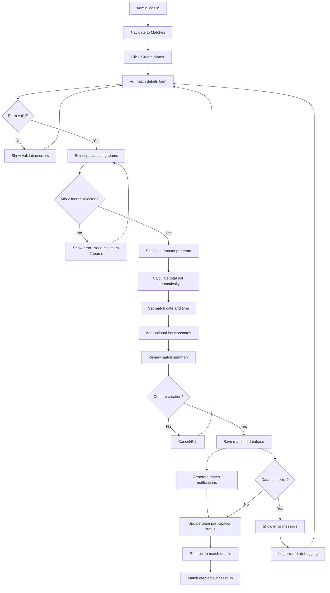

### 2.2 Match Result Recording Process

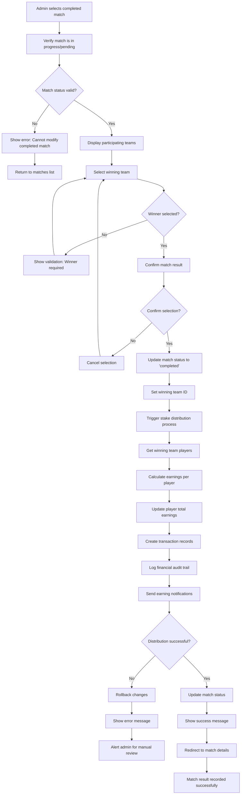

### 2.3 Player Statistics Entry Process

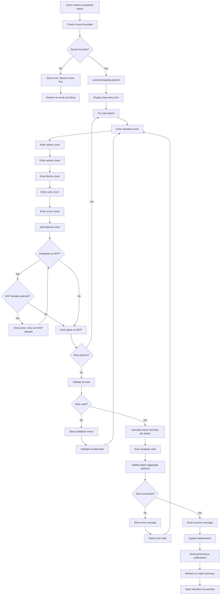

### 2.4 Team Creation and Management Process

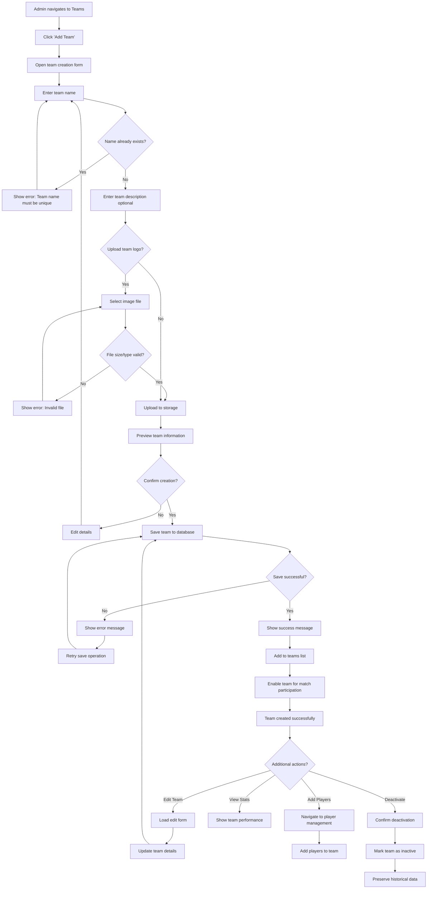

### 2.5 Player Transfer Process

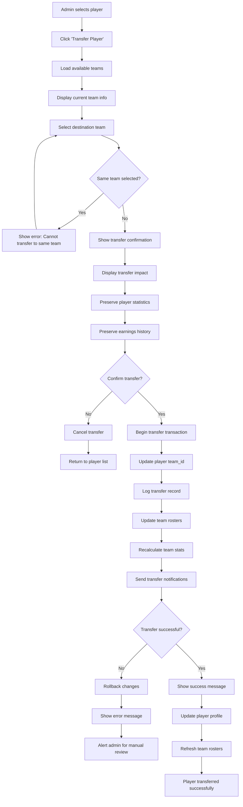

### 2.6 Financial Distribution Algorithm

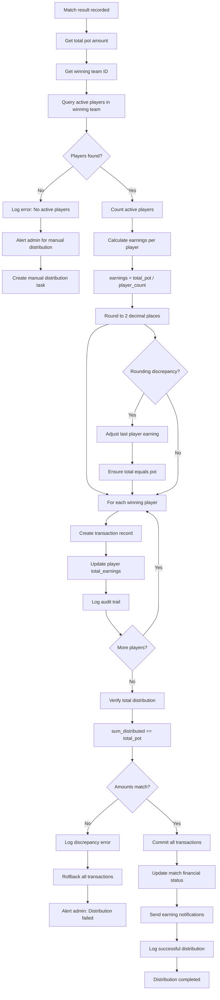

### 2.7 Leaderboard Generation Process

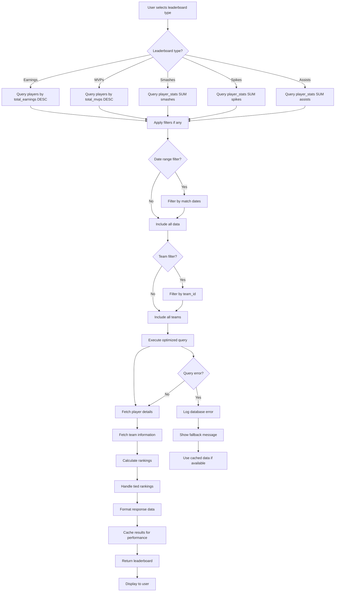

### 2.8 User Authentication Flow

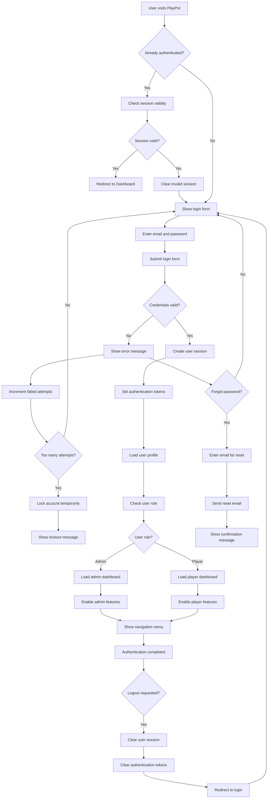

---

## 3. Error Handling and Edge Cases

### 3.1 Database Connection Failures
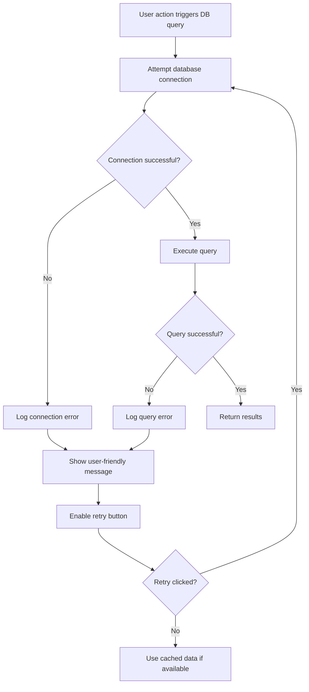

### 3.2 Concurrent User Actions
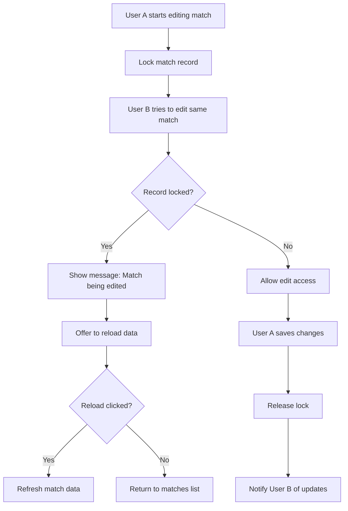

### 3.3 Data Validation Failures
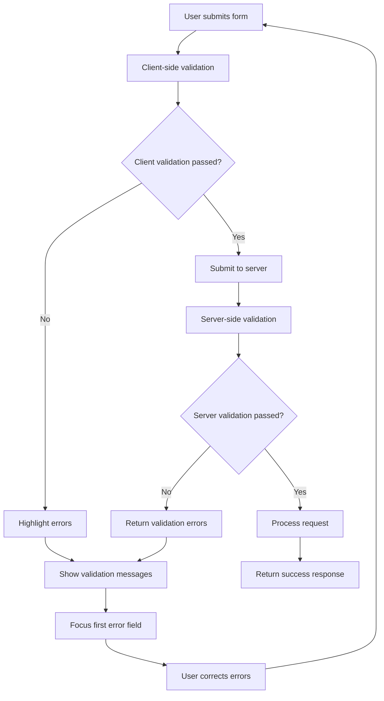

---

## 4. Performance Optimization Flows

### 4.1 Data Loading Strategy
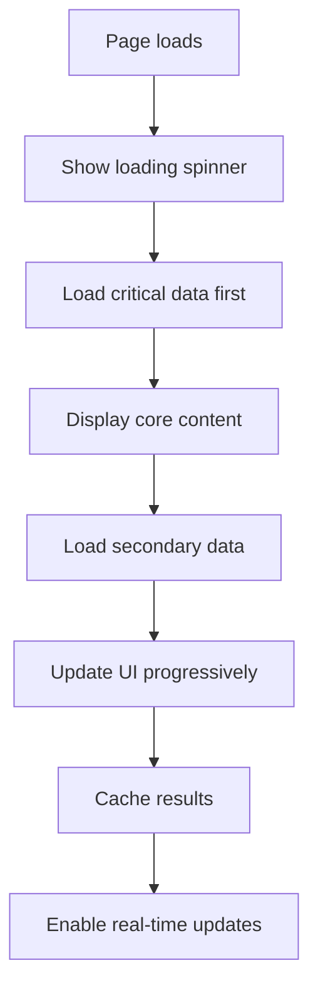

### 4.2 Real-time Updates Flow
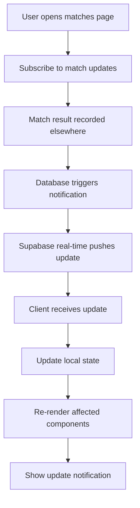

---

## 5. Mobile-Specific Workflows

### 5.1 Mobile Match Creation
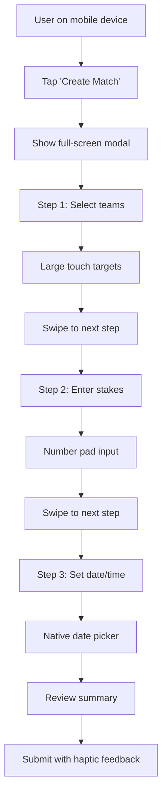

### 5.2 Mobile Stats Entry
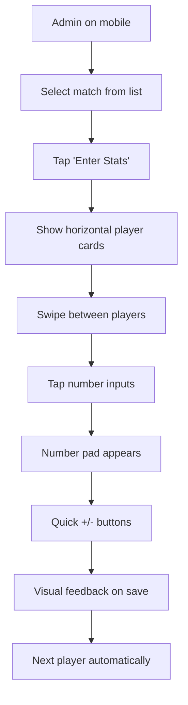

---

## 6. Integration Points

### 6.1 Supabase Integration Flow
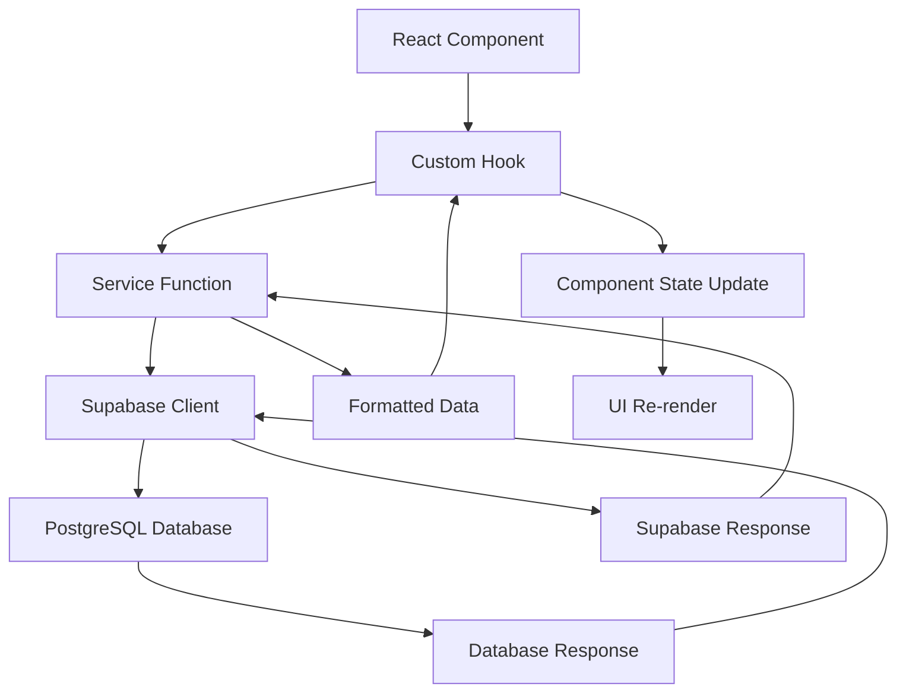

### 6.2 Real-time Subscription Flow
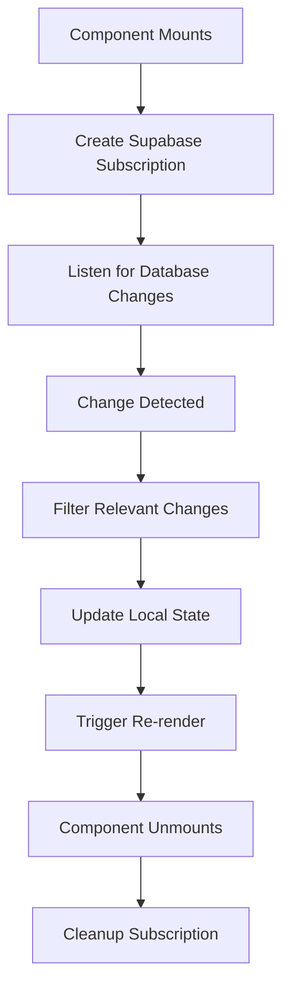

---

## 7. Business Rules Enforcement

### 7.1 Match Participation Rules
- Minimum 2 teams, maximum 6 teams per match
- Teams must have minimum 3 active players
- Stake amount must be positive and divisible by participating teams
- Only active teams can join new matches

### 7.2 Financial Rules
- Total distribution must equal total pot exactly
- Player earnings cannot be negative
- Only one financial transaction per player per match
- Audit trail required for all money movements

### 7.3 Statistics Rules
- Only one MVP per match
- Statistics can only be recorded after match completion
- Negative statistics not allowed
- Player must be on participating team to have stats

---

**Activity Diagrams Status:** ✅ Complete  
**Next Step:** Sequence Diagram for API interactions  
**Business Logic:** Ready for implementation 