# Sequence Diagrams - API Interaction Flows
## PlayPot - System Communication Patterns

**Document Version:** 1.0  
**Date:** January 2025  
**Created by:** Development Team

---

## 1. Overview

This document presents Sequence Diagrams for PlayPot's API interactions between the React frontend, Supabase services, and PostgreSQL database. These diagrams show the temporal flow of messages and data exchange patterns.

---

## 2. Core API Interaction Sequences

### 2.1 User Authentication Sequence

### 2.2 Match Creation Sequence

### 2.3 Match Result Recording and Financial Distribution

### 2.4 Player Statistics Entry Sequence

```mermaid
sequenceDiagram
    participant A as Admin
    participant SC as StatsComponent
    participant SH as useStats Hook
    participant SS as StatsService
    participant MS as MatchService
    participant SUP as Supabase Client
    participant PG as PostgreSQL
    
    Note over A,PG: Load Match Players
    
    A->>SC: Select match for stats entry
    SC->>SH: loadMatchPlayers(matchId)
    SH->>MS: getMatchParticipants(matchId)
    
    MS->>SUP: Complex query for players
    SUP->>PG: SELECT p.*, t.name as team_name FROM players p JOIN...
    PG-->>SUP: Player data with teams
    SUP-->>MS: Formatted player list
    MS-->>SH: Players data
    SH-->>SC: Update players state
    SC-->>A: Show stats entry form
    
    Note over A,PG: Enter Statistics
    
    A->>SC: Fill stats for all players
    SC->>SH: submitStats(matchId, playerStats)
    SH->>SS: createPlayerStats(statsData)
    
    Note over SS,PG: Validation & Transaction
    
    SS->>SUP: Validate MVP selection
    SUP->>PG: SELECT COUNT(*) FROM player_stats WHERE match_id=? AND is_mvp=true
    PG-->>SUP: MVP count
    
    alt MVP validation fails
        SUP-->>SS: Error: Multiple MVPs
        SS-->>SH: Validation error
        SH-->>SC: Show error
        SC-->>A: Highlight MVP conflict
    else MVP validation passes
        SS->>SUP: Begin transaction
        SUP->>PG: BEGIN TRANSACTION
        
        loop For each player's stats
            SS->>SUP: Insert player stats
            SUP->>PG: INSERT INTO player_stats (match_id, player_id, ...)
            PG-->>SUP: Stats inserted
            
            SS->>SUP: Update player aggregates
            SUP->>PG: UPDATE players SET total_matches = total_matches + 1, ...
            PG-->>SUP: Player updated
        end
        
        SS->>SUP: Commit transaction
        SUP->>PG: COMMIT
        PG-->>SUP: Transaction committed
        
        SUP-->>SS: All stats saved
        SS-->>SH: Success response
        SH-->>SC: Update stats state
        SC-->>A: Show success message
    end
```

### 2.5 Real-time Data Subscription Sequence

### 2.6 Leaderboard Generation Sequence

### 2.7 Error Handling and Retry Sequence

### 2.8 Mobile-Optimized API Sequence

---

## 3. Security and Authorization Sequences

### 3.1 Row Level Security (RLS) Enforcement

### 3.2 API Rate Limiting Sequence

---

## 4. Performance Optimization Sequences

### 4.1 Data Prefetching Sequence

### 4.2 Batch Operations Sequence

---

## 5. Integration Testing Sequences

### 5.1 End-to-End Test Sequence

---

## 6. Monitoring and Logging Sequences

### 6.1 Performance Monitoring Sequence

---

**Sequence Diagrams Status:** ✅ Complete  
**Next Step:** Data Flow Diagram for system overview  
**API Patterns:** Ready for implementation 