# Data Flow Diagrams - System Data Movement
## PlayPot - Information Flow Architecture

**Document Version:** 1.0  
**Date:** January 2025  
**Created by:** Development Team

---

## 1. Overview

This document presents Data Flow Diagrams (DFDs) for PlayPot, illustrating how data moves through the system from external entities through processes, data stores, and back to users. These diagrams help understand the information architecture and data transformation patterns.

---

## 2. Context Level DFD (Level 0)

```mermaid
flowchart TD
    %% External Entities
    Admin[👨‍💼 Admin<br/>Match Organizer]
    Players[🏐 Players<br/>Team Members]
    
    %% Main System
    PlayPot[📱 PlayPot System<br/>Volleyball Management]
    
    %% Data Flows - Admin
    Admin -->|Team Data<br/>Player Data<br/>Match Setup<br/>Results Entry<br/>Stats Input| PlayPot
    PlayPot -->|Team Rosters<br/>Match History<br/>Financial Reports<br/>Player Statistics<br/>Leaderboards| Admin
    
    %% Data Flows - Players
    Players -->|Login Credentials<br/>Profile Updates| PlayPot
    PlayPot -->|Personal Stats<br/>Earnings History<br/>Match Notifications<br/>Team Information| Players
    
    %% System Boundaries
    style PlayPot fill:#e1f5fe,stroke:#01579b,stroke-width:3px
    style Admin fill:#fff3e0,stroke:#e65100,stroke-width:2px
    style Players fill:#f3e5f5,stroke:#4a148c,stroke-width:2px
```

---

## 3. Level 1 DFD - Major System Processes

```mermaid
flowchart TD
    %% External Entities
    Admin[👨‍💼 Admin]
    Players[🏐 Players]
    
    %% Main Processes
    P1[1.0<br/>User<br/>Authentication]
    P2[2.0<br/>Team<br/>Management]
    P3[3.0<br/>Player<br/>Management]
    P4[4.0<br/>Match<br/>Management]
    P5[5.0<br/>Financial<br/>Distribution]
    P6[6.0<br/>Statistics<br/>Processing]
    P7[7.0<br/>Reporting &<br/>Analytics]
    
    %% Data Stores
    DS1[(D1: Users)]
    DS2[(D2: Teams)]
    DS3[(D3: Players)]
    DS4[(D4: Matches)]
    DS5[(D5: Player Stats)]
    DS6[(D6: Transactions)]
    
    %% External to Process Flows
    Admin -->|Login Credentials| P1
    Players -->|Login Credentials| P1
    
    Admin -->|Team Info| P2
    Admin -->|Player Info| P3
    Admin -->|Match Setup<br/>Results| P4
    Admin -->|Stats Entry| P6
    
    %% Process to External Flows
    P1 -->|Auth Status| Admin
    P1 -->|Auth Status| Players
    P7 -->|Reports<br/>Analytics| Admin
    P7 -->|Personal Stats| Players
    
    %% Process to Data Store Flows
    P1 -.->|User Data| DS1
    P2 -.->|Team Data| DS2
    P3 -.->|Player Data| DS3
    P4 -.->|Match Data| DS4
    P5 -.->|Transaction Data| DS6
    P6 -.->|Stats Data| DS5
    
    %% Data Store to Process Flows
    DS1 -.->|User Info| P1
    DS2 -.->|Team Info| P2
    DS2 -.->|Team Info| P4
    DS3 -.->|Player Info| P3
    DS3 -.->|Player Info| P4
    DS3 -.->|Player Info| P5
    DS4 -.->|Match Info| P4
    DS4 -.->|Match Info| P5
    DS4 -.->|Match Info| P6
    DS5 -.->|Stats Info| P6
    DS5 -.->|Stats Info| P7
    DS6 -.->|Financial Data| P7
    
    %% Inter-Process Flows
    P4 -->|Match Results| P5
    P5 -->|Earnings Data| P3
    P6 -->|Aggregated Stats| P3
    
    %% Styling
    style P1 fill:#e8f5e8,stroke:#2e7d32
    style P2 fill:#fff3e0,stroke:#f57c00
    style P3 fill:#f3e5f5,stroke:#7b1fa2
    style P4 fill:#e3f2fd,stroke:#1976d2
    style P5 fill:#ffebee,stroke:#c62828
    style P6 fill:#f1f8e9,stroke:#558b2f
    style P7 fill:#fce4ec,stroke:#ad1457
```

---

## 4. Level 2 DFD - Detailed Process Breakdowns

### 4.1 Match Management Process (4.0) Detailed

```mermaid
flowchart TD
    %% External Entities
    Admin[👨‍💼 Admin]
    
    %% Sub-processes
    P41[4.1<br/>Create<br/>Match]
    P42[4.2<br/>Manage<br/>Participation]
    P43[4.3<br/>Record<br/>Results]
    P44[4.4<br/>Validate<br/>Match Data]
    
    %% Data Stores
    DS2[(D2: Teams)]
    DS3[(D3: Players)]
    DS4[(D4: Matches)]
    DS7[(D7: Match Teams)]
    
    %% External to Process
    Admin -->|Match Setup Data| P41
    Admin -->|Team Selection| P42
    Admin -->|Match Results| P43
    
    %% Process to External
    P41 -->|Match Created| Admin
    P43 -->|Result Confirmed| Admin
    P44 -->|Validation Errors| Admin
    
    %% Inter-Process Flows
    P41 -->|Match Info| P42
    P41 -->|Match Data| P44
    P42 -->|Participation Data| P44
    P43 -->|Result Data| P44
    P44 -->|Validated Data| P41
    P44 -->|Validated Data| P43
    
    %% Data Store Interactions
    P41 -.->|New Match| DS4
    P42 -.->|Team Participation| DS7
    P43 -.->|Match Results| DS4
    
    DS2 -.->|Team Info| P41
    DS2 -.->|Team Info| P42
    DS3 -.->|Player Count| P44
    DS4 -.->|Match Data| P43
    DS7 -.->|Participation Info| P44
    
    %% To Other Major Processes
    P43 -->|Results| P5[5.0 Financial Distribution]
    P43 -->|Results| P6[6.0 Statistics Processing]
```

### 4.2 Financial Distribution Process (5.0) Detailed

```mermaid
flowchart TD
    %% Input from other processes
    P4[4.0 Match Management]
    
    %% Sub-processes
    P51[5.1<br/>Calculate<br/>Distribution]
    P52[5.2<br/>Update<br/>Earnings]
    P53[5.3<br/>Create<br/>Transactions]
    P54[5.4<br/>Validate<br/>Amounts]
    
    %% Data Stores
    DS3[(D3: Players)]
    DS4[(D4: Matches)]
    DS6[(D6: Transactions)]
    
    %% External Entity
    Admin[👨‍💼 Admin]
    
    %% Main Flow
    P4 -->|Match Results<br/>Winning Team| P51
    P51 -->|Distribution Plan| P54
    P54 -->|Validated Plan| P52
    P52 -->|Updated Players| P53
    P53 -->|Transaction Records| P54
    P54 -->|Final Validation| Admin
    
    %% Data Store Interactions
    DS4 -.->|Total Pot<br/>Stake Info| P51
    DS3 -.->|Team Players<br/>Current Earnings| P51
    DS3 -.->|Player Data| P52
    P52 -.->|Updated Earnings| DS3
    P53 -.->|Transaction Log| DS6
    
    %% Error Handling
    P54 -->|Validation Errors| Admin
    P54 -->|Rollback Required| P52
    
    %% Output to other processes
    P53 -->|Earning Updates| P7[7.0 Reporting]
    P53 -->|Notifications| NotificationService[📧 Notification Service]
```

### 4.3 Statistics Processing (6.0) Detailed

```mermaid
flowchart TD
    %% Input sources
    Admin[👨‍💼 Admin]
    P4[4.0 Match Management]
    
    %% Sub-processes
    P61[6.1<br/>Collect<br/>Match Stats]
    P62[6.2<br/>Validate<br/>Statistics]
    P63[6.3<br/>Update<br/>Aggregates]
    P64[6.4<br/>Calculate<br/>Rankings]
    
    %% Data Stores
    DS3[(D3: Players)]
    DS4[(D4: Matches)]
    DS5[(D5: Player Stats)]
    DS8[(D8: Leaderboards)]
    
    %% Main Flow
    Admin -->|Player Performance<br/>Data| P61
    P4 -->|Match Context| P61
    P61 -->|Raw Stats| P62
    P62 -->|Validated Stats| P63
    P63 -->|Updated Aggregates| P64
    P64 -->|Rankings| DS8
    
    %% Data Store Interactions
    DS4 -.->|Match Info<br/>Participants| P61
    DS3 -.->|Current Player Stats| P63
    P61 -.->|Match Statistics| DS5
    P63 -.->|Updated Totals| DS3
    
    %% Validation Flows
    P62 -->|MVP Conflicts<br/>Invalid Stats| Admin
    DS5 -.->|Existing MVP<br/>Historical Stats| P62
    
    %% Output to Reporting
    P64 -->|Performance Data| P7[7.0 Reporting]
    DS5 -.->|Detailed Stats| P7
    DS8 -.->|Leaderboard Data| P7
```

---

## 5. Data Transformation Flows

### 5.1 Match Creation Data Flow

### 5.2 Financial Distribution Data Flow

### 5.3 Statistics Aggregation Data Flow

```mermaid
flowchart LR
    %% Input
    A[Player Stats:<br/>• Match Performance<br/>• Individual Metrics<br/>• MVP Status]
    
    %% Processing
    B[Validate:<br/>• Non-negative Values<br/>• Single MVP<br/>• Player Participation]
    C[Aggregate:<br/>• Running Totals<br/>• Match Count<br/>• MVP Count]
    D[Rank:<br/>• Performance Metrics<br/>• Earnings Ranking<br/>• Team Standing]
    
    %% Output
    E[Updated Views:<br/>• Player Profiles<br/>• Leaderboards<br/>• Team Stats]
    
    A --> B --> C --> D --> E
    
    %% Cache Updates
    D --> F[Cache Refresh:<br/>• Leaderboard Cache<br/>• Player Cache<br/>• Team Cache]
    
    style A fill:#f3e5f5
    style E fill:#e8f5e8
    style F fill:#fff8e1
```

---

## 6. Real-time Data Flow

### 6.1 Live Match Updates

```mermaid
flowchart TD
    %% Data Sources
    A[Admin Device<br/>📱 Match Update]
    B[Database<br/>🗄️ Change Trigger]
    C[Supabase Realtime<br/>⚡ Event Bus]
    
    %% Subscribers
    D[Mobile App 1<br/>📱 Player View]
    E[Mobile App 2<br/>📱 Spectator]
    F[Desktop Admin<br/>💻 Dashboard]
    
    %% Flow
    A -->|Result Entry| B
    B -->|Change Event| C
    C -->|Push Update| D
    C -->|Push Update| E
    C -->|Push Update| F
    
    %% Local Updates
    D -->|Update UI| D1[Local State<br/>• Match Status<br/>• Scores<br/>• Earnings]
    E -->|Update UI| E1[Local State<br/>• Live Scores<br/>• Team Performance]
    F -->|Update UI| F1[Local State<br/>• Admin Dashboard<br/>• Financial Data]
    
    style A fill:#e3f2fd
    style B fill:#fff3e0
    style C fill:#e8f5e8
    style D fill:#f3e5f5
    style E fill:#f3e5f5
    style F fill:#f3e5f5
```

### 6.2 Notification Data Flow

```mermaid
flowchart LR
    %% Trigger Events
    A[System Events:<br/>• Match Created<br/>• Result Recorded<br/>• Money Distributed]
    
    %% Processing
    B[Notification Engine:<br/>• Determine Recipients<br/>• Format Messages<br/>• Choose Channels]
    
    %% Channels
    C[In-App:<br/>• Toast Messages<br/>• Dashboard Updates<br/>• Badge Counters]
    D[Push:<br/>• Mobile Notifications<br/>• Email Alerts<br/>• SMS Updates]
    
    %% Recipients
    E[Players:<br/>• Earning Alerts<br/>• Match Invites<br/>• Stats Updates]
    F[Admins:<br/>• System Alerts<br/>• Error Notifications<br/>• Reports Ready]
    
    A --> B
    B --> C --> E
    B --> D --> E
    C --> F
    D --> F
    
    style A fill:#fff3e0
    style B fill:#e8f5e8
    style C fill:#e3f2fd
    style D fill:#f3e5f5
```

---

## 7. Data Security and Privacy Flows

### 7.1 Authentication Data Flow

```mermaid
flowchart TD
    %% User Input
    A[User Credentials:<br/>• Email<br/>• Password]
    
    %% Authentication Process
    B[Supabase Auth:<br/>• Verify Credentials<br/>• Generate Tokens<br/>• Create Session]
    
    %% Security Layers
    C[Row Level Security:<br/>• Apply Policies<br/>• Filter Data<br/>• Authorize Access]
    
    %% Data Access
    D[Authorized Data:<br/>• User Profile<br/>• Accessible Teams<br/>• Permitted Actions]
    
    %% Client Storage
    E[Client Side:<br/>• Session Tokens<br/>• User Context<br/>• Cached Permissions]
    
    A --> B --> C --> D --> E
    
    %% Security Validations
    B -.->|Invalid Credentials| F[Access Denied:<br/>• Clear Tokens<br/>• Redirect Login<br/>• Log Attempt]
    C -.->|Unauthorized| F
    
    style A fill:#f3e5f5
    style B fill:#e8f5e8
    style C fill:#fff3e0
    style D fill:#e3f2fd
    style F fill:#ffebee
```

### 7.2 Data Encryption Flow

```mermaid
flowchart LR
    %% Source Data
    A[Sensitive Data:<br/>• Financial Records<br/>• Personal Info<br/>• Auth Tokens]
    
    %% Encryption Process
    B[Encryption Layer:<br/>• TLS in Transit<br/>• AES at Rest<br/>• Token Hashing]
    
    %% Storage
    C[Secure Storage:<br/>• Encrypted Database<br/>• Hashed Passwords<br/>• Signed Tokens]
    
    %% Access Control
    D[Decryption:<br/>• Authorized Access<br/>• Role-based Keys<br/>• Audit Logging]
    
    %% Client Delivery
    E[Secure Delivery:<br/>• HTTPS Only<br/>• Minimal Data<br/>• Time-limited Tokens]
    
    A --> B --> C --> D --> E
    
    style A fill:#ffebee
    style B fill:#e8f5e8
    style C fill:#fff3e0
    style D fill:#e3f2fd
    style E fill:#f3e5f5
```

---

## 8. Data Storage and Backup Flows

### 8.1 Data Persistence Flow

```mermaid
flowchart TD
    %% Application Layer
    A[Application Data:<br/>• User Inputs<br/>• System Generated<br/>• Calculated Values]
    
    %% Validation Layer
    B[Data Validation:<br/>• Type Checking<br/>• Business Rules<br/>• Referential Integrity]
    
    %% Database Layer
    C[PostgreSQL:<br/>• ACID Transactions<br/>• Foreign Keys<br/>• Constraints]
    
    %% Backup Systems
    D[Backup Strategy:<br/>• Daily Snapshots<br/>• Transaction Logs<br/>• Point-in-time Recovery]
    
    %% Storage
    E[Secure Storage:<br/>• Encrypted Volumes<br/>• Redundant Copies<br/>• Geographic Distribution]
    
    A --> B --> C --> D --> E
    
    %% Error Recovery
    C -.->|Failure| F[Recovery Process:<br/>• Restore from Backup<br/>• Replay Transactions<br/>• Verify Integrity]
    D -.->|Corruption| F
    
    style A fill:#e3f2fd
    style B fill:#fff3e0
    style C fill:#e8f5e8
    style D fill:#f3e5f5
    style F fill:#ffebee
```

---

## 9. Performance and Caching Data Flows

### 9.1 Data Caching Strategy

```mermaid
flowchart LR
    %% Data Request
    A[Data Request:<br/>• User Query<br/>• API Call<br/>• Page Load]
    
    %% Cache Check
    B[Cache Layer:<br/>• Memory Cache<br/>• Browser Cache<br/>• CDN Cache]
    
    %% Decision Point
    C{Cache Hit?}
    
    %% Cache Hit Path
    D[Serve from Cache:<br/>• Instant Response<br/>• No DB Load<br/>• Update Metrics]
    
    %% Cache Miss Path
    E[Database Query:<br/>• Execute Query<br/>• Process Results<br/>• Update Cache]
    
    %% Response
    F[Client Response:<br/>• Formatted Data<br/>• Fresh Content<br/>• Cache Headers]
    
    A --> B --> C
    C -->|Yes| D --> F
    C -->|No| E --> F
    
    %% Cache Management
    E --> G[Cache Update:<br/>• Store Results<br/>• Set TTL<br/>• Tag for Invalidation]
    
    style A fill:#e3f2fd
    style B fill:#fff3e0
    style C fill:#f3e5f5
    style D fill:#e8f5e8
    style E fill:#ffebee
```

---

## 10. Mobile Data Optimization

### 10.1 Mobile Data Sync Flow

```mermaid
flowchart TD
    %% Mobile Context
    A[Mobile Device:<br/>• Limited Bandwidth<br/>• Intermittent Connection<br/>• Battery Constraints]
    
    %% Sync Strategy
    B[Smart Sync:<br/>• Delta Updates<br/>• Compressed Payloads<br/>• Priority Queuing]
    
    %% Local Storage
    C[Local Cache:<br/>• SQLite Storage<br/>• Image Cache<br/>• Offline Queue]
    
    %% Background Sync
    D[Background Tasks:<br/>• Scheduled Sync<br/>• Connection Detection<br/>• Conflict Resolution]
    
    %% User Experience
    E[Optimized UX:<br/>• Offline Capability<br/>• Instant Feedback<br/>• Progressive Loading]
    
    A --> B --> C --> D --> E
    
    %% Conflict Handling
    D -.->|Data Conflicts| F[Conflict Resolution:<br/>• Last Writer Wins<br/>• Manual Resolution<br/>• User Choice]
    
    style A fill:#f3e5f5
    style B fill:#e8f5e8
    style C fill:#fff3e0
    style D fill:#e3f2fd
    style F fill:#ffebee
```

---

**Data Flow Diagrams Status:** ✅ Complete  
**Phase 2 Status:** ✅ All deliverables completed  
**Ready for:** Phase 3 - Methodology & Tracking 