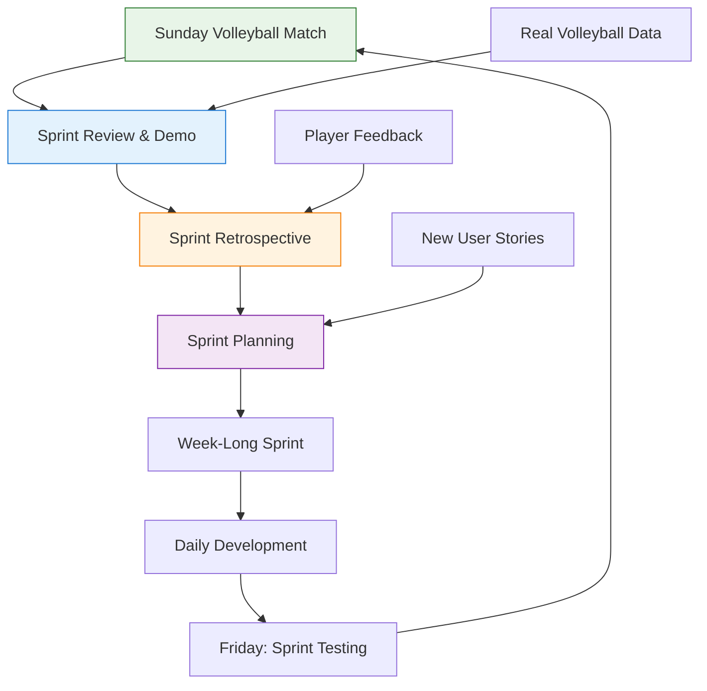
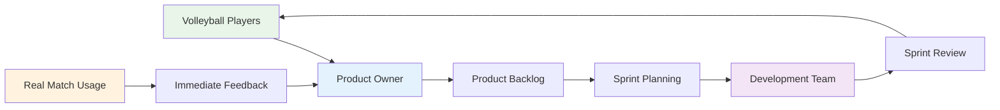

# Software Development Life Cycle (SDLC) Model
## PlayPot - Agile Scrum Methodology Selection

**Document Version:** 1.0  
**Date:** January 2025  
**Created by:** Development Team

---

## 1. Executive Summary

**Selected SDLC:** **Agile Scrum**  
**Rationale:** Perfect alignment with weekly volleyball schedule, rapid feedback from real users, and iterative improvement based on actual match usage patterns.

**Key Benefits:**
- Weekly sprints align with Sunday volleyball matches
- Continuous stakeholder feedback from volleyball community
- Rapid adaptation to real-world usage patterns
- Learning-focused approach suitable for student developer

---

## 2. SDLC Model Comparison Analysis

### 2.1 Models Considered

| SDLC Model | Suitability Score | Key Advantages | Key Disadvantages |
|------------|------------------|----------------|------------------|
| **Agile Scrum** | ⭐⭐⭐⭐⭐ | Weekly feedback, flexible, learning-focused | Requires discipline, frequent communication |
| **Waterfall** | ⭐⭐ | Clear phases, documentation | Too rigid, late feedback, no adaptation |
| **Kanban** | ⭐⭐⭐ | Visual, flexible | Lacks structure, no time boundaries |
| **RAD** | ⭐⭐⭐ | Quick prototyping | Resource intensive, less documentation |
| **Spiral** | ⭐⭐ | Risk management | Complex, over-engineered for MVP |

### 2.2 Selection Criteria

| Criteria | Weight | Scrum Score | Why Scrum Wins |
|----------|--------|-------------|---------------|
| **Volleyball Schedule Alignment** | 25% | 10/10 | Weekly sprints = weekly volleyball games |
| **Real User Feedback** | 20% | 10/10 | Continuous stakeholder involvement |
| **Learning & Skill Development** | 20% | 9/10 | Industry-standard agile practices |
| **Flexibility & Adaptation** | 15% | 10/10 | Easy to change based on user needs |
| **Resource Constraints** | 10% | 8/10 | Works with single developer + stakeholders |
| **Time-to-Market** | 10% | 9/10 | Early and continuous delivery |

**Total Score: 9.4/10** ✅

---

## 3. PlayPot-Specific Scrum Implementation

### 3.1 Scrum Framework Adaptation



### 3.2 Volleyball-Driven Sprint Cycle

| Day | Scrum Activity | PlayPot Context |
|-----|---------------|-----------------|
| **Sunday** | Sprint Review + Demo | Show progress to volleyball players after match |
| **Sunday** | Sprint Retrospective | Gather feedback from actual volleyball usage |
| **Monday** | Sprint Planning | Plan next week's features based on player needs |
| **Tue-Thu** | Daily Development | Build and test features |
| **Friday** | Sprint Testing | Test with volleyball data from previous Sunday |
| **Saturday** | Sprint Prep | Prepare demo for Sunday's volleyball session |

---

## 4. Scrum Roles and Responsibilities

### 4.1 Role Assignments

| Scrum Role | PlayPot Assignment | Responsibilities |
|------------|-------------------|------------------|
| **Product Owner** | Lead Volleyball Organizer | Define requirements, prioritize backlog, accept features |
| **Scrum Master** | Student Developer (You) | Facilitate process, remove blockers, ensure methodology |
| **Development Team** | Student Developer + Community | Build features, test, provide technical input |
| **Stakeholders** | Volleyball Players | Provide feedback, test features, validate requirements |

### 4.2 Stakeholder Involvement Strategy



---

## 5. Sprint Structure Design

### 5.1 Sprint Timeline (1 Week Sprints)

#### **Sprint Duration Justification:**
- **Volleyball Schedule:** Matches every Sunday provide natural sprint boundaries
- **Feedback Loop:** Weekly feedback is optimal for rapid iteration
- **Student Schedule:** Manageable alongside studies and other commitments
- **Motivation:** Frequent progress demonstrations maintain momentum

### 5.2 Sprint Events Schedule

#### **Sprint Planning (Monday 1-2 hours)**
```
Location: Online/Study space
Attendees: Product Owner + Development Team
Inputs: 
  - Refined product backlog
  - Velocity from previous sprint
  - Volleyball player feedback from Sunday
Outputs:
  - Sprint goal
  - Sprint backlog
  - Task breakdown
```

#### **Daily Standups (Tuesday-Friday 15 mins)**
```
Format: Async updates (solo developer)
Questions:
  - What did I accomplish yesterday?
  - What will I work on today?
  - What blockers do I have?
Documentation: Daily progress log
```

#### **Sprint Review (Sunday 30 mins)**
```
Location: Volleyball venue (after match)
Attendees: All volleyball players + organizers
Format: Live demo on mobile device
Focus: Show working features in volleyball context
```

#### **Sprint Retrospective (Sunday 30 mins)**
```
Timing: After sprint review
Format: Informal discussion with volleyball community
Focus: What worked well? What could improve?
Output: Action items for next sprint
```

### 5.3 Definition of Done

A user story is "Done" when:
- [ ] Feature implemented and tested
- [ ] Code reviewed (self-review + documentation)
- [ ] Works on mobile device
- [ ] Tested with real volleyball data
- [ ] User acceptance criteria met
- [ ] Demo-ready for volleyball players
- [ ] Documentation updated

---

## 6. User Story Management

### 6.1 Story Estimation Technique

**Planning Poker Adaptation for Solo Developer:**
- Use Fibonacci sequence (1, 2, 3, 5, 8, 13)
- Consider complexity, uncertainty, and effort
- Validate estimates against actual time spent
- Adjust velocity based on learning curve

**Estimation Guidelines:**
- **1 point:** Simple UI component (< 2 hours)
- **2 points:** Basic CRUD operation (2-4 hours)
- **3 points:** Complex form with validation (4-8 hours)
- **5 points:** Feature with business logic (1-2 days)
- **8 points:** Complex feature with multiple components (2-3 days)
- **13 points:** Epic requiring breakdown

### 6.2 Backlog Prioritization Framework

**MoSCoW Method Applied to Volleyball Context:**

#### **Must Have (High Priority)**
- Admin authentication
- Team creation and management
- Player addition to teams
- Match creation with stake setting
- Match result recording
- Automatic stake distribution

#### **Should Have (Medium Priority)**
- Player statistics entry
- Basic leaderboards
- Financial reporting
- Match history view

#### **Could Have (Low Priority)**
- Advanced analytics
- Player performance charts
- Team comparison features
- Export capabilities

#### **Won't Have (Future Versions)**
- Tournament management
- Payment gateway integration
- Social media integration
- Video/photo uploads

### 6.3 User Story Template

```
As a [user type]
I want [functionality]
So that [business value]

Acceptance Criteria:
- [ ] Criterion 1
- [ ] Criterion 2
- [ ] Criterion 3

Volleyball Context:
- How this helps during actual volleyball matches
- Real-world usage scenario
- Mobile/touch considerations

Definition of Done:
- [ ] Works on mobile
- [ ] Tested with real data
- [ ] Demo-ready
```

---

## 7. Risk Management in Agile Context

### 7.1 Agile Risk Mitigation

| Risk Category | Agile Mitigation | PlayPot Specific |
|---------------|------------------|------------------|
| **Requirements Changes** | Embrace change through backlog refinement | Weekly volleyball feedback drives changes |
| **Technical Unknowns** | Spike stories for research | Prototype with real volleyball data |
| **Timeline Pressure** | Prioritize ruthlessly, MVP focus | Core volleyball features first |
| **Quality Issues** | Definition of done, continuous testing | Test with actual volleyball usage |
| **Stakeholder Engagement** | Regular demos and feedback | Sunday volleyball sessions = natural demos |

### 7.2 Sprint-Level Risk Management

**Daily Risk Assessment:**
- Technical blockers identified early
- Scope adjustment within sprint
- Help-seeking triggers (online communities, documentation)
- Fallback plans for complex features

**Sprint Risk Indicators:**
- Story points not progressing
- Technical debt accumulating
- Stakeholder feedback negative
- Personal motivation decreasing

---

## 8. Learning and Skill Development Integration

### 8.1 Agile as Learning Vehicle

**Technical Skills:**
- **Sprint 1-2:** React basics and component development
- **Sprint 3-4:** State management and API integration
- **Sprint 5-6:** Database design and complex queries
- **Sprint 7-8:** Testing and deployment automation
- **Sprint 9:** Performance optimization and monitoring

**Soft Skills:**
- **Communication:** Regular stakeholder interaction
- **Project Management:** Sprint planning and tracking
- **Problem Solving:** Real-world requirement changes
- **Time Management:** Balancing development with studies

### 8.2 Portfolio Development Strategy

**Agile Artifacts for Portfolio:**
- Sprint planning documents
- Velocity charts and burndown graphs
- Retrospective insights and improvements
- Stakeholder feedback and testimonials
- Working software demonstrations

---

## 9. Tools and Infrastructure

### 9.1 Agile Toolchain

| Tool Category | Selected Tool | Cost | Justification |
|---------------|---------------|------|---------------|
| **Project Management** | Trello or Notion | Free | Visual kanban board, easy stakeholder access |
| **Code Repository** | GitHub | Free | Version control, issue tracking, project boards |
| **Communication** | WhatsApp/Discord | Free | Quick communication with volleyball players |
| **Documentation** | Markdown in GitHub | Free | Living documentation alongside code |
| **Time Tracking** | Toggl Track | Free tier | Velocity calculation and estimation improvement |

### 9.2 Development Environment Integration

**GitHub Integration:**
- Issues linked to user stories
- Pull requests for feature development
- Project boards for sprint tracking
- Actions for automated testing and deployment

**Continuous Integration:**
- Automated testing on pull requests
- Deployment to staging on main branch
- Performance monitoring and alerts
- Security scanning and dependency updates

---

## 10. Success Metrics and KPIs

### 10.1 Agile Process Metrics

| Metric | Target | Measurement |
|--------|--------|-------------|
| **Sprint Velocity** | Steady improvement | Story points completed per sprint |
| **Sprint Goal Achievement** | 80%+ | Sprints meeting their defined goals |
| **Stakeholder Satisfaction** | 8/10+ | Post-demo feedback scores |
| **Technical Debt** | <20% of velocity | Time spent on refactoring vs new features |
| **Defect Rate** | <5 per sprint | Issues found after sprint completion |

### 10.2 Business Value Metrics

| Metric | Target | Volleyball Context |
|--------|--------|-------------------|
| **Time Savings** | 30+ minutes per match | Reduced manual money calculation time |
| **Accuracy Improvement** | 100% | Zero financial calculation errors |
| **User Adoption** | 90%+ volleyball players | Active usage during volleyball sessions |
| **Satisfaction** | 8/10+ | Player happiness with digital solution |

---

## 11. Agile Ceremonies Detailed

### 11.1 Sprint Planning Deep Dive

**Preparation (30 mins before):**
- Review last sprint's feedback
- Prioritize backlog based on volleyball player input
- Check development environment and tools

**Sprint Planning Meeting (1-2 hours):**
1. **Review sprint goal** (15 mins)
2. **Select user stories** from prioritized backlog (45 mins)
3. **Break down tasks** and estimate effort (45 mins)
4. **Commit to sprint scope** (15 mins)

**Output:** Sprint backlog with clear tasks and estimates

### 11.2 Sprint Review Best Practices

**Demo Preparation:**
- Prepare mobile device with latest build
- Create realistic volleyball data for demonstration
- Plan 5-10 minute demo focusing on user value
- Prepare for questions and immediate feedback

**Demo Structure:**
1. **Context setting** (2 mins): "Here's what we built this week"
2. **Feature demonstration** (5 mins): Show working functionality
3. **Volleyball context** (2 mins): How it helps during actual matches
4. **Feedback collection** (1 min): Quick questions and suggestions

---

## 12. Adaptation and Continuous Improvement

### 12.1 Process Evolution Strategy

**Monthly Process Review:**
- Evaluate sprint length effectiveness
- Assess stakeholder engagement levels
- Review tool effectiveness and adoption
- Adjust ceremonies based on learnings

**Quarterly Methodology Assessment:**
- Compare actual vs planned velocity
- Analyze stakeholder satisfaction trends
- Review technical debt accumulation
- Plan process improvements for next quarter

### 12.2 Learning Integration Points

**Weekly Learning Goals:**
- Each sprint focuses on one new technical skill
- Document learnings for portfolio development
- Share knowledge with online communities
- Apply learnings to improve future sprints

---

## 13. Conclusion

**Why Agile Scrum is Perfect for PlayPot:**

1. **Natural Alignment:** Weekly volleyball matches = perfect sprint boundaries
2. **Continuous Feedback:** Real users provide immediate, valuable input
3. **Learning Focus:** Ideal for student developer skill development
4. **Flexibility:** Adapts to changing volleyball community needs
5. **Deliverable Value:** Each sprint produces working volleyball functionality

**Expected Outcomes:**
- Working MVP in 9 weeks
- High user adoption in volleyball community
- Strong portfolio project demonstrating agile practices
- Practical experience with industry-standard development methodology

---

**SDLC Model Status:** ✅ Complete  
**Next Step:** Tech Stack Justification  
**Ready for:** Sprint 0 planning and setup 