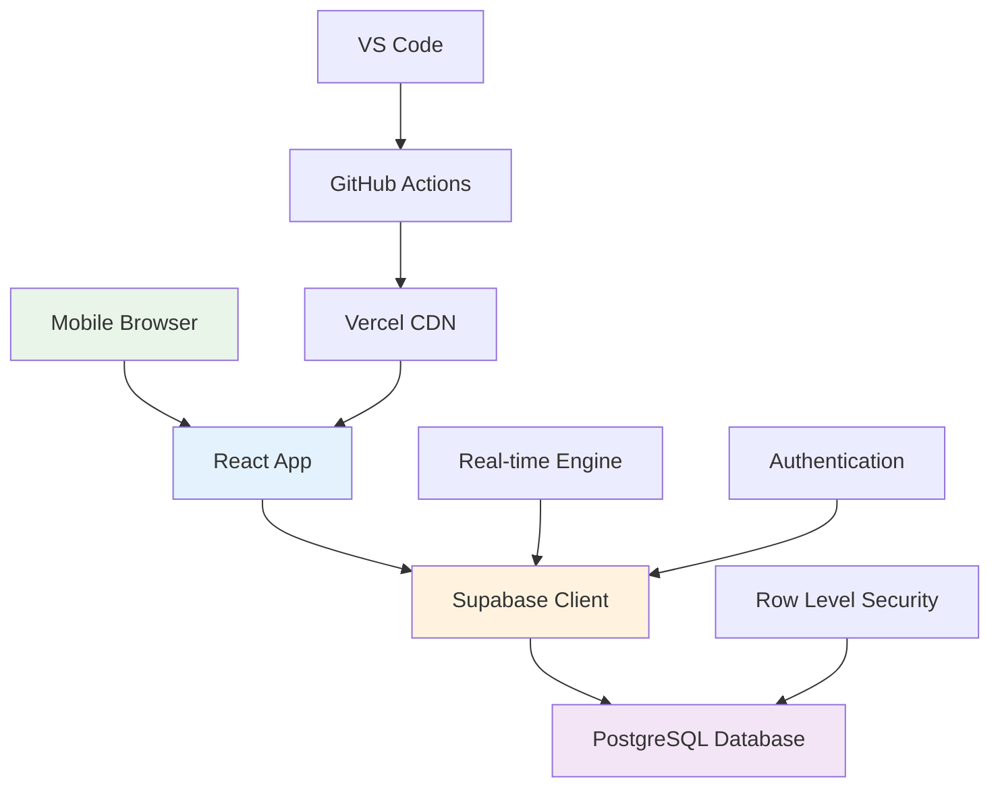

# Tech Stack Justification
## PlayPot - React + Supabase + PostgreSQL Rationale

**Document Version:** 1.0  
**Date:** January 2025  
**Created by:** Development Team

---

## 1. Executive Summary

**Selected Tech Stack:**
- **Frontend:** React.js + Tailwind CSS
- **Database:** PostgreSQL (via Supabase)
- **Authentication:** Supabase Auth
- **API:** Supabase Auto-generated REST/GraphQL
- **Hosting:** Vercel/Netlify + Supabase

**Total Cost:** **$0** (Free tiers + GitHub Student Pack)

**Key Decision Factors:**
1. **Zero Cost:** Complete solution within free tiers
2. **Student Learning:** Industry-relevant skills development
3. **Volleyball Context:** Mobile-first, real-time capabilities
4. **Financial Precision:** PostgreSQL for exact stake calculations
5. **Rapid Development:** No backend coding required

---

## 2. Technology Selection Matrix

### 2.1 Frontend Framework Comparison

| Framework | Score | Pros | Cons | PlayPot Suitability |
|-----------|-------|------|------|---------------------|
| **React.js** | ⭐⭐⭐⭐⭐ | • Industry standard<br/>• Mobile-responsive<br/>• Large ecosystem<br/>• Student-friendly | • Learning curve<br/>• Setup complexity | Perfect for volleyball mobile-first needs |
| **Vue.js** | ⭐⭐⭐⭐ | • Easier learning<br/>• Good documentation<br/>• Progressive adoption | • Smaller ecosystem<br/>• Less job market | Good but less industry relevance |
| **Angular** | ⭐⭐⭐ | • Full framework<br/>• TypeScript native<br/>• Enterprise features | • Steep learning<br/>• Overkill for MVP<br/>• Complex setup | Too complex for student + volleyball context |
| **Vanilla JS** | ⭐⭐ | • No dependencies<br/>• Full control<br/>• Fast loading | • Manual everything<br/>• No components<br/>• Poor maintainability | Too time-consuming for 9-week MVP |

**Winner: React.js** - Perfect balance of industry relevance, mobile capabilities, and learning value.

### 2.2 Backend/Database Comparison

| Solution | Score | Pros | Cons | PlayPot Suitability |
|----------|-------|------|------|---------------------|
| **Supabase (PostgreSQL)** | ⭐⭐⭐⭐⭐ | • No backend coding<br/>• SQL power<br/>• Real-time<br/>• Free tier<br/>• ACID compliance | • Vendor dependency<br/>• Learning PostgreSQL | Perfect for financial calculations + learning |
| **Firebase (NoSQL)** | ⭐⭐⭐⭐ | • Google backing<br/>• Easy real-time<br/>• Good free tier | • NoSQL limitations<br/>• Vendor lock-in<br/>• JavaScript math precision | Poor for exact financial calculations |
| **MongoDB + Express** | ⭐⭐⭐ | • Full control<br/>• NoSQL flexibility<br/>• JavaScript everywhere | • Backend complexity<br/>• Hosting costs<br/>• Manual everything | Too much work for student timeline |
| **MySQL + PHP** | ⭐⭐ | • Traditional LAMP<br/>• Hosting available | • Old technology<br/>• Poor learning value<br/>• Manual API building | Outdated for portfolio value |

**Winner: Supabase** - Eliminates backend complexity while providing SQL power for financial precision.

### 2.3 Styling Framework Comparison

| Framework | Score | Pros | Cons | PlayPot Suitability |
|-----------|-------|------|------|---------------------|
| **Tailwind CSS** | ⭐⭐⭐⭐⭐ | • Utility-first<br/>• Mobile-responsive<br/>• Fast development<br/>• Modern approach | • Learning curve<br/>• Verbose HTML | Perfect for volleyball mobile-first design |
| **Bootstrap** | ⭐⭐⭐⭐ | • Quick setup<br/>• Responsive<br/>• Component library | • Generic look<br/>• jQuery dependency<br/>• Harder customization | Good but less modern/customizable |
| **Material-UI** | ⭐⭐⭐ | • Google design<br/>• React integration<br/>• Accessibility | • Bundle size<br/>• Opinionated design<br/>• Complex theming | Too heavy for volleyball simplicity |
| **Custom CSS** | ⭐⭐ | • Full control<br/>• No dependencies<br/>• Lightweight | • Time-consuming<br/>• Responsive complexity<br/>• Maintenance burden | Too slow for 9-week timeline |

**Winner: Tailwind CSS** - Rapid development with mobile-first responsive design capabilities.

---

## 3. Detailed Technology Justification

### 3.1 React.js for Frontend

#### **Why React.js is Perfect for PlayPot:**

**🏐 Volleyball-Specific Benefits:**
- **Mobile-First Components:** Perfect for volleyball players using phones
- **Real-time Updates:** Seamless integration with Supabase real-time features
- **Touch-Optimized:** Easy to create touch-friendly volleyball interfaces
- **Progressive Web App:** Can be added to phone home screens like native app

**📚 Student Learning Benefits:**
- **Industry Standard:** 74% of developers use React professionally
- **Portfolio Value:** Highly sought-after skill in job market
- **Community Support:** Massive ecosystem and learning resources
- **Transferable Skills:** Concepts apply to React Native for mobile apps

**⚡ Technical Advantages:**
- **Component Reusability:** PlayerCard, TeamCard, MatchCard can be reused
- **State Management:** Built-in hooks perfect for volleyball data management
- **Performance:** Virtual DOM ensures smooth experience on mobile devices
- **TypeScript Support:** Type safety for complex volleyball statistics

#### **React Architecture for PlayPot:**

```javascript
// Component hierarchy designed for volleyball workflows
App
├── AuthProvider (Supabase Auth integration)
├── Layout
│   ├── Header (Admin tools, logout)
│   ├── Navigation (Teams, Players, Matches, Stats)
│   └── Main Content
│       ├── Dashboard (Quick match overview)
│       ├── TeamsPage (Team management)
│       ├── PlayersPage (Player roster management)
│       ├── MatchesPage (Match creation, results)
│       └── StatsPage (Leaderboards, analytics)
└── Mobile-optimized components for volleyball context
```

**Custom Hooks for Volleyball Logic:**
```javascript
// Volleyball-specific business logic hooks
useAuth()          // Supabase authentication
useTeams()         // Team CRUD operations
usePlayers()       // Player management + transfers
useMatches()       // Match creation + results
useStats()         // Performance analytics
useFinancials()    // Stake distribution calculations
```

### 3.2 Supabase for Backend-as-a-Service

#### **Why Supabase is Perfect for PlayPot:**

**💰 Cost Efficiency:**
- **Free Tier:** 500MB database, 50K monthly API calls, unlimited API requests
- **No Backend Coding:** Eliminates Express.js development time
- **No Server Management:** Focus on volleyball features, not infrastructure
- **Student Friendly:** Free GitHub integration and deployment

**🏐 Volleyball-Specific Features:**
- **Real-time Subscriptions:** Live match updates across all connected devices
- **Row Level Security:** Protect team/player data with database-level security
- **Geographic Distribution:** Fast access from volleyball courts worldwide
- **Mobile Optimization:** Optimized for mobile-first volleyball usage

**📊 Financial System Requirements:**
- **ACID Compliance:** Guarantees exact stake distribution calculations
- **PostgreSQL Precision:** DECIMAL data types prevent floating-point errors
- **Transaction Safety:** Rollback capabilities for failed distributions
- **Audit Trails:** Complete transaction logging for transparency

#### **Supabase Services Utilization:**

```typescript
// Authentication integration
const { user, session } = useSupabaseAuth()

// Real-time match updates
supabase
  .channel('matches')
  .on('postgres_changes', { 
    event: 'UPDATE', 
    schema: 'public', 
    table: 'matches' 
  }, handleMatchUpdate)
  .subscribe()

// Row Level Security for team data
CREATE POLICY "Teams visible to all authenticated users" 
ON teams FOR SELECT 
USING (auth.role() = 'authenticated');
```

### 3.3 PostgreSQL for Database

#### **Why PostgreSQL Over NoSQL for PlayPot:**

**💸 Financial Precision Requirements:**
```sql
-- Exact stake distribution with PostgreSQL DECIMAL
-- No floating-point precision errors
CREATE TABLE players (
    total_earnings DECIMAL(10,2) DEFAULT 0.00
);

-- Precise calculation ensuring exact distribution
UPDATE players 
SET total_earnings = total_earnings + (total_pot / team_member_count)
WHERE team_id = winning_team_id;
```

**🏐 Volleyball Analytics Power:**
```sql
-- Complex leaderboard queries impossible with NoSQL
SELECT 
    p.name,
    t.name as team_name,
    SUM(ps.smashes) as total_smashes,
    COUNT(CASE WHEN ps.is_mvp THEN 1 END) as mvp_count,
    AVG(ps.smashes + ps.spikes + ps.assists) as avg_performance
FROM players p
JOIN teams t ON p.team_id = t.id
JOIN player_stats ps ON p.id = ps.player_id
JOIN matches m ON ps.match_id = m.id
WHERE m.match_date >= '2024-01-01'
GROUP BY p.id, p.name, t.name
ORDER BY total_smashes DESC, mvp_count DESC;
```

**📈 Scalability and Performance:**
- **Indexes:** Optimized queries for volleyball statistics
- **Views:** Pre-computed leaderboards and team summaries
- **Constraints:** Enforce volleyball business rules at database level
- **Joins:** Efficient cross-table analytics for complex volleyball insights

### 3.4 Tailwind CSS for Styling

#### **Why Tailwind CSS for Volleyball UI:**

**📱 Mobile-First Design:**
```html
<!-- Volleyball player card optimized for mobile -->
<div class="bg-white rounded-lg shadow-md p-4 m-2 
            sm:w-full md:w-1/2 lg:w-1/3
            touch-manipulation">
  <div class="flex items-center space-x-4">
    
    <div class="flex-1 min-w-0">
      <h3 class="text-lg font-bold text-gray-900 truncate">
        {player.name}
      </h3>
      <p class="text-sm text-gray-500">{player.team}</p>
    </div>
    <div class="text-right">
      <p class="text-xl font-bold text-green-600">
        ${player.earnings}
      </p>
      <p class="text-sm text-gray-500">
        {player.mvps} MVPs
      </p>
    </div>
  </div>
</div>
```

**⚡ Rapid Development Benefits:**
- **Utility Classes:** Build volleyball interfaces 3x faster
- **Responsive Breakpoints:** Mobile-first design built-in
- **Custom Components:** Easy to create volleyball-specific designs
- **No CSS Files:** All styling in component files

---

## 4. Alternative Technologies Considered

### 4.1 Why Not Full-Stack Alternatives?

#### **MEAN/MERN Stack (MongoDB + Express + Angular/React + Node)**
**Pros:**
- Full control over backend
- JavaScript everywhere
- Flexible NoSQL structure

**Cons for PlayPot:**
- **Too Complex:** Backend development adds 4-6 weeks
- **Cost:** VPS hosting required ($5-20/month)
- **Financial Risk:** JavaScript floating-point precision issues
- **Maintenance:** Server management overhead
- **Learning:** Too many concepts for 9-week timeline

#### **Laravel + PHP + MySQL**
**Pros:**
- Traditional web development
- Good hosting options
- SQL database benefits

**Cons for PlayPot:**
- **Outdated Skills:** Poor portfolio value for modern jobs
- **Development Speed:** Slower than modern JavaScript frameworks
- **Mobile:** Poor mobile-first development experience
- **Real-time:** Complex to implement live updates

#### **Django + Python + PostgreSQL**
**Pros:**
- Excellent for data analysis
- Strong PostgreSQL integration
- Good security features

**Cons for PlayPot:**
- **Learning Curve:** New language for JavaScript-focused student
- **Frontend:** Still need React for modern UI
- **Development Time:** Backend development overhead
- **Hosting:** More complex deployment than static sites

### 4.2 Why Not Native Mobile Development?

#### **React Native**
**Pros:**
- True native mobile performance
- Share code with React web
- Better mobile user experience

**Cons for PlayPot:**
- **Timeline:** Additional 2-3 weeks for mobile-specific features
- **Complexity:** App store submission process
- **Web Access:** Admins might prefer web interface
- **Updates:** App store approval delays

#### **Flutter**
**Pros:**
- Excellent mobile performance
- Single codebase for iOS/Android
- Growing popularity

**Cons for PlayPot:**
- **New Language:** Dart learning curve
- **Portfolio:** Less job market demand than React
- **Web Version:** Flutter web still maturing
- **Timeline:** Too complex for 9-week MVP

---

## 5. Cost Analysis and Student Benefits

### 5.1 Complete Cost Breakdown

| Service | Free Tier Limits | Cost After Limits | PlayPot Usage | Annual Cost |
|---------|------------------|-------------------|---------------|-------------|
| **Supabase** | 500MB DB, 50K API calls/month | $25/month | <50MB, <10K calls | $0 |
| **Vercel Hosting** | 100GB bandwidth, unlimited sites | $20/month | <1GB bandwidth | $0 |
| **GitHub** | Unlimited public repos | $4/month | 1 public repo | $0 |
| **Domain** | GitHub Student Pack | $12/year | playpot.dev | $0 |
| **Development Tools** | VS Code, Node.js, Git | Free | All free tools | $0 |
| **Monitoring** | Basic analytics included | Varies | Basic usage | $0 |
| **Total Annual Cost** | | | | **$0** |

### 5.2 GitHub Student Pack Benefits

**Free Resources Relevant to PlayPot:**
- **Domain:** Free .me domain or discounted .dev
- **Hosting Credits:** $200 DigitalOcean, $100 Azure credits
- **Development Tools:** JetBrains IDEs, GitHub Copilot
- **Design Tools:** Figma Pro, Canva Pro
- **Analytics:** DataDog, LogDNA monitoring credits

### 5.3 Learning ROI Analysis

**Skills Gained vs Market Value:**

| Skill | Market Hourly Rate | PlayPot Hours | Value Gained |
|-------|-------------------|---------------|--------------|
| **React Development** | $50-80/hr | 40 hours | $2,000-3,200 |
| **PostgreSQL/SQL** | $60-90/hr | 20 hours | $1,200-1,800 |
| **Agile/Scrum** | $70-100/hr | 10 hours | $700-1,000 |
| **Mobile-First Design** | $45-75/hr | 15 hours | $675-1,125 |
| **Real-time Systems** | $80-120/hr | 10 hours | $800-1,200 |
| **Total Learning Value** | | | **$5,375-8,325** |

---

## 6. Technical Architecture Deep Dive

### 6.1 Data Flow Architecture



### 6.2 Security Architecture

**Multi-Layer Security Strategy:**

1. **Frontend Security:**
   - HTTPS only (Vercel automatic SSL)
   - Input validation and sanitization
   - XSS protection with React's built-in escaping
   - CSRF protection via SameSite cookies

2. **API Security:**
   - JWT token authentication
   - Rate limiting (Supabase built-in)
   - CORS configuration for volleyball domains only
   - Request/response logging

3. **Database Security:**
   - Row Level Security policies
   - Encrypted connections (TLS)
   - Regular automated backups
   - Audit logging for financial transactions

4. **Infrastructure Security:**
   - No server management required
   - Automatic security updates (Supabase managed)
   - DDoS protection (Vercel/Supabase)
   - Geographic data replication

### 6.3 Performance Architecture

**Optimization Strategy for Volleyball Mobile Usage:**

```typescript
// Lazy loading for non-critical components
const StatsPage = lazy(() => import('./pages/StatsPage'))
const ReportsPage = lazy(() => import('./pages/ReportsPage'))

// React.memo for expensive volleyball calculations
const PlayerLeaderboard = React.memo(({ players }) => {
  return useMemo(() => 
    players.sort((a, b) => b.totalEarnings - a.totalEarnings)
  , [players])
})

// Service Worker for offline volleyball data
if ('serviceWorker' in navigator) {
  navigator.serviceWorker.register('/volleyball-sw.js')
}
```

**Caching Strategy:**
- **React Query:** Cache volleyball data with smart invalidation
- **Browser Cache:** Static assets cached for 1 year
- **CDN Cache:** Geographic distribution for fast loading
- **Database Cache:** Supabase connection pooling and query optimization

---

## 7. Development Environment Setup

### 7.1 Local Development Stack

**Required Software (All Free):**
```bash
# Node.js and package management
node --version  # v18+ LTS
npm --version   # v9+

# Version control
git --version   # v2.30+

# Code editor
code --version  # VS Code latest

# Browser for testing
# Chrome/Firefox latest for DevTools
```

**Project Setup Commands:**
```bash
# Create React app with TypeScript
npx create-react-app playpot --template typescript
cd playpot

# Install volleyball-specific dependencies
npm install @supabase/supabase-js
npm install @tailwindcss/forms
npm install react-router-dom
npm install react-hook-form
npm install recharts  # For volleyball statistics charts

# Development tools
npm install -D @types/react
npm install -D eslint-config-prettier
npm install -D husky  # Git hooks for quality
```

### 7.2 VS Code Extensions for PlayPot

**Essential Extensions:**
- **ES7+ React/Redux/React-Native snippets** - Fast React development
- **Tailwind CSS IntelliSense** - Autocomplete for styling
- **PostgreSQL** - Database query support
- **Thunder Client** - API testing for Supabase
- **GitLens** - Enhanced Git capabilities
- **Prettier** - Code formatting
- **Auto Rename Tag** - HTML/JSX tag management

### 7.3 Environment Configuration

**.env.local Configuration:**
```bash
# Supabase configuration
REACT_APP_SUPABASE_URL=your_supabase_project_url
REACT_APP_SUPABASE_ANON_KEY=your_supabase_anon_key

# Environment
REACT_APP_ENVIRONMENT=development

# Volleyball-specific settings
REACT_APP_DEFAULT_STAKE_AMOUNT=50
REACT_APP_MIN_TEAM_PLAYERS=3
REACT_APP_MAX_TEAMS_PER_MATCH=6
```

---

## 8. Scalability and Future Considerations

### 8.1 Scaling Strategy

**User Growth Scenarios:**

| Users | Matches/Month | Data Size | Supabase Plan | Monthly Cost |
|-------|---------------|-----------|---------------|--------------|
| **1-50** | 1-20 | <50MB | Free | $0 |
| **50-500** | 20-200 | 50-500MB | Free/Pro | $0-25 |
| **500-5000** | 200-2000 | 500MB-2GB | Pro | $25 |
| **5000+** | 2000+ | 2GB+ | Pro+ | $25-100 |

**Migration Path if Needed:**
1. **Supabase Pro:** $25/month for 8GB database
2. **Custom Backend:** Move to Express.js if complex logic needed
3. **Microservices:** Split into specialized services
4. **Mobile App:** React Native version for better performance

### 8.2 Technology Evolution Path

**6-Month Enhancement Plan:**
- **PWA Features:** Offline capability, push notifications
- **Advanced Analytics:** Machine learning for volleyball insights
- **Payment Integration:** Online stake collection via Stripe
- **Social Features:** Team photos, match highlights

**1-Year Advanced Features:**
- **Tournament Management:** Multi-team bracket tournaments
- **Live Scoring:** Real-time match scoring during games
- **Video Integration:** Match highlights and player performance
- **Multi-Sport Support:** Expand beyond volleyball

---

## 9. Risk Assessment and Mitigation

### 9.1 Technology Risks

| Risk | Probability | Impact | Mitigation Strategy |
|------|-------------|--------|-------------------|
| **Supabase Service Outage** | Low | High | Local backup, multiple hosting regions |
| **Free Tier Limits Exceeded** | Medium | Medium | Monitor usage, upgrade plan ready |
| **React Breaking Changes** | Low | Medium | Use LTS versions, comprehensive testing |
| **Browser Compatibility** | Low | Low | Modern browser focus, progressive enhancement |
| **Mobile Performance** | Medium | High | Performance testing, optimization priority |

### 9.2 Vendor Lock-in Mitigation

**Data Portability Strategy:**
- **Database Export:** Regular PostgreSQL dumps
- **Code Portability:** Standard SQL queries, minimal Supabase-specific code
- **API Abstraction:** Service layer isolates Supabase dependencies
- **Documentation:** Migration guides for alternative platforms

---

## 10. Conclusion

### 10.1 Technology Decision Summary

**The React + Supabase + PostgreSQL stack is optimal for PlayPot because:**

1. **Perfect for Volleyball Context:**
   - Mobile-first responsive design
   - Real-time updates for live match scenarios
   - Touch-optimized interfaces for volleyball players
   - Offline capability for poor connectivity volleyball courts

2. **Ideal for Student Developer:**
   - Zero cost within free tiers
   - Industry-relevant skill development
   - Portfolio-worthy project architecture
   - Manageable complexity for 9-week timeline

3. **Financial System Requirements:**
   - PostgreSQL DECIMAL precision for exact stake calculations
   - ACID transactions for financial integrity
   - Audit trails for transparency
   - Rollback capabilities for error recovery

4. **Rapid Development Advantages:**
   - No backend coding required
   - Auto-generated APIs
   - Built-in authentication and security
   - Real-time subscriptions included

### 10.2 Expected Outcomes

**Technical Outcomes:**
- Working MVP in 9 weeks
- Mobile-optimized volleyball interface
- Accurate financial calculations
- Real-time match updates
- Secure user authentication

**Learning Outcomes:**
- Professional React development skills
- PostgreSQL and SQL expertise
- Modern web development practices
- Real-world project management experience
- Industry-standard development workflow

**Business Outcomes:**
- Successful volleyball community adoption
- Reduced manual calculation errors
- Time savings for match organizers
- Enhanced player engagement through statistics
- Foundation for potential business expansion

---

**Tech Stack Justification Status:** ✅ Complete  
**Total Annual Cost:** $0 🎉  
**Next Step:** Project Timeline and Gantt Chart  
**Ready for:** Development environment setup 