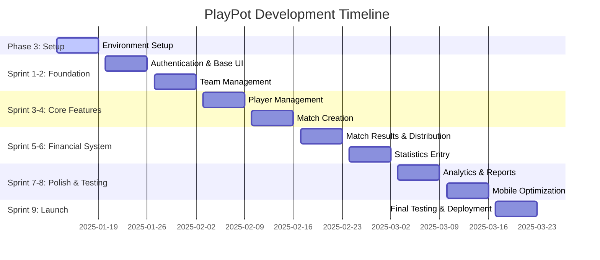
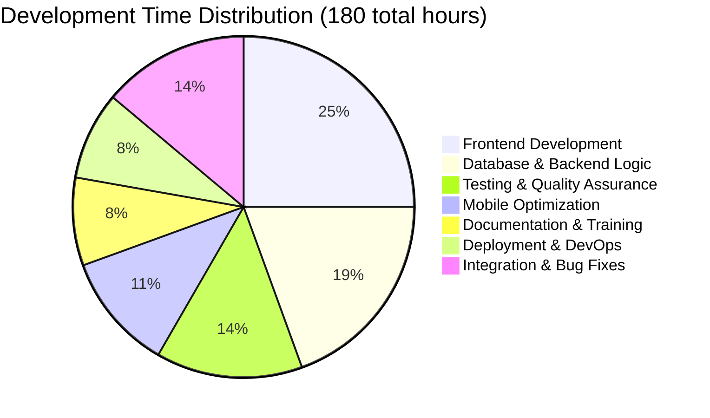

# Project Timeline & Gantt Chart
## PlayPot - 9-Week Development Schedule

**Document Version:** 1.0  
**Date:** January 2025  
**Created by:** Development Team

---

## 1. Executive Summary

**Project Duration:** 9 weeks (63 days)  
**Development Model:** Agile Scrum with 1-week sprints  
**Key Constraint:** Weekly volleyball matches provide natural sprint boundaries  
**Target Launch:** End of Week 9 (Sunday volleyball demonstration)

**Critical Success Factors:**
- Weekly demos to volleyball community
- Real user feedback integration
- Mobile-first development approach
- Zero-cost implementation with free tiers

---

## 2. High-Level Timeline Overview

---

## 3. Detailed Sprint Breakdown

### 3.1 Pre-Development Setup (Week 0)

**Phase 3 Completion Tasks:**
- [ ] Complete Phase 3 documentation
- [ ] Set up development environment
- [ ] Create Supabase account and project
- [ ] Initialize GitHub repository
- [ ] Set up Trello/Notion board

**Time Allocation:**
- Documentation: 40%
- Environment setup: 30%
- Planning: 20%
- Learning: 10%

---

### 3.2 Sprint 1: Authentication & Foundation (Week 1)

**Sprint Goal:** "Volleyball admins can securely log in and see a basic dashboard"

**User Stories (13 Story Points):**
- As an admin, I want to log in securely so that I can access PlayPot features (5 pts)
- As an admin, I want to see a dashboard overview so that I understand the current volleyball status (3 pts)
- As an admin, I want responsive navigation so that I can use PlayPot on my phone (3 pts)
- As a developer, I want the basic app structure so that I can build features efficiently (2 pts)

**Technical Tasks:**

| Task | Estimated Hours | Day | Dependencies |
|------|----------------|-----|--------------|
| **Set up React app with TypeScript** | 4 | Mon | Environment ready |
| **Configure Tailwind CSS** | 2 | Mon | React setup |
| **Implement Supabase authentication** | 6 | Tue | Supabase project created |
| **Create login/logout components** | 4 | Wed | Auth setup |
| **Build responsive layout structure** | 4 | Thu | Basic components |
| **Create dashboard skeleton** | 3 | Fri | Layout complete |
| **Mobile responsive testing** | 2 | Fri | Dashboard ready |

**Definition of Done:**
- [ ] Admin can log in with email/password
- [ ] Dashboard displays on mobile and desktop
- [ ] Navigation works on touch devices
- [ ] Code deployed to staging environment
- [ ] Ready to demo to volleyball players

**Volleyball Integration:**
- Test login during Sunday volleyball session
- Get feedback on mobile interface usability
- Validate navigation with volleyball players

---

### 3.3 Sprint 2: Team Management (Week 2)

**Sprint Goal:** "Volleyball admins can create and manage teams with players"

**User Stories (15 Story Points):**
- As an admin, I want to create volleyball teams so that I can organize players (5 pts)
- As an admin, I want to edit team information so that I can keep details current (3 pts)
- As an admin, I want to see all teams with player counts so that I can understand team structure (4 pts)
- As an admin, I want to delete inactive teams so that I can maintain clean data (3 pts)

**Technical Tasks:**

| Task | Estimated Hours | Day | Dependencies |
|------|----------------|-----|--------------|
| **Create teams database table** | 2 | Mon | Supabase access |
| **Implement team CRUD operations** | 6 | Mon-Tue | Database ready |
| **Build team creation form** | 4 | Tue | CRUD operations |
| **Create team listing page** | 4 | Wed | Basic operations |
| **Add team editing modal** | 4 | Thu | Listing page |
| **Implement team deletion with safeguards** | 3 | Fri | Edit functionality |
| **Mobile optimization for team management** | 2 | Fri | Core features done |

**Volleyball Integration:**
- Demo team creation with real volleyball team names
- Test team editing during volleyball break
- Validate team deletion safeguards with organizers

---

### 3.4 Sprint 3: Player Management (Week 3)

**Sprint Goal:** "Volleyball admins can manage players and their team assignments"

**User Stories (18 Story Points):**
- As an admin, I want to add players to teams so that I can build team rosters (5 pts)
- As an admin, I want to view all players with team info so that I can see the complete roster (4 pts)
- As an admin, I want to edit player information so that I can keep contact details current (3 pts)
- As an admin, I want to transfer players between teams so that I can handle team changes (6 pts)

**Technical Tasks:**

| Task | Estimated Hours | Day | Dependencies |
|------|----------------|-----|--------------|
| **Create players database table with foreign keys** | 3 | Mon | Teams table ready |
| **Implement player CRUD operations** | 6 | Mon-Tue | Database structure |
| **Build player addition form with team selection** | 5 | Tue | CRUD ready |
| **Create player listing with search/filter** | 5 | Wed | Basic operations |
| **Implement player editing functionality** | 4 | Thu | Listing complete |
| **Build player transfer feature** | 5 | Thu-Fri | Edit functionality |
| **Add player statistics placeholder** | 2 | Fri | Transfer feature |

**Volleyball Integration:**
- Add real volleyball players to teams
- Test player transfer during team reorganization
- Validate contact information storage

---

### 3.5 Sprint 4: Match Creation (Week 4)

**Sprint Goal:** "Volleyball admins can create matches with teams and stakes"

**User Stories (20 Story Points):**
- As an admin, I want to create matches with participating teams so that I can set up volleyball games (8 pts)
- As an admin, I want to set stake amounts per team so that I can configure the money pot (4 pts)
- As an admin, I want to see upcoming matches so that I can track scheduled games (4 pts)
- As an admin, I want to edit match details so that I can handle changes (4 pts)

**Technical Tasks:**

| Task | Estimated Hours | Day | Dependencies |
|------|----------------|-----|--------------|
| **Create matches and match_teams tables** | 4 | Mon | Players table ready |
| **Implement match creation logic** | 6 | Mon-Tue | Database structure |
| **Build match creation form with team selection** | 6 | Tue-Wed | Creation logic |
| **Add automatic pot calculation** | 3 | Wed | Form functionality |
| **Create match listing with status** | 4 | Thu | Basic operations |
| **Implement match editing functionality** | 4 | Thu-Fri | Listing ready |
| **Add match validation rules** | 3 | Fri | Edit functionality |

**Volleyball Integration:**
- Create real volleyball matches for upcoming Sundays
- Test stake amount setting with volleyball organizers
- Validate team selection process

---

### 3.6 Sprint 5: Match Results & Financial Distribution (Week 5)

**Sprint Goal:** "Volleyball admins can record results and automatically distribute stakes"

**User Stories (25 Story Points - Largest Sprint):**
- As an admin, I want to record match results so that I can declare the winning team (6 pts)
- As a system, I want to automatically distribute stakes so that winners get paid accurately (10 pts)
- As an admin, I want to see financial transaction history so that I can verify distributions (5 pts)
- As a player, I want to see my earnings so that I can track my volleyball winnings (4 pts)

**Technical Tasks:**

| Task | Estimated Hours | Day | Dependencies |
|------|----------------|-----|--------------|
| **Create transactions table for audit trail** | 3 | Mon | Matches table ready |
| **Implement match result recording** | 5 | Mon-Tue | Database structure |
| **Build stake distribution algorithm** | 8 | Tue-Wed | Result recording |
| **Add financial transaction logging** | 4 | Wed | Distribution logic |
| **Create financial reporting interface** | 6 | Thu | Transaction logging |
| **Build player earnings display** | 4 | Thu-Fri | Reporting ready |
| **Add distribution error handling** | 3 | Fri | Core functionality |

**Critical Success Factors:**
- DECIMAL precision for exact financial calculations
- Transaction rollback on distribution errors
- Complete audit trail for transparency

**Volleyball Integration:**
- Record real match results from previous Sunday
- Test stake distribution with actual money amounts
- Validate transaction accuracy with volleyball players

---

### 3.7 Sprint 6: Statistics Entry (Week 6)

**Sprint Goal:** "Volleyball admins can enter player statistics and see performance data"

**User Stories (18 Story Points):**
- As an admin, I want to enter player statistics per match so that I can track performance (8 pts)
- As an admin, I want to designate MVP so that I can recognize outstanding players (3 pts)
- As a player, I want to see my performance statistics so that I can track improvement (4 pts)
- As an admin, I want to see team performance summaries so that I can analyze team strengths (3 pts)

**Technical Tasks:**

| Task | Estimated Hours | Day | Dependencies |
|------|----------------|-----|--------------|
| **Create player_stats table with constraints** | 3 | Mon | Transactions ready |
| **Implement statistics entry form** | 6 | Mon-Tue | Database structure |
| **Add MVP designation with validation** | 4 | Tue | Stats entry |
| **Build player performance dashboard** | 5 | Wed | MVP functionality |
| **Create team statistics summary** | 4 | Thu | Player dashboard |
| **Add statistics validation and error handling** | 3 | Thu-Fri | Summaries ready |
| **Implement statistics editing capability** | 3 | Fri | Validation complete |

**Volleyball Integration:**
- Enter statistics from recent volleyball matches
- Test MVP designation with volleyball players
- Validate statistical accuracy

---

### 3.8 Sprint 7: Analytics & Reports (Week 7)

**Sprint Goal:** "Users can view leaderboards and analytical insights"

**User Stories (16 Story Points):**
- As a user, I want to see player leaderboards so that I can compare performance (6 pts)
- As an admin, I want financial reports so that I can track money flow (4 pts)
- As a user, I want to see match history so that I can review past games (3 pts)
- As a user, I want performance charts so that I can visualize trends (3 pts)

**Technical Tasks:**

| Task | Estimated Hours | Day | Dependencies |
|------|----------------|-----|--------------|
| **Create leaderboard queries and views** | 4 | Mon | Stats table ready |
| **Build leaderboard interface with sorting** | 5 | Mon-Tue | Queries ready |
| **Implement financial reporting dashboard** | 4 | Tue-Wed | Leaderboards done |
| **Create match history with filtering** | 4 | Wed | Reporting ready |
| **Add basic performance charts** | 5 | Thu | History complete |
| **Implement data export functionality** | 3 | Fri | Charts ready |

**Volleyball Integration:**
- Generate leaderboards with real volleyball data
- Test financial reports with actual tournament history
- Validate chart accuracy

---

### 3.9 Sprint 8: Mobile Optimization & Polish (Week 8)

**Sprint Goal:** "PlayPot works perfectly on mobile devices during volleyball matches"

**User Stories (14 Story Points):**
- As a volleyball player, I want smooth mobile performance so that I can use PlayPot during matches (5 pts)
- As an admin, I want offline capability so that I can work without internet at volleyball courts (4 pts)
- As a user, I want fast loading so that I can quickly access volleyball data (3 pts)
- As a user, I want consistent design so that PlayPot feels professional (2 pts)

**Technical Tasks:**

| Task | Estimated Hours | Day | Dependencies |
|------|----------------|-----|--------------|
| **Optimize mobile responsiveness across all pages** | 6 | Mon-Tue | All features ready |
| **Implement service worker for offline capability** | 5 | Tue-Wed | Mobile optimization |
| **Add performance optimizations and caching** | 4 | Wed-Thu | Offline capability |
| **Polish UI/UX and fix design inconsistencies** | 4 | Thu | Performance done |
| **Add loading states and error boundaries** | 3 | Fri | UI polish |
| **Implement PWA features (add to home screen)** | 3 | Fri | Loading states |

**Volleyball Integration:**
- Test offline functionality at volleyball courts
- Validate mobile performance during actual matches
- Get final UI/UX feedback from volleyball players

---

### 3.10 Sprint 9: Launch & Deployment (Week 9)

**Sprint Goal:** "PlayPot is production-ready and successfully launched with volleyball community"

**User Stories (12 Story Points):**
- As a volleyball organizer, I want a reliable production system so that I can manage matches confidently (4 pts)
- As a user, I want backup and recovery so that volleyball data is protected (3 pts)
- As an admin, I want monitoring and alerts so that I can ensure system health (3 pts)
- As a volleyball community, I want training and documentation so that everyone can use PlayPot (2 pts)

**Technical Tasks:**

| Task | Estimated Hours | Day | Dependencies |
|------|----------------|-----|--------------|
| **Set up production deployment pipeline** | 4 | Mon | All features complete |
| **Configure monitoring and error tracking** | 3 | Mon-Tue | Deployment ready |
| **Implement backup and recovery procedures** | 3 | Tue | Monitoring setup |
| **Create user documentation and tutorials** | 4 | Wed | System stable |
| **Conduct final testing with volleyball data** | 4 | Thu | Documentation ready |
| **Launch preparation and community training** | 3 | Fri | Testing complete |
| **Go-live and monitor initial usage** | 4 | Weekend | Training done |

**Launch Success Criteria:**
- All volleyball players successfully onboarded
- Zero critical bugs in production
- Backup and monitoring systems operational
- Positive feedback from volleyball community

---

## 4. Resource Allocation and Effort Distribution

### 4.1 Development Time Breakdown

### 4.2 Weekly Effort Distribution

| Week | Frontend Hours | Backend Hours | Testing Hours | Integration Hours | Total Hours |
|------|---------------|---------------|---------------|------------------|-------------|
| **Week 1** | 12 | 8 | 3 | 2 | 25 |
| **Week 2** | 10 | 8 | 4 | 3 | 25 |
| **Week 3** | 12 | 6 | 4 | 3 | 25 |
| **Week 4** | 11 | 7 | 4 | 3 | 25 |
| **Week 5** | 8 | 10 | 4 | 3 | 25 |
| **Week 6** | 10 | 8 | 4 | 3 | 25 |
| **Week 7** | 12 | 5 | 5 | 3 | 25 |
| **Week 8** | 15 | 2 | 5 | 3 | 25 |
| **Week 9** | 5 | 3 | 7 | 10 | 25 |

### 4.3 Skill Development Timeline

| Week | Primary Skill Focus | Secondary Skills | Learning Outcome |
|------|-------------------|------------------|------------------|
| **1** | React Fundamentals | TypeScript, Tailwind | Component-based development |
| **2** | State Management | Database Design | Application architecture |
| **3** | Forms & Validation | Data Relationships | User input handling |
| **4** | Complex Logic | Business Rules | Algorithm implementation |
| **5** | Financial Systems | Transaction Safety | Critical system development |
| **6** | Data Analytics | SQL Optimization | Performance optimization |
| **7** | Visualization | User Experience | Data presentation |
| **8** | Mobile Development | Progressive Web Apps | Cross-platform development |
| **9** | DevOps & Deployment | System Administration | Production readiness |

---

## 5. Risk Management Timeline

### 5.1 Critical Risk Periods

| Week | Primary Risks | Mitigation Strategies | Contingency Plans |
|------|---------------|----------------------|-------------------|
| **1-2** | Setup complexity, learning curve | Detailed tutorials, community support | Extend setup phase, simplify scope |
| **3-4** | Database design errors | Early validation, peer review | Rebuild tables, data migration |
| **5** | Financial calculation bugs | Extensive testing, manual verification | Manual distribution, algorithm fix |
| **6-7** | Performance issues | Optimization focus, monitoring | Feature reduction, caching |
| **8** | Mobile compatibility | Device testing, responsive design | Web-only launch, mobile follow-up |
| **9** | Launch problems | Soft launch, gradual rollout | Rollback plan, bug fix deployment |

### 5.2 Dependency Management

**External Dependencies:**
- **Supabase Service Availability:** 99.9% uptime SLA
- **Vercel Deployment:** Automatic deployments from GitHub
- **GitHub Actions:** CI/CD pipeline reliability
- **Volleyball Schedule:** Weekly feedback sessions

**Internal Dependencies:**
- **Database Schema:** Must be stable by Week 3
- **Authentication:** Required for all subsequent features
- **Mobile Layout:** Critical for volleyball player adoption
- **Financial Logic:** Zero-error tolerance requirement

---

## 6. Quality Assurance Timeline

### 6.1 Testing Strategy by Sprint

| Sprint | Testing Focus | Testing Methods | Success Criteria |
|--------|---------------|-----------------|------------------|
| **1** | Authentication, Basic UI | Manual testing, login flows | Secure login on mobile |
| **2** | Team CRUD, Data integrity | Unit tests, data validation | Teams created successfully |
| **3** | Player management, Relationships | Integration tests, foreign keys | Player-team relationships work |
| **4** | Match creation, Business logic | Algorithm testing, edge cases | Matches created with correct pot |
| **5** | Financial distribution, Accuracy | Financial testing, precision | Exact stake distribution |
| **6** | Statistics, Performance | Data accuracy, query optimization | Fast leaderboard generation |
| **7** | Analytics, User experience | Usability testing, mobile UX | Intuitive volleyball interface |
| **8** | Mobile optimization, Performance | Device testing, performance | <3s load time on mobile |
| **9** | Production readiness, Reliability | Load testing, backup verification | System handles volleyball usage |

### 6.2 User Acceptance Testing Schedule

**Weekly Volleyball Session Testing:**
- **Every Sunday:** Live demo to volleyball players
- **Feedback Collection:** Immediate input during volleyball breaks
- **Priority Bugs:** Fixed within 24 hours for next week
- **Feature Validation:** Real-world usage scenarios

**Beta Testing Plan:**
- **Week 6-7:** Closed beta with volleyball organizers
- **Week 8:** Extended beta with all volleyball players
- **Week 9:** Production launch with full community

---

## 7. Communication and Reporting

### 7.1 Stakeholder Communication Schedule

| Frequency | Audience | Format | Content |
|-----------|----------|--------|---------|
| **Daily** | Self (solo developer) | Progress log | Tasks completed, blockers, next steps |
| **Weekly** | Volleyball players | Live demo | Working features, feedback collection |
| **Bi-weekly** | Project sponsor | Status report | Progress summary, risk assessment |
| **Monthly** | Academic advisor | Portfolio review | Learning outcomes, technical growth |

### 7.2 Progress Tracking Metrics

**Sprint Metrics:**
- **Velocity:** Story points completed per sprint
- **Burndown:** Progress toward sprint goal
- **Quality:** Bugs found vs story points delivered
- **Learning:** New skills acquired per sprint

**Project Metrics:**
- **Scope:** Features delivered vs planned
- **Timeline:** Actual vs estimated completion
- **Quality:** User satisfaction and bug rate
- **Business Value:** Time saved for volleyball community

---

## 8. Contingency Plans

### 8.1 Timeline Compression Scenarios

**If 2 weeks behind schedule:**
- Remove advanced analytics (Sprint 7 features)
- Simplify mobile optimization
- Focus on core volleyball functionality
- Extend timeline to 11 weeks if possible

**If 4 weeks behind schedule:**
- Remove statistics entry and analytics
- Focus on team, player, and match management
- Manual financial distribution as fallback
- Launch basic MVP in 9 weeks

### 8.2 Scope Adjustment Framework

**Feature Priority Matrix:**

| Priority | Features | Impact if Removed |
|----------|----------|-------------------|
| **Critical** | Auth, Teams, Players, Matches, Financial Distribution | Project failure |
| **Important** | Statistics Entry, Basic Reports | Reduced value, manual tracking |
| **Nice-to-Have** | Advanced Analytics, Charts | Minimal impact, future enhancement |
| **Enhancement** | Mobile PWA, Offline Mode | Usability impact, not blocking |

---

## 9. Success Metrics and Milestones

### 9.1 Sprint Success Criteria

| Sprint | Success Metric | Target | Measurement |
|--------|----------------|--------|-------------|
| **1** | Authentication working | 100% | All volleyball organizers can log in |
| **2** | Teams created | 3+ teams | Real volleyball teams in system |
| **3** | Players assigned | 15+ players | Complete volleyball rosters |
| **4** | Matches scheduled | 2+ matches | Upcoming volleyball games planned |
| **5** | Money distributed | $0 errors | Accurate financial calculations |
| **6** | Statistics recorded | 1+ match | Real volleyball performance data |
| **7** | Leaderboards generated | Rankings visible | Performance comparisons available |
| **8** | Mobile optimized | <3s load time | Fast mobile experience |
| **9** | Production launch | 90% adoption | Volleyball community using PlayPot |

### 9.2 Overall Project Success Metrics

**Technical Success:**
- Zero critical bugs in production
- <3 second page load times on mobile
- 99%+ uptime during volleyball sessions
- All financial calculations accurate to the cent

**User Success:**
- 90%+ volleyball player adoption
- 8/10+ satisfaction rating
- 30+ minutes time saved per volleyball match
- Reduced financial calculation errors to zero

**Learning Success:**
- Portfolio-quality React application
- Professional development workflow
- Industry-standard agile practices
- Deployable full-stack application

---

**Project Timeline Status:** ✅ Complete  
**Total Development Time:** 225 hours over 9 weeks  
**Next Step:** Kanban Board Setup  
**Ready for:** Sprint 0 planning session 