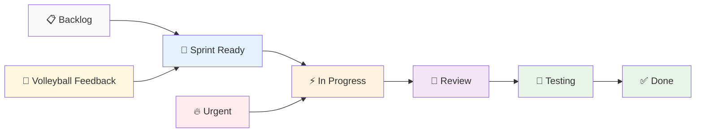
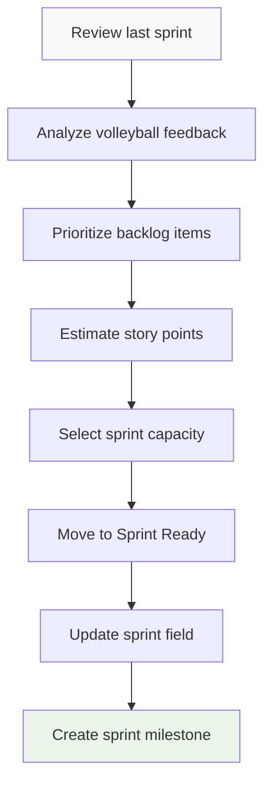

# Kanban Board Setup Guide
## PlayPot - Visual Project Management System

**Document Version:** 1.0  
**Date:** January 2025  
**Created by:** Development Team

---

## 1. Overview

This document provides a complete setup guide for PlayPot's Kanban board using **GitHub Projects** (free with student account) as the primary tool, with **Trello** as a backup option. The board will track all volleyball-related development tasks with visual workflow management.

**Selected Tool:** **GitHub Projects v2** (Beta)  
**Rationale:** Integrated with code repository, free, powerful automation, student-friendly

---

## 2. Board Structure and Columns

### 2.1 Kanban Column Layout



### 2.2 Column Definitions

| Column | Purpose | WIP Limit | Entry Criteria | Exit Criteria |
|--------|---------|-----------|----------------|---------------|
| **📋 Backlog** | All user stories and tasks | No limit | Story written | Sprint planning |
| **🚀 Sprint Ready** | Current sprint tasks | 25 items | Sprint planning | Development starts |
| **⚡ In Progress** | Active development | 3 items | Work begins | Feature complete |
| **👀 Review** | Code review needed | 5 items | PR created | Code approved |
| **🧪 Testing** | Ready for testing | 5 items | Review passed | Tests pass |
| **✅ Done** | Completed features | No limit | Testing complete | Demo ready |
| **🔥 Urgent** | Critical issues | 2 items | Bug/blocker found | Issue resolved |
| **🎯 Volleyball Feedback** | User input items | 10 items | Feedback received | Prioritized |

---

## 3. GitHub Projects Setup

### 3.1 Project Creation Steps

**Step 1: Create GitHub Project**
```bash
# Navigate to your GitHub repository
https://github.com/yourusername/playpot

# Go to Projects tab
Click "Projects" → "New project"

# Select template
Choose "Team planning" template
Name: "PlayPot Development Board"
Description: "Volleyball stake management development tracking"
```

**Step 2: Configure Project Views**

```yaml
Views to Create:
1. "Current Sprint" - Board view with sprint filter
2. "Backlog Management" - Table view for prioritization  
3. "Bug Tracking" - Board view filtered by bug label
4. "Volleyball Feedback" - Table view for user stories
5. "Timeline View" - Timeline showing sprint progress
```

### 3.2 Custom Fields Configuration

**Field Setup for Volleyball Context:**

| Field Name | Type | Options | Purpose |
|------------|------|---------|---------|
| **Sprint** | Single select | Sprint 1-9 | Track sprint assignment |
| **Story Points** | Number | 1, 2, 3, 5, 8, 13 | Effort estimation |
| **Priority** | Single select | Critical, High, Medium, Low | Volleyball urgency |
| **Feature Area** | Single select | Auth, Teams, Players, Matches, Finance, Stats | Component tracking |
| **Volleyball Impact** | Single select | High, Medium, Low | User value assessment |
| **Testing Status** | Single select | Not Started, In Progress, Passed, Failed | Quality tracking |
| **Demo Ready** | Checkbox | Yes/No | Sunday demo preparation |

### 3.3 Label System for PlayPot

**GitHub Labels Configuration:**

```yaml
# Feature Labels
- name: "🏐 volleyball-core"
  color: "0366d6"
  description: "Core volleyball functionality"

- name: "💰 financial"
  color: "28a745"
  description: "Money and stake distribution"

- name: "📱 mobile"
  color: "6f42c1"
  description: "Mobile-specific features"

- name: "📊 analytics"
  color: "fd7e14"
  description: "Statistics and reporting"

# Priority Labels  
- name: "🔥 critical"
  color: "d73a49"
  description: "Blocking volleyball matches"

- name: "⚡ high-priority"
  color: "f66a0a"
  description: "Important for volleyball users"

# Type Labels
- name: "🐛 bug"
  color: "d73a49"
  description: "Something isn't working"

- name: "✨ enhancement"
  color: "a2eeef"
  description: "New feature or request"

- name: "📚 documentation"
  color: "0075ca"
  description: "Improvements or additions to docs"

# Status Labels
- name: "🚀 ready-for-demo"
  color: "28a745"
  description: "Ready to show volleyball players"

- name: "🧪 needs-testing"
  color: "fbca04"
  description: "Requires volleyball data testing"
```

---

## 4. Task Card Template

### 4.1 User Story Card Format

```markdown
## 🏐 User Story: [Title]

**As a** [user type]  
**I want** [functionality]  
**So that** [volleyball benefit]

### Acceptance Criteria
- [ ] Criterion 1 (with volleyball context)
- [ ] Criterion 2 (mobile-specific)
- [ ] Criterion 3 (financial accuracy if applicable)

### Volleyball Context
- **Real-world scenario:** How this helps during actual volleyball
- **Mobile usage:** Touch/mobile considerations
- **Demo scenario:** How to show this to volleyball players

### Technical Notes
- **Dependencies:** What must be done first
- **Database changes:** Schema modifications needed
- **API endpoints:** New or modified endpoints

### Definition of Done
- [ ] Feature implemented and tested
- [ ] Works on mobile device (tested on phone)
- [ ] Tested with real volleyball data
- [ ] Code reviewed and documented
- [ ] Ready to demo to volleyball players
- [ ] User acceptance criteria met

### Estimation: [X] Story Points
**Sprint:** [Sprint Number]  
**Priority:** [High/Medium/Low]  
**Volleyball Impact:** [High/Medium/Low]
```

### 4.2 Bug Report Card Format

```markdown
## 🐛 Bug: [Title]

### Problem Description
Clear description of what's broken during volleyball usage

### Steps to Reproduce
1. Step 1 (volleyball context)
2. Step 2 
3. Step 3

### Expected Behavior
What should happen during volleyball match

### Actual Behavior
What actually happens (screenshots if possible)

### Volleyball Impact
- **Severity:** How much this affects volleyball matches
- **Frequency:** How often volleyball players encounter this
- **Workaround:** Temporary solution if available

### Technical Details
- **Browser:** Chrome/Firefox/Safari
- **Device:** Mobile/Desktop details
- **Supabase errors:** Database error messages
- **Console logs:** JavaScript errors

### Fix Priority
**Priority:** [Critical/High/Medium/Low]  
**Sprint:** [Current/Next Sprint]
```

### 4.3 Task Card Format

```markdown
## ⚙️ Task: [Title]

### Description
Technical task description with volleyball context

### Scope
- **Estimated time:** X hours
- **Complexity:** Low/Medium/High
- **Dependencies:** List of blocking items

### Implementation Notes
- Technical approach
- Files to modify
- Database changes needed
- Testing approach

### Volleyball Validation
- How to test with volleyball data
- Mobile testing requirements
- Demo preparation needed

**Estimation:** [X] Hours  
**Sprint:** [Sprint Number]  
**Component:** [Auth/Teams/Players/Matches/etc.]
```

---

## 5. Workflow Automation

### 5.1 GitHub Actions Integration

**Automated Board Updates:**

```yaml
# .github/workflows/board-automation.yml
name: Kanban Board Automation

on:
  pull_request:
    types: [opened, closed, ready_for_review]
  issues:
    types: [opened, closed, labeled]

jobs:
  update-board:
    runs-on: ubuntu-latest
    steps:
      - name: Move to Review
        if: github.event_name == 'pull_request' && github.event.action == 'opened'
        uses: alex-page/github-project-automation-plus@v0.8.3
        with:
          project: PlayPot Development Board
          column: 👀 Review
          repo-token: ${{ secrets.GITHUB_TOKEN }}

      - name: Move to Done
        if: github.event_name == 'pull_request' && github.event.action == 'closed' && github.event.pull_request.merged
        uses: alex-page/github-project-automation-plus@v0.8.3
        with:
          project: PlayPot Development Board
          column: ✅ Done
          repo-token: ${{ secrets.GITHUB_TOKEN }}
```

### 5.2 Sprint Automation Rules

**Automated Transitions:**

| Trigger | Action | New Column |
|---------|--------|------------|
| PR opened | Auto-move task | 👀 Review |
| PR merged | Auto-move task | ✅ Done |
| Issue labeled "bug" | Auto-move to | 🔥 Urgent |
| Issue labeled "volleyball-feedback" | Auto-move to | 🎯 Volleyball Feedback |
| Commit pushed | Add commit link | Stay in current |
| Task overdue | Add warning label | Stay in current |

---

## 6. Sprint Management Workflow

### 6.1 Sprint Planning Process

**Weekly Sprint Planning (Monday):**



**Sprint Planning Checklist:**
- [ ] Review previous sprint velocity
- [ ] Incorporate Sunday volleyball feedback
- [ ] Estimate new user stories
- [ ] Check sprint capacity (25 hours)
- [ ] Move selected items to "🚀 Sprint Ready"
- [ ] Update sprint custom field
- [ ] Create GitHub milestone for sprint

### 6.2 Daily Workflow Management

**Daily Standup Process (Solo Developer):**

```markdown
## Daily Standup - [Date]

### Yesterday's Progress
- [Completed tasks from board]
- [Challenges encountered]
- [Volleyball feedback integrated]

### Today's Plan
- [Tasks moving to "⚡ In Progress"]
- [Expected completion targets]
- [Potential blockers]

### Blockers/Help Needed
- [Technical challenges]
- [External dependencies]
- [Learning requirements]

### Board Updates Needed
- [Tasks to move between columns]
- [New bugs or issues found]
- [Priority adjustments]
```

### 6.3 Sprint Review Process

**Sunday Sprint Review (At Volleyball):**

1. **Demo Preparation:**
   - Filter board to "✅ Done" items
   - Prepare mobile device with latest build
   - Create volleyball demo scenario

2. **Demo Execution:**
   - Show completed features on mobile
   - Get volleyball player feedback
   - Note feature requests and bugs

3. **Board Updates:**
   - Move items to "✅ Done" 
   - Create new items from feedback
   - Prioritize urgent volleyball needs

---

## 7. Metrics and Reporting

### 7.1 Kanban Metrics Dashboard

**Key Performance Indicators:**

| Metric | Target | Measurement | Volleyball Context |
|--------|--------|-------------|-------------------|
| **Cycle Time** | <3 days | Card creation to done | Feature delivery speed |
| **Lead Time** | <5 days | Idea to delivery | Volleyball feedback response |
| **WIP Limits** | 90% adherence | Column limits respected | Focus maintenance |
| **Throughput** | 15-25 points/sprint | Story points completed | Velocity tracking |
| **Defect Rate** | <5% | Bugs vs features | Quality measurement |

### 7.2 Sprint Burndown Integration

**GitHub Project Views:**

```yaml
Sprint Burndown View:
  - Type: Chart view
  - X-axis: Days in sprint
  - Y-axis: Remaining story points
  - Filter: Current sprint only
  - Update: Daily automatic

Volleyball Feedback View:
  - Type: Table view
  - Columns: Title, Priority, Volleyball Impact, Status
  - Filter: Labels contain "volleyball-feedback"
  - Sort: Priority descending, Date created
```

### 7.3 Reporting Templates

**Weekly Sprint Report:**
```markdown
# Sprint [Number] Report - Week of [Date]

## 📊 Sprint Metrics
- **Planned Story Points:** [X]
- **Completed Story Points:** [Y]
- **Velocity:** [Y/X ratio]
- **Items Completed:** [Count]
- **Bugs Found:** [Count]

## 🏐 Volleyball Integration
- **Demo Results:** [Positive/Negative feedback]
- **New User Stories:** [Count from feedback]
- **Priority Changes:** [Adjustments made]
- **Real Usage:** [How volleyball players used features]

## 🎯 Sprint Goal Achievement
- **Goal:** [Sprint goal statement]
- **Achievement:** [Met/Partially Met/Not Met]
- **Blockers:** [Issues encountered]
- **Lessons Learned:** [Key insights]

## 📋 Next Sprint Planning
- **Focus Areas:** [Priorities for next week]
- **Volleyball Feedback:** [Items to address]
- **Technical Debt:** [Improvements needed]
- **Capacity:** [Available hours next sprint]
```

---

## 8. Mobile Kanban Access

### 8.1 Mobile GitHub Projects

**Mobile Optimization for Volleyball Context:**

```markdown
Mobile Board Access:
- GitHub mobile app for quick updates
- Mobile browser optimized interface
- Touch-friendly drag and drop
- Quick task creation from volleyball sessions

Mobile Workflow:
1. During volleyball break → Check urgent items
2. After volleyball match → Add feedback items
3. Sunday evening → Update sprint progress
4. Daily commute → Review and plan tasks
```

### 8.2 Offline Task Management

**Offline Capability:**
- Use GitHub mobile app offline mode
- Voice-to-text for quick task creation
- Sync updates when internet available
- Mobile-friendly task templates

---

## 9. Integration with Development Workflow

### 9.1 Git Branch Naming Convention

**Branch names tied to Kanban cards:**

```bash
# Feature branches
feature/PP-123-team-creation
feature/PP-124-player-management

# Bug fix branches  
bugfix/PP-125-financial-calculation

# Hot fix branches
hotfix/PP-126-login-error

# Where PP-XXX matches GitHub issue number
```

### 9.2 Commit Message Integration

**Commit format that updates Kanban:**

```bash
# Commit that moves card automatically
git commit -m "feat: implement team creation form

- Add team name validation
- Add logo upload capability  
- Add mobile-responsive layout

Closes #123"

# This automatically moves PP-123 to Done column
```

### 9.3 PR Template Integration

**Pull Request template linking to Kanban:**

```markdown
## 🏐 Volleyball Feature PR

### Related Kanban Card
Closes #[issue_number]

### Changes Made
- [ ] Feature implementation
- [ ] Mobile optimization
- [ ] Volleyball context validation

### Testing Done
- [ ] Unit tests passing
- [ ] Mobile device testing
- [ ] Volleyball data testing
- [ ] Demo preparation complete

### Volleyball Impact
- **User benefit:** How this helps volleyball players
- **Demo scenario:** How to show this feature
- **Mobile usage:** Touch interaction validation

### Review Checklist
- [ ] Code follows style guidelines
- [ ] Mobile responsive design
- [ ] Volleyball business rules validated
- [ ] Ready for Sunday demo
```

---

## 10. Backup and Alternative Options

### 10.1 Trello as Backup Option

**If GitHub Projects has issues:**

```yaml
Trello Board Structure:
Lists:
  - "📋 Backlog"
  - "🚀 This Sprint" 
  - "⚡ Doing"
  - "👀 Review"
  - "🧪 Testing"
  - "✅ Done"
  - "🏐 Volleyball Feedback"

Power-Ups:
  - Calendar (sprint timeline)
  - Butler (automation)
  - GitHub integration
  - Time tracking
```

### 10.2 Notion Alternative

**Notion Kanban Template:**
```markdown
Notion Database Properties:
- Title: Text
- Status: Select (Backlog, Sprint, Progress, Review, Testing, Done)
- Sprint: Select (Sprint 1-9)
- Story Points: Number
- Priority: Select
- Volleyball Impact: Select
- Assignee: Person (self)
- Due Date: Date
- Demo Ready: Checkbox
```

---

## 11. Best Practices and Tips

### 11.1 Kanban Best Practices for Solo Developer

**Daily Habits:**
- Update board first thing each morning
- Limit WIP to maintain focus (max 3 active items)
- Move cards immediately when status changes
- Add comments with progress updates
- Review and clean up board weekly

**Volleyball-Specific Practices:**
- Tag volleyball players in relevant cards
- Take photos during volleyball demos
- Voice record feedback during matches
- Update priorities based on real usage
- Celebrate completed features with volleyball community

### 11.2 Common Pitfalls to Avoid

**Board Management Mistakes:**
- ❌ Too many columns (keep it simple)
- ❌ No WIP limits (causes task switching)
- ❌ Stale cards (regular cleanup needed)
- ❌ Generic task titles (be volleyball-specific)
- ❌ Missing acceptance criteria

**Volleyball Integration Mistakes:**
- ❌ Not getting real user feedback
- ❌ Ignoring mobile usage patterns
- ❌ Building features volleyball players don't need
- ❌ Not testing during actual volleyball sessions

---

## 12. Success Metrics

### 12.1 Board Health Indicators

**Green (Healthy):**
- ✅ WIP limits respected 90%+ of time
- ✅ Cards move through board within 3 days
- ✅ Weekly velocity consistent (±20%)
- ✅ Volleyball feedback integrated weekly

**Yellow (Needs Attention):**
- ⚠️ WIP limits exceeded occasionally
- ⚠️ Cards stagnant in columns >5 days
- ⚠️ Velocity fluctuating 20-40%
- ⚠️ Volleyball feedback delayed

**Red (Action Required):**
- ❌ WIP limits consistently ignored
- ❌ Cards stuck >1 week
- ❌ Velocity dropped >40%
- ❌ No volleyball feedback integration

### 12.2 Volleyball Integration Success

**Successful Integration Indicators:**
- Weekly demos showing board progress
- New user stories from volleyball feedback
- Real-world usage scenarios tested
- Mobile usage during volleyball sessions
- Community engagement with development process

---

**Kanban Board Setup Status:** ✅ Complete  
**Recommended Tool:** GitHub Projects v2  
**Next Step:** Deployment Strategy  
**Ready for:** Sprint 0 board setup 