# Deployment Strategy
## PlayPot - Production Hosting & DevOps Plan

**Document Version:** 1.0  
**Date:** January 2025  
**Created by:** Development Team

---

## 1. Executive Summary

**Deployment Architecture:** **Jamstack** (JavaScript, APIs, Markup)  
**Total Monthly Cost:** **$0** (Free tiers + Student benefits)  
**Deployment Model:** **Continuous Deployment** with Git-based workflow  
**Target Availability:** **99.9%** uptime for volleyball sessions

**Selected Stack:**
- **Frontend Hosting:** Vercel (free tier)
- **Database:** Supabase PostgreSQL (free tier)
- **Domain:** GitHub Student Pack (.dev domain)
- **CDN:** Vercel Edge Network (included)
- **Monitoring:** Built-in Vercel Analytics + Supabase Dashboard

---

## 2. Deployment Architecture Overview

### 2.1 Infrastructure Diagram

```mermaid
graph TD
    A[🏐 Volleyball Players<br/>Mobile Browsers] --> B[☁️ Vercel CDN<br/>Global Edge Network]
    B --> C[⚡ React App<br/>Static Site]
    C --> D[🔗 Supabase Client<br/>JavaScript SDK]
    D --> E[🛡️ Supabase Gateway<br/>API & Auth]
    E --> F[🗄️ PostgreSQL Database<br/>Volleyball Data]
    
    G[👨‍💻 Developer<br/>VS Code] --> H[📚 GitHub Repository<br/>Source Code]
    H --> I[🔄 GitHub Actions<br/>CI/CD Pipeline]
    I --> J[📦 Build Process<br/>React Build]
    J --> K[🚀 Vercel Deployment<br/>Automatic Deploy]
    K --> B
    
    L[📊 Monitoring<br/>Vercel Analytics] --> B
    M[🔍 Database Monitoring<br/>Supabase Dashboard] --> E
    
    style A fill:#e8f5e8
    style B fill:#e3f2fd
    style C fill:#fff3e0
    style F fill:#f3e5f5
    style H fill:#e8f5e8
```



### 2.2 Environment Strategy

| Environment | Purpose | URL Pattern | Data | Deployment Trigger |
|-------------|---------|-------------|------|-------------------|
| **Development** | Local coding | localhost:3000 | Local Supabase | Manual npm start |
| **Preview** | Feature testing | playpot-[branch].vercel.app | Staging database | PR creation |
| **Production** | Live volleyball use | playpot.dev | Production database | Main branch push |

---

## 3. Frontend Deployment (Vercel)

### 3.1 Vercel Configuration

**Why Vercel for PlayPot:**
- **Zero Cost:** Free tier includes 100GB bandwidth
- **Performance:** Global CDN with edge caching  
- **Mobile Optimization:** Automatic image optimization
- **Student Friendly:** Seamless GitHub integration
- **Volleyball Context:** Fast loading during poor connectivity

**Vercel Setup Steps:**

```bash
# 1. Install Vercel CLI
npm install -g vercel

# 2. Login to Vercel
vercel login

# 3. Project configuration (vercel.json)
{
  "name": "playpot",
  "version": 2,
  "builds": [
    {
      "src": "package.json",
      "use": "@vercel/static-build",
      "config": {
        "distDir": "build"
      }
    }
  ],
  "routes": [
    {
      "src": "/static/(.*)",
      "headers": {
        "cache-control": "public, max-age=31536000, immutable"
      }
    },
    {
      "src": "/(.*)",
      "dest": "/index.html"
    }
  ],
  "env": {
    "REACT_APP_SUPABASE_URL": "@supabase-url",
    "REACT_APP_SUPABASE_ANON_KEY": "@supabase-anon-key"
  }
}
```

### 3.2 Build Optimization for Volleyball

**React Build Configuration:**

```javascript
// webpack.config.js optimizations for mobile volleyball usage
const config = {
  optimization: {
    splitChunks: {
      chunks: 'all',
      cacheGroups: {
        vendor: {
          test: /[\\/]node_modules[\\/]/,
          name: 'vendors',
          chunks: 'all',
        },
        volleyball: {
          test: /[\\/]src[\\/](components|hooks|services)[\\/]/,
          name: 'volleyball-core',
          chunks: 'all',
        }
      }
    }
  },
  resolve: {
    alias: {
      '@': path.resolve(__dirname, 'src'),
      '@components': path.resolve(__dirname, 'src/components'),
      '@hooks': path.resolve(__dirname, 'src/hooks'),
      '@services': path.resolve(__dirname, 'src/services')
    }
  }
}
```

**Performance Optimizations:**

```javascript
// src/index.js - Service Worker for offline volleyball
if ('serviceWorker' in navigator) {
  window.addEventListener('load', () => {
    navigator.serviceWorker.register('/volleyball-sw.js')
      .then((registration) => {
        console.log('Volleyball SW registered: ', registration);
      })
      .catch((registrationError) => {
        console.log('SW registration failed: ', registrationError);
      });
  });
}

// Code splitting for non-critical features
const StatsPage = lazy(() => import('./pages/StatsPage'));
const ReportsPage = lazy(() => import('./pages/ReportsPage'));
```

### 3.3 Environment Variables Management

**Environment Configuration:**

```bash
# .env.local (development)
REACT_APP_SUPABASE_URL=https://your-project.supabase.co
REACT_APP_SUPABASE_ANON_KEY=your-anon-key
REACT_APP_ENVIRONMENT=development
REACT_APP_VOLLEYBALL_DEBUG=true

# .env.production (Vercel)
REACT_APP_SUPABASE_URL=@supabase-url-prod
REACT_APP_SUPABASE_ANON_KEY=@supabase-anon-key-prod
REACT_APP_ENVIRONMENT=production
REACT_APP_VOLLEYBALL_DEBUG=false
```

**Vercel Environment Setup:**
```bash
# Set production environment variables
vercel env add REACT_APP_SUPABASE_URL production
vercel env add REACT_APP_SUPABASE_ANON_KEY production

# Set preview environment variables
vercel env add REACT_APP_SUPABASE_URL preview
vercel env add REACT_APP_SUPABASE_ANON_KEY preview
```

---

## 4. Database Deployment (Supabase)

### 4.1 Supabase Project Setup

**Production Database Configuration:**

```sql
-- Enable Row Level Security on all tables
ALTER TABLE teams ENABLE ROW LEVEL SECURITY;
ALTER TABLE players ENABLE ROW LEVEL SECURITY;
ALTER TABLE matches ENABLE ROW LEVEL SECURITY;
ALTER TABLE player_stats ENABLE ROW LEVEL SECURITY;
ALTER TABLE transactions ENABLE ROW LEVEL SECURITY;

-- Create RLS policies for volleyball context
CREATE POLICY "Teams visible to authenticated users" ON teams
    FOR SELECT USING (auth.role() = 'authenticated');

CREATE POLICY "Only creators can modify teams" ON teams
    FOR ALL USING (auth.uid() = created_by);

-- Enable real-time for volleyball updates
ALTER PUBLICATION supabase_realtime ADD TABLE matches;
ALTER PUBLICATION supabase_realtime ADD TABLE player_stats;
ALTER PUBLICATION supabase_realtime ADD TABLE transactions;
```

### 4.2 Database Migration Strategy

**Migration Workflow:**

```bash
# 1. Development migrations
supabase migration new create_volleyball_schema
supabase db push

# 2. Staging deployment  
supabase db push --project-ref staging-project-id

# 3. Production deployment
supabase db push --project-ref production-project-id

# 4. Data seeding for volleyball
supabase seed run --project-ref production-project-id
```

**Migration Files Structure:**
```
supabase/
├── migrations/
│   ├── 20250113_create_users_table.sql
│   ├── 20250113_create_teams_table.sql
│   ├── 20250113_create_players_table.sql
│   ├── 20250113_create_matches_table.sql
│   ├── 20250113_create_player_stats_table.sql
│   └── 20250113_create_transactions_table.sql
├── seed/
│   ├── volleyball_teams.sql
│   ├── volleyball_players.sql
│   └── sample_matches.sql
└── config.toml
```

### 4.3 Backup and Recovery Strategy

**Automated Backup Configuration:**

```sql
-- Enable automatic backups (Supabase Pro feature)
-- Free tier: Manual exports weekly

-- Manual backup script for free tier
pg_dump "postgresql://[username]:[password]@[host]:5432/[database]" \
  --no-owner --no-privileges --clean --if-exists \
  > volleyball_backup_$(date +%Y%m%d).sql

-- Restore script
psql "postgresql://[username]:[password]@[host]:5432/[database]" \
  < volleyball_backup_20250113.sql
```

**Backup Schedule:**
- **Daily:** Automated (Supabase managed)
- **Weekly:** Manual export during low volleyball activity
- **Before major releases:** Full backup before deployment
- **Before match season:** Complete data export

---

## 5. CI/CD Pipeline (GitHub Actions)

### 5.1 Complete Workflow Configuration

**.github/workflows/deploy.yml:**

```yaml
name: PlayPot CI/CD Pipeline

on:
  push:
    branches: [ main, develop ]
  pull_request:
    branches: [ main ]

jobs:
  test:
    name: Run Tests
    runs-on: ubuntu-latest
    steps:
      - name: Checkout code
        uses: actions/checkout@v3

      - name: Setup Node.js
        uses: actions/setup-node@v3
        with:
          node-version: '18'
          cache: 'npm'

      - name: Install dependencies
        run: npm ci

      - name: Run ESLint
        run: npm run lint

      - name: Run unit tests
        run: npm test -- --coverage --watchAll=false

      - name: Run volleyball integration tests
        run: npm run test:integration
        env:
          REACT_APP_SUPABASE_URL: ${{ secrets.SUPABASE_URL_TEST }}
          REACT_APP_SUPABASE_ANON_KEY: ${{ secrets.SUPABASE_ANON_KEY_TEST }}

  build:
    name: Build Application
    runs-on: ubuntu-latest
    needs: test
    steps:
      - name: Checkout code
        uses: actions/checkout@v3

      - name: Setup Node.js
        uses: actions/setup-node@v3
        with:
          node-version: '18'
          cache: 'npm'

      - name: Install dependencies
        run: npm ci

      - name: Build for production
        run: npm run build
        env:
          REACT_APP_SUPABASE_URL: ${{ secrets.SUPABASE_URL_PROD }}
          REACT_APP_SUPABASE_ANON_KEY: ${{ secrets.SUPABASE_ANON_KEY_PROD }}

      - name: Upload build artifacts
        uses: actions/upload-artifact@v3
        with:
          name: build-files
          path: build/

  deploy-preview:
    name: Deploy Preview
    runs-on: ubuntu-latest
    needs: build
    if: github.event_name == 'pull_request'
    steps:
      - name: Deploy to Vercel Preview
        uses: amondnet/vercel-action@v25
        with:
          vercel-token: ${{ secrets.VERCEL_TOKEN }}
          vercel-org-id: ${{ secrets.VERCEL_ORG_ID }}
          vercel-project-id: ${{ secrets.VERCEL_PROJECT_ID }}
          scope: ${{ secrets.VERCEL_ORG_ID }}

  deploy-production:
    name: Deploy Production
    runs-on: ubuntu-latest
    needs: build
    if: github.ref == 'refs/heads/main'
    steps:
      - name: Deploy to Vercel Production
        uses: amondnet/vercel-action@v25
        with:
          vercel-token: ${{ secrets.VERCEL_TOKEN }}
          vercel-org-id: ${{ secrets.VERCEL_ORG_ID }}
          vercel-project-id: ${{ secrets.VERCEL_PROJECT_ID }}
          vercel-args: '--prod'
          scope: ${{ secrets.VERCEL_ORG_ID }}

      - name: Run production smoke tests
        run: |
          curl -f https://playpot.dev/health || exit 1
          npm run test:e2e:production

      - name: Notify volleyball team
        uses: 8398a7/action-slack@v3
        with:
          status: success
          text: '🏐 PlayPot deployed successfully! Ready for volleyball session.'
        env:
          SLACK_WEBHOOK_URL: ${{ secrets.SLACK_WEBHOOK }}
```

### 5.2 Quality Gates

**Pre-deployment Checks:**

```yaml
# Quality gate configuration
quality-gate:
  name: Quality Gate
  runs-on: ubuntu-latest
  needs: test
  steps:
    - name: Check test coverage
      run: |
        COVERAGE=$(npm test -- --coverage --silent | grep "Lines" | awk '{print $3}' | sed 's/%//')
        if [ $COVERAGE -lt 80 ]; then
          echo "❌ Test coverage below 80%: $COVERAGE%"
          exit 1
        fi
        echo "✅ Test coverage: $COVERAGE%"

    - name: Check volleyball-specific tests
      run: |
        npm run test:volleyball || exit 1
        echo "✅ Volleyball integration tests passed"

    - name: Security scan
      uses: securecodewarrior/github-action-add-sarif@v1
      with:
        sarif-file: 'security-scan.sarif'

    - name: Performance budget check
      run: |
        npm run build:analyze
        BUNDLE_SIZE=$(stat -c%s build/static/js/*.js | awk '{sum+=$1} END {print sum/1024/1024}')
        if [ $(echo "$BUNDLE_SIZE > 2" | bc) -eq 1 ]; then
          echo "❌ Bundle size too large: ${BUNDLE_SIZE}MB"
          exit 1
        fi
        echo "✅ Bundle size: ${BUNDLE_SIZE}MB"
```

---

## 6. Domain and SSL Configuration

### 6.1 Domain Setup

**GitHub Student Pack Domain:**

```bash
# 1. Claim free .dev domain from GitHub Student Pack
# https://education.github.com/pack

# 2. Configure DNS records
Type: CNAME
Name: @
Value: cname.vercel-dns.com

Type: CNAME  
Name: www
Value: cname.vercel-dns.com

# 3. Add domain to Vercel project
vercel domains add playpot.dev
vercel domains add www.playpot.dev
```

**SSL Configuration:**
- **Automatic SSL:** Vercel provides automatic Let's Encrypt certificates
- **HTTPS Redirect:** Automatic redirect from HTTP to HTTPS
- **HSTS Headers:** Security headers for volleyball player protection

### 6.2 Custom Domain Configuration

**Vercel Domain Settings:**

```json
{
  "domains": [
    {
      "name": "playpot.dev",
      "redirect": null,
      "gitBranch": "main"
    },
    {
      "name": "www.playpot.dev", 
      "redirect": "playpot.dev",
      "gitBranch": null
    }
  ],
  "headers": [
    {
      "source": "/(.*)",
      "headers": [
        {
          "key": "Strict-Transport-Security",
          "value": "max-age=31536000; includeSubDomains"
        },
        {
          "key": "X-Content-Type-Options",
          "value": "nosniff"
        },
        {
          "key": "X-Frame-Options",
          "value": "DENY"
        }
      ]
    }
  ]
}
```

---

## 7. Monitoring and Analytics

### 7.1 Application Monitoring

**Vercel Analytics Integration:**

```javascript
// src/lib/analytics.js
import { Analytics } from '@vercel/analytics/react';

export function VolleyballAnalytics() {
  return (
    <Analytics 
      beforeSend={(event) => {
        // Filter volleyball-specific events
        if (event.url.includes('/volleyball')) {
          return {
            ...event,
            tags: ['volleyball', 'mobile-usage']
          };
        }
        return event;
      }}
    />
  );
}

// Custom volleyball tracking
export function trackVolleyballEvent(action, details) {
  if (typeof window !== 'undefined' && window.va) {
    window.va('track', action, {
      volleyball_context: true,
      ...details
    });
  }
}
```

**Usage Tracking for Volleyball Context:**

```javascript
// src/hooks/useVolleyballTracking.js
export function useVolleyballTracking() {
  const trackMatchCreation = (matchData) => {
    trackVolleyballEvent('match_created', {
      teams_count: matchData.teams.length,
      stake_amount: matchData.stakePerTeam,
      device_type: window.innerWidth < 768 ? 'mobile' : 'desktop'
    });
  };

  const trackFinancialDistribution = (distributionData) => {
    trackVolleyballEvent('stakes_distributed', {
      total_amount: distributionData.totalPot,
      players_count: distributionData.playersCount,
      accuracy: 'exact'
    });
  };

  return {
    trackMatchCreation,
    trackFinancialDistribution
  };
}
```

### 7.2 Performance Monitoring

**Core Web Vitals Tracking:**

```javascript
// src/lib/performance.js
import { getCLS, getFID, getFCP, getLCP, getTTFB } from 'web-vitals';

function sendToAnalytics(metric) {
  // Track volleyball-specific performance metrics
  const body = JSON.stringify({
    name: metric.name,
    value: metric.value,
    volleyball_context: true,
    device_type: window.innerWidth < 768 ? 'mobile' : 'desktop',
    url: window.location.href
  });

  // Send to Vercel Analytics
  if (navigator.sendBeacon) {
    navigator.sendBeacon('/api/analytics', body);
  }
}

// Track all Core Web Vitals
getCLS(sendToAnalytics);
getFID(sendToAnalytics);
getFCP(sendToAnalytics);
getLCP(sendToAnalytics);
getTTFB(sendToAnalytics);
```

### 7.3 Error Tracking

**Error Boundary for Volleyball Features:**

```javascript
// src/components/VolleyballErrorBoundary.js
class VolleyballErrorBoundary extends React.Component {
  constructor(props) {
    super(props);
    this.state = { hasError: false, errorInfo: null };
  }

  static getDerivedStateFromError(error) {
    return { hasError: true };
  }

  componentDidCatch(error, errorInfo) {
    // Log volleyball-specific errors
    console.error('Volleyball feature error:', error, errorInfo);
    
    // Send to monitoring service
    this.logErrorToService(error, errorInfo);
  }

  logErrorToService(error, errorInfo) {
    // Custom error logging for volleyball context
    fetch('/api/log-error', {
      method: 'POST',
      headers: { 'Content-Type': 'application/json' },
      body: JSON.stringify({
        error: error.toString(),
        errorInfo,
        volleyball_context: true,
        timestamp: new Date().toISOString(),
        user_agent: navigator.userAgent,
        url: window.location.href
      })
    });
  }

  render() {
    if (this.state.hasError) {
      return (
        <div className="error-boundary p-4 bg-red-50 border border-red-200 rounded">
          <h2 className="text-lg font-bold text-red-800">
            🏐 Volleyball Feature Error
          </h2>
          <p className="text-red-600">
            Something went wrong with this volleyball feature. 
            Please refresh the page or contact support.
          </p>
          <button 
            onClick={() => window.location.reload()}
            className="mt-2 px-4 py-2 bg-red-600 text-white rounded"
          >
            Refresh Page
          </button>
        </div>
      );
    }

    return this.props.children;
  }
}
```

---

## 8. Security Configuration

### 8.1 Content Security Policy

**CSP Headers for Volleyball App:**

```javascript
// vercel.json security configuration
{
  "headers": [
    {
      "source": "/(.*)",
      "headers": [
        {
          "key": "Content-Security-Policy",
          "value": "default-src 'self'; script-src 'self' 'unsafe-inline' https://cdn.vercel-insights.com; style-src 'self' 'unsafe-inline'; img-src 'self' data: https:; connect-src 'self' https://*.supabase.co https://api.vercel.com; font-src 'self' data:; frame-ancestors 'none';"
        },
        {
          "key": "X-Content-Type-Options",
          "value": "nosniff"
        },
        {
          "key": "Referrer-Policy",
          "value": "strict-origin-when-cross-origin"
        }
      ]
    }
  ]
}
```

### 8.2 Authentication Security

**Supabase Security Configuration:**

```sql
-- Row Level Security policies for volleyball data
CREATE POLICY "Users can only see their own profile" ON profiles
  FOR ALL USING (auth.uid() = id);

CREATE POLICY "Volleyball admins can manage teams" ON teams
  FOR ALL USING (
    EXISTS (
      SELECT 1 FROM profiles 
      WHERE profiles.id = auth.uid() 
      AND profiles.role = 'admin'
    )
  );

-- API rate limiting
CREATE OR REPLACE FUNCTION check_rate_limit(user_id UUID)
RETURNS BOOLEAN AS $$
BEGIN
  -- Implement rate limiting for volleyball API calls
  RETURN TRUE; -- Simplified for example
END;
$$ LANGUAGE plpgsql;
```

---

## 9. Scalability Planning

### 9.1 Performance Optimization

**CDN and Caching Strategy:**

```javascript
// Service Worker for volleyball offline capability
// public/volleyball-sw.js
const CACHE_NAME = 'volleyball-cache-v1';
const urlsToCache = [
  '/',
  '/static/js/bundle.js',
  '/static/css/main.css',
  '/teams',
  '/matches',
  '/players'
];

self.addEventListener('install', (event) => {
  event.waitUntil(
    caches.open(CACHE_NAME)
      .then((cache) => cache.addAll(urlsToCache))
  );
});

self.addEventListener('fetch', (event) => {
  // Cache volleyball pages for offline use
  if (event.request.url.includes('/volleyball') || 
      event.request.url.includes('/matches')) {
    event.respondWith(
      caches.match(event.request)
        .then((response) => {
          return response || fetch(event.request);
        })
    );
  }
});
```

### 9.2 Database Scaling Strategy

**Supabase Scaling Path:**

| User Range | Database Size | Supabase Plan | Monthly Cost | Features |
|------------|---------------|---------------|--------------|----------|
| **1-50** | <500MB | Free | $0 | Basic volleyball features |
| **50-500** | 500MB-8GB | Pro | $25 | Advanced analytics |
| **500-5000** | 8GB-100GB | Pro+ | $100 | Multi-region, backups |
| **5000+** | 100GB+ | Enterprise | Custom | Dedicated support |

**Migration Path if Needed:**
1. **Vertical Scaling:** Upgrade Supabase plan
2. **Read Replicas:** Add read-only databases for analytics
3. **Caching Layer:** Redis for frequently accessed volleyball data
4. **Custom Backend:** Move to Express.js if complex logic needed

---

## 10. Disaster Recovery Plan

### 10.1 Backup Strategy

**Comprehensive Backup Plan:**

```bash
#!/bin/bash
# volleyball-backup.sh - Complete system backup

# 1. Database backup
DATE=$(date +%Y%m%d_%H%M%S)
BACKUP_DIR="/backups/volleyball_$DATE"
mkdir -p $BACKUP_DIR

# Export volleyball database
supabase db dump --file $BACKUP_DIR/volleyball_db.sql

# 2. Code repository backup (Git already provides this)
git bundle create $BACKUP_DIR/playpot_repo.bundle --all

# 3. Environment configuration backup
cp .env.production $BACKUP_DIR/
cp vercel.json $BACKUP_DIR/

# 4. Upload to cloud storage (if available)
# aws s3 cp $BACKUP_DIR s3://volleyball-backups/ --recursive

echo "✅ Volleyball backup completed: $BACKUP_DIR"
```

### 10.2 Recovery Procedures

**Disaster Recovery Steps:**

1. **Database Recovery:**
   ```bash
   # Restore volleyball database from backup
   supabase db reset
   psql -h [host] -d [database] -f volleyball_db_backup.sql
   ```

2. **Application Recovery:**
   ```bash
   # Redeploy from GitHub
   git push origin main  # Triggers automatic Vercel deployment
   
   # Or manual deployment
   vercel --prod
   ```

3. **Domain Recovery:**
   ```bash
   # Re-add custom domain if needed
   vercel domains add playpot.dev
   ```

**Recovery Time Objectives:**
- **Database:** <30 minutes (from latest backup)
- **Application:** <5 minutes (automatic redeployment)
- **Full System:** <45 minutes (complete restoration)

---

## 11. Cost Management and Monitoring

### 11.1 Cost Tracking

**Free Tier Usage Monitoring:**

```javascript
// src/lib/usageMonitoring.js
export function monitorServiceUsage() {
  // Track Vercel bandwidth usage
  const trackBandwidth = () => {
    // Log page views for bandwidth estimation
    localStorage.setItem('volleyball_page_views', 
      (parseInt(localStorage.getItem('volleyball_page_views') || '0') + 1).toString()
    );
  };

  // Track Supabase API calls
  const trackAPIUsage = () => {
    const apiCalls = parseInt(localStorage.getItem('volleyball_api_calls') || '0') + 1;
    localStorage.setItem('volleyball_api_calls', apiCalls.toString());
    
    // Alert if approaching limits
    if (apiCalls > 45000) { // 90% of 50K monthly limit
      console.warn('⚠️ Approaching Supabase API limit');
    }
  };

  return { trackBandwidth, trackAPIUsage };
}
```

### 11.2 Upgrade Planning

**Cost Progression Plan:**

| Growth Stage | Estimated Cost | Services | Trigger Point |
|--------------|----------------|----------|---------------|
| **MVP Launch** | $0/month | Free tiers | 0-50 volleyball players |
| **Community Growth** | $25/month | Supabase Pro | 500MB database reached |
| **Multi-Region** | $100/month | Pro + CDN | 1000+ volleyball players |
| **Enterprise** | $300/month | Dedicated | 10+ volleyball communities |

---

## 12. Launch Strategy

### 12.1 Phased Rollout Plan

**Progressive Launch Strategy:**


**Launch Checklist:**

- [ ] **Week 1:** Internal testing with sample volleyball data
- [ ] **Week 2:** Beta testing with volleyball organizers
- [ ] **Week 3:** Limited beta with one volleyball team
- [ ] **Week 4:** Extended beta with multiple teams
- [ ] **Week 5:** Full community launch and onboarding

### 12.2 Go-Live Process

**Launch Day Procedure:**

```bash
# 1. Final production deployment
git tag v1.0.0
git push origin v1.0.0
vercel --prod

# 2. Database final migration
supabase db push --project-ref production

# 3. DNS propagation check
dig playpot.dev
nslookup www.playpot.dev

# 4. Smoke tests
curl -f https://playpot.dev/health
npm run test:e2e:production

# 5. Monitor for issues
vercel logs --follow
supabase logs --project-ref production
```

**Post-Launch Monitoring:**
- **First 24 hours:** Continuous monitoring
- **First week:** Daily health checks
- **First month:** Weekly performance reviews
- **Ongoing:** Monthly volleyball community feedback

---

## 13. Success Metrics

### 13.1 Technical Metrics

**Production Health Indicators:**

| Metric | Target | Alert Threshold | Measurement |
|--------|--------|----------------|-------------|
| **Uptime** | 99.9% | <99% | Vercel monitoring |
| **Response Time** | <2s | >5s | Core Web Vitals |
| **Error Rate** | <1% | >5% | Error boundary tracking |
| **Bundle Size** | <2MB | >3MB | Build analysis |
| **Mobile Performance** | >90 | <80 | Lighthouse score |

### 13.2 Business Metrics

**Volleyball Community Success:**

| Metric | Target | Measurement Method |
|--------|--------|--------------------|
| **User Adoption** | 90% of volleyball players | Registration tracking |
| **Weekly Active Users** | 80% of registered users | Analytics |
| **Match Creation** | 100% of volleyball matches | Database tracking |
| **Financial Accuracy** | 100% accuracy | Transaction verification |
| **Mobile Usage** | 90% of interactions | Device analytics |

---

**Deployment Strategy Status:** ✅ Complete  
**Total Infrastructure Cost:** $0/month 🎉  
**Production Ready:** ✅ Deployment pipeline configured  
**Ready for:** Sprint 0 environment setup 